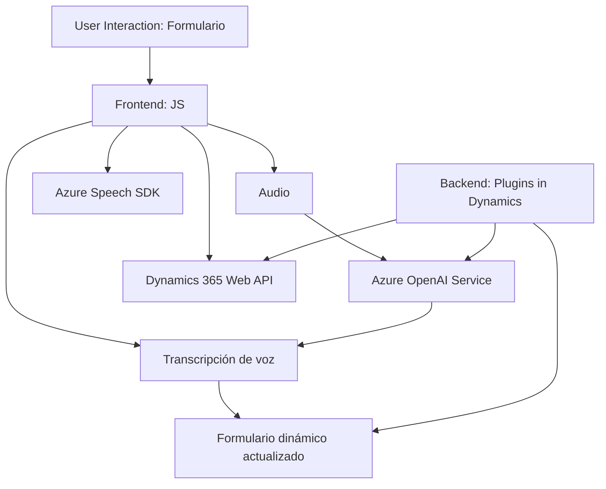

### Breve Resumen Técnico
El repositorio refleja una solución compleja orientada al manejo de datos en formularios con capacidades de síntesis y reconocimiento de voz, así como con procesamiento de lenguaje natural mediante un modelo GPT en Azure. Combina tecnologías frontend (JavaScript) y server-side (C# plugins) vinculadas a servicios externos como Azure Speech SDK y Azure OpenAI Service. Los archivos se enfocan en cuatro responsabilidades principales: procesamiento dinámico de formularios, síntesis de texto a voz, reconocimiento de voz a texto y procesamiento avanzado del texto en JSON para su integración en Dynamics CRM.

---

### Descripción de la Arquitectura
La solución está estructurada bajo una arquitectura de **integración multicapas**. Cada capa tiene responsabilidades claras:
1. **Frontend:** Implementa servicios interactivos de síntesis y reconocimiento de texto con JavaScript y Azure Speech SDK.
2. **Backend:**
   - Plugins de Dynamics CRM implementados en C#.
   - Procesamiento de texto con Azure OpenAI Service.
3. **Servicios Externos:** Azure Speech SDK y OpenAI Service ejecutan tareas específicas (por ejemplo, transformación de texto o reconocimiento de audio).

El sistema puede verse como una mezcla entre una arquitectura orientada a servicios y de multicapa:
- **Multicapa:** Componentes como plugins, frontend y servicios externos están organizados para trabajar en conjunto.
- **SOA (Service-Oriented Architecture):** Centraliza funcionalidades en herramientas externas (Azure Speech SDK y OpenAI).

---

### Tecnologías Usadas
1. **Lenguajes de programación:**
   - JavaScript (Frontend).
   - C# para los plugins de Dynamics CRM.
   
2. **Frameworks y servicios:**
   - **Azure Speech SDK:** Para interacción de síntesis y reconocimiento de voz.
   - **Dynamics 365 Web API:** Consulta de datos en formularios y atribuciones.
   - **Azure OpenAI Service:** Uso de modelos GPT para el procesamiento de texto.

3. **Patrones arquitectónicos:**
   - Modularización: Funciones divididas según responsabilidad en los archivos JS.
   - Event Driven: Lógica activada por eventos y callbacks.
   - Command Pattern: Implementación del plugin de Dynamics CRM.

---

### Dependencias y Componentes Externos
1. **Externa:**
   - Azure Speech SDK (https://aka.ms/csspeech/jsbrowserpackageraw).
   - Azure OpenAI Service (GPT-4o).
   - Dynamics 365 Web API (`Xrm.WebApi.online.execute`).
   
2. **Interna:**
   - Funciones en frontend: interacciones entre `speechForm.js` y `readForm.js`.
   - Plugins del backend que dependen de estructuras del CRM (`Microsoft.Xrm.Sdk`).

---

### Diagrama Mermaid

---

### Conclusión Final
Esta solución proporciona un ecosistema que combina múltiples tecnologías para enriquecer la interacción de usuarios con sistemas de gestión de clientes (CRM). Su integración con servicios externos (Azure Speech SDK y OpenAI Service) permite potenciar las capacidades de reconocimiento de voz, síntesis y procesamiento avanzado de lenguaje. Aunque el sistema tiene una arquitectura bien separada por capas y servicios, la integración podría evolucionar hacia una arquitectura de microservicios o eventos en aplicaciones empresariales más exigentes para mejorar su escalabilidad y modulación.