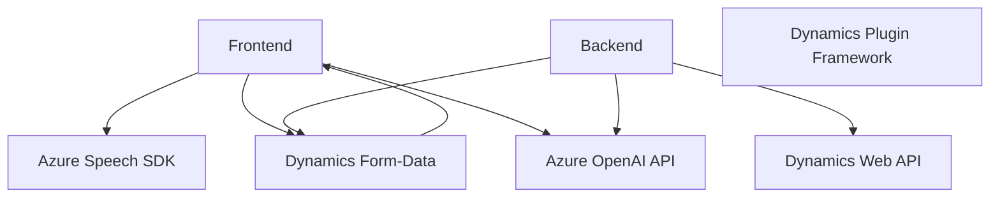

### Breve resumen técnico

El repositorio describe una solución orientada a la integración de voz, transcripciones y procesamiento textual en aplicaciones basadas en Microsoft Dynamics CRM. Combina frontend (JavaScript) y backend (C# Plugins) con interacción directa de servicios externos como Azure Speech SDK y Azure OpenAI.

---

### Descripción de arquitectura

La arquitectura general se centra en un **modelo de capa n** donde cada componente tiene una responsabilidad específica:
1. **Frontend:** Scripts JavaScript que manipulan datos dinámicos en formularios de Dynamics CRM mediante reconocimiento de voz y síntesis (usando el Azure Speech SDK).
2. **Backend:** Plugins en C# que actúan como controladores para transformar datos textuales utilizando Azure OpenAI y exponer resultados mediante el modelo de Dynamics CRM.
3. **Servicios externos (integrados):** Azure Speech SDK para funcionalidades de voz y Azure OpenAI para procesamiento y transformación textual.

La solución presenta una **arquitectura híbrida**, basada en plugins extensibles en Dynamics CRM y scripts especializados para formularios dinámicos. Utiliza patrones centralizados para procesamiento y delega tareas específicas a servicios externos, como síntesis y análisis de texto.

---

### Tecnologías utilizadas

**Frontend:**
- **Lenguaje:** JavaScript (vanilla).
- **Servicios:** Azure Speech SDK.
- **Plataforma:** Dynamics CRM (utilizando `executionContext`).
- **Patrones:** Callback Pattern y Modular JavaScript.

**Backend:**
- **Lenguaje:** C#.
- **Framework:** Dynamics CRM Plugin Framework.
- **Servicios:** Azure OpenAI (modelos GPT - transformaciones textuales).
- **Bibliotecas:** Newtonsoft.Json y System.Net.Http.
- **Patrones:** Plugin Pattern y Encapsulación.

**Dependencias externas:**
1. **Azure Speech SDK:** Para síntesis y transcripción.
2. **Azure OpenAI API:** Para procesamiento textual con modelos GPT.
3. **Dynamic Web API (`Xrm.WebApi`)** para la interacción con entidades CRM.
4. **Dynamics CRM SDKs:** Para la ejecución de plugins y manejo de contexto en el backend.

---

### Diagrama Mermaid (válido para GitHub Markdown)

---

### Conclusión final

Esta solución es una integración avanzada entre capacidades de voz (extraer, sintetizar y transcribir) y procesamiento de texto (transformar mediante IA), en un entorno corporativo como Dynamics CRM. Su arquitectura basada en **n capas** permite que el frontend y backend trabajen juntos, delegando tareas especializadas a servicios externos. Esto garantiza modularidad, flexibilidad y fácil actualización de componentes, como SDKs y APIs.