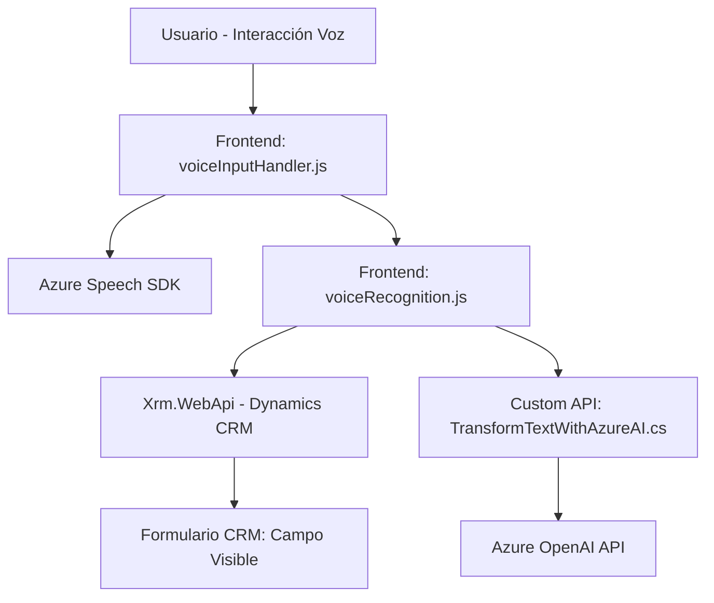

## Resumen técnico

Los archivos presentan una solución que mezcla servicios de reconocimiento y síntesis de voz en un entorno de Dynamics 365 CRM. Los elementos analizados revelan una arquitectura que combina front-end modular con plugins de Dynamics CRM y servicios de Azure, siendo parte de una aplicación orientada a la automatización de procesos empresariales mediante reconocimiento y procesamiento de voz.

---

### Descripción de arquitectura

La solución adopta un **patrón modular** tanto en el front-end como en los plugins de Dynamics CRM. El back-end utiliza un patrón específico de **IPlugin** (Dynamics CRM) para procesamiento de texto con Azure OpenAI. La integración del SDK de Azure Speech y la API personalizada en el front-end fomenta una arquitectura **n capas**, donde se separa la presentación (interacción de voz), la lógica (procesamiento de datos) y la integración (API, SDK).

### Tecnologías usadas

#### Frontend:
- **HTML/JavaScript**: Scripts para manejar voz y manipular datos en formularios.
- **Azure Speech SDK**: Reconocimiento y síntesis de voz.
- **Xrm.WebApi**: Comunicación con Dynamics CRM.
- **Dynamics CRM Form API**: Manipulación directa de atributos del formulario.

#### Plugins de Dynamics CRM:
- **Microsoft.Xrm.Sdk (.NET Framework)**: Framework específico de Dynamics CRM para el desarrollo de plugins.
- **Azure OpenAI API**: Transformación dinámica de texto en estructuras JSON.

#### Lenguajes y frameworks:
- **JavaScript:** En el front-end, para integración con SDKs.
- **C# (.NET Framework):** En plugins del Dynamics CRM.
- **Azure servicios:** SDK de Speech y OpenAI.

---

### Dependencias o componentes externos presentes

1. **Azure Speech SDK:** Cargado en el front-end para interacción con voz (reconocimiento y síntesis).
2. **Dynamics 365 APIs:**
   - Operaciones CRUD en entidades del formulario.
   - Custom API para procesamiento extendido.
3. **Azure OpenAI API:** Utilizada por el plugin para transformar texto en JSON.
4. **Librerías para manejo de JSON:** Newtonsoft.Json y System.Text.Json, presentes en el plugin.

---

### Diagrama Mermaid

---

### Conclusión final

La solución es una **aplicación orientada a servicios con arquitectura n capas** que integra múltiples tecnologías de Azure para lograr automatización en procesos dinámicos de CRM. Divide claramente las responsabilidades entre interacción de usuario, procesamiento y almacenamiento. La integración de voz con Azure Speech SDK y el plugin con OpenAI API refleja un sistema moderno y escalable con un enfoque en IA y automatización empresarial. El diseño modular permite mantener flexibilidad para futuras adaptaciones o expansiones mientras capitaliza capacidades cloud.