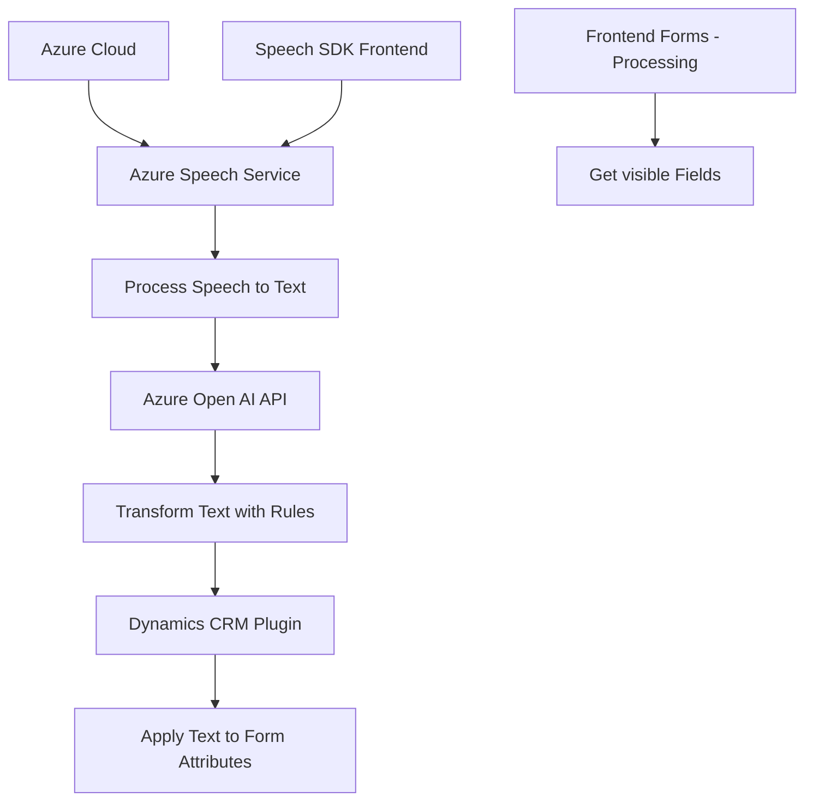

### Breve resumen técnico

El repositorio contiene tres archivos clave que implementan un sistema de reconocimiento de voz y síntesis de texto para voz (frontend) junto con un plugin de Dynamics CRM (backend) que transforma texto mediante Azure OpenAI. 

En el **frontend**, se emplea el Azure Speech SDK para lectura de formularios y entrada de datos mediante voz. El **backend** complementa esta funcionalidad al procesar texto mediante reglas predefinidas, generando un JSON estructurado usando la API de Azure OpenAI.

---

### Descripción de arquitectura

La arquitectura parece estar basada en un modelo **cliente-servidor**, donde el cliente (frontend) interactúa con servicios de Azure (Speech SDK) y solicita la entrada por voz, mientras que el servidor (backend) actúa como intermediario (plugin de Dynamics CRM), procesando y transformando los datos generados en operaciones del CRM. 

- **Frontend**: Modular, utilizando patrones de delegación/observador. Estructurado en archivos JavaScript separados según roles específicos, como síntesis de texto y reconocimiento de voz.
- **Backend**: Plugin basado en arquitecturas típicas de Dynamics CRM (IPlugin) que opera sobre un modelo de servicios y eventos, comunicándose con Azure OpenAI para realizar tareas de procesamiento.

---

### Tecnologías usadas

1. **Frontend**:
   - **Azure Speech SDK**: Para reconocimiento y síntesis de voz.
   - **JavaScript**: Desarrollo de lógica modular y funciones separadas.
   - **Xrm.WebApi**: Utilizado en el entorno Dynamics 365 para acceso a datos.
   - **Dynamic CRM mappings**: Mapeo dinámico de atributos y contextos.

2. **Backend**:
   - **C#**, **Dynamics CRM SDK (Microsoft.Xrm.Sdk)**: Para desarrollo de plugins CRM.
   - **Azure OpenAI API**: Procesamiento y transformación de texto.

3. **Patrones de diseño**:
   - Delegate/Observer: Carga dinámica de SDK y callbacks para eventos.
   - Plugin Architecture: Segmentación de responsabilidades en el CRM.
   - Encapsulation: Métodos bien definidos y separados.
   - Modular Design: Funciones y clases en archivos separados según el propósito.

---

### Diagrama Mermaid válido para GitHub

---

### Conclusión final

Este repositorio implementa un **hybrid client-server architecture** consistente en un frontend basado en Azure Speech SDK para reconocimiento/síntesis de datos y un backend basado en Dynamics CRM que incorpora un plugin diseñado con C# y que utiliza servicios de Azure OpenAI para transformar texto. Está organizado modularmente, emplea patrones de diseño como **Delegate**, **Observer**, y **Plugin Architecture**, y depende de servicios externos (Azure Speech API y Azure OpenAI API) para garantizar interactividad y procesamiento automático.

El diseño es sólido y expansible, permitiendo futuras integraciones con otras APIs o funcionalidades relacionadas con CRM y manejo de datos directamente en formularios o entidades del sistema.