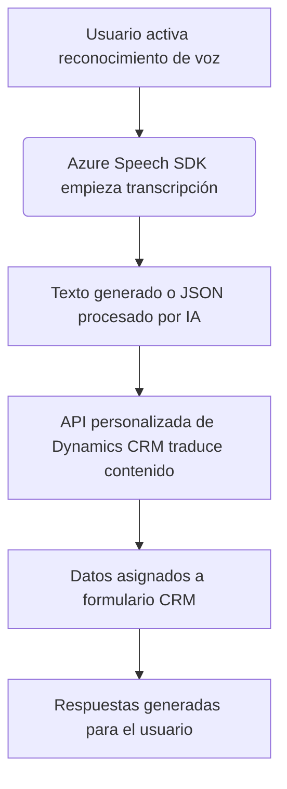
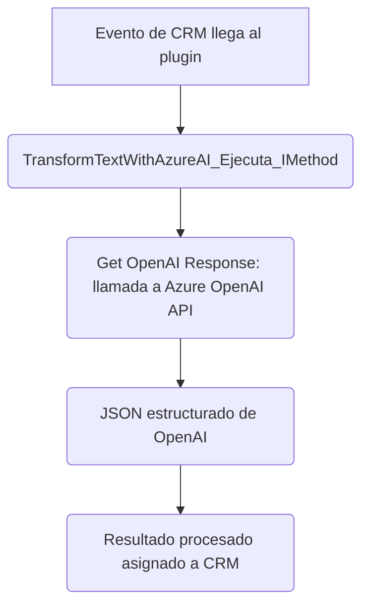
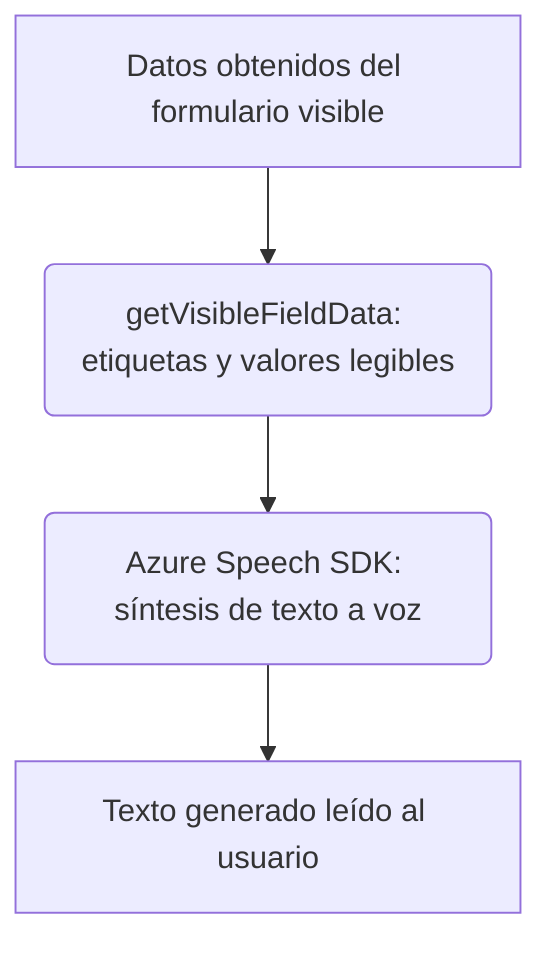

# Análisis de la solución de software

## Breve resumen técnico
El repositorio combina diferentes componentes de software que tienen como objetivo interactuar con formularios de Dynamics CRM, hacer uso del reconocimiento de voz, síntesis de texto a voz y procesamiento con servicios de inteligencia artificial (Azure OpenAI y Azure Speech SDK). Está diseñado para extender la funcionalidad de Dynamics CRM mediante complementos (plugins) y servicios de integración habilitados por APIs externas.

---

### **Descripción de la arquitectura**
La solución tiene las siguientes características arquitectónicas:

1. **Tipo de solución:**
   - **Híbrido:** El repositorio contiene tanto código para frontend (integrado directamente en CRM o accesorio como en readForm.js/speechForm.js) como lógica extendida del backend mediante plugins (TransformTextWithAzureAI.cs). Su objetivo combina extensión funcional y procesamiento mediante APIs externas.

2. **Patrón de arquitectura:**
   - **Partición funcional mediante dominios:** La solución modulariza acciones específicas, como síntesis de voz, reconocimiento de voz, mapeo y procesamiento, lo cual es importante para desacoplar responsabilidades en el diseño.
   - **Plugin-based architecture:** En el backend, sigue el patrón de arquitectura basado en plugins para personalizar Microsoft Dynamics CRM. Los plugins encapsulan reglas específicas asociadas a eventos CRM.
   - **Integración API:** Protección y comunicación mediante servicios como Azure Speech SDK, OpenAI, y Web API de Dynamics indican un enfoque en interacción con plataformas externas.
   - **Orientación a eventos:** En toda la arquitectura, los diferentes flujos se activan en respuesta a eventos generados en formularios de Dynamics CRM.

3. **Tipo de arquitectura global:**
   - **Distribuida** (entre frontend y backend en Dynamics CRM).
   - **Capas:** Aunque no es explícito, se pueden percibir capas básicas de interacción: presentación (formularios), negocio (procesamiento en frontend y plugins), y servicios (API externas).
   - **API-centric:** Las externalidades como Azure y Web API juegan un papel crítico en ejecutar la funcionalidad.

4. **Dependencias y componentes externos (identificados al nivel del código):**
   - **Azure Speech SDK**: Reconocimiento de voz y síntesis de texto a voz (importado dinámicamente en JS).
   - **Azure OpenAI Service**: Para transformación de texto adherido al plugin TransformTextWithAzureAI.cs.
   - **Dynamics Web API**: Interacción directa con datos de Dynamics CRM.
   - **Microsoft.Xrm.Sdk**: Para integrar las operaciones de plugins en el backend.
   - Librerías de JSON como `Newtonsoft.Json` y `System.Text.Json`.
   - Entorno que requiera soporte para Plugins en Dynamics CRM y ejecución en aplicaciones de formularios CRM.

5. **Tecnologías y frameworks usados:**
   - **Frontend:** JavaScript vinculado a Dynamics CRM mediante su modelo de eventos. Utiliza el SDK de Azure Speech y peticiones a APIs dinámicas.
   - **Backend:** C# con .NET Framework orientado a plugins, complementado por librerías de manipulación de datos JSON y clientes HTTP para integrar la API de Azure OpenAI.

---

### **Diagramas Mermaid compatibles con GitHub**

#### **Diagrama general de la interacción:**  

#### **Diagrama del flujo del plugin backend (TransformTextWithAzureAI.cs):**

#### **Diagrama del flujo del frontend (Javascript):**

### Conclusión final
La solución presente en el repositorio se centra en extender las capacidades de Microsoft Dynamics CRM utilizando integración con servicios de Azure, incluyendo reconocimiento de voz, síntesis de texto y procesamiento avanzado con inteligencia artificial. La arquitectura es híbrida y semi-distribuida, con capas funcionales representadas en frontend (formularios Dynamics) que interactúan mediante plugins backend y servicios externos. Su diseño modular y basado en APIs permite mejor escalabilidad y separación de responsabilidades.

El uso extensivo de APIs externas y plugins representa un enfoque moderno y adaptable a ecosistemas empresariales basados en tecnología de Microsoft.