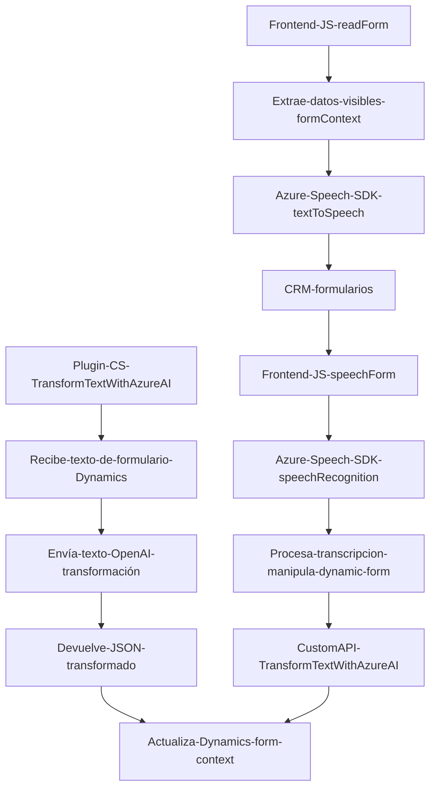

### Breve resumen técnico
El repositorio incluye tres archivos orientados hacia la integración de **Azure services** y **Microsoft Dynamics CRM**. Estas integraciones están diseñadas para mejorar la funcionalidad de procesamiento de voz y texto en formularios de CRM mediante SDKs y APIs externas, como **Azure Speech SDK** y **Azure OpenAI**. Los sistemas están organizados principalmente en torno a funciones especializadas y un plugin que amplía las capacidades del CRM.

---

### Descripción de arquitectura
La arquitectura general del conjunto parece estar orientada hacia un diseño de *n capas* modificado con integración de servicios externos (Azure SDK, Azure OpenAI y Dynamics 365). 

Los tres archivos proporcionados cumplen roles diferentes:
1. **`readForm.js`**: Funciones para extraer datos visibles de un formulario del CRM y convertirlos en texto mediante el servicio de síntesis de voz.
2. **`speechForm.js`**: Funciones de entrada por voz, que reciben texto reconocido desde servicio Azure Speech SDK, lo normalizan y actualizan datos en el CRM.
3. **`TransformTextWithAzureAI.cs`**: Plugin de Dynamics 365 que transforma texto según reglas personalizadas mediante una solicitud HTTP al servicio Azure OpenAI.

La comunicación directa con servicios externos y su ejecución en diferentes capas del sistema refuerza el uso de una arquitectura orientada a la integración y modularidad.

### Tecnologías usadas
1. **Frontend de JavaScript**:
   - **Azure Speech SDK**: Para conversión texto a voz y voz a texto.
   - **Microsoft Dynamics 365 Web API** (usada como intermediaria para integrar con el CRM).

2. **Backend basado en C# (.NET)**:
   - Sistema de plugins de **Dynamics CRM**.
   - Servicios API mediante **Azure OpenAI** para procesamiento de datos personalizados.
   - Buen uso de dependencias de .NET (librerías JSON de **Newtonsoft.Json**, manejo de operaciones en `System.Net.Http`).

3. **Patrones de diseño identificados**:
   - Modularización: En los archivos JavaScript, cada función tiene un propósito especializado.
   - Mediator Pattern: Uso de `executionContext` como ente de coordinación entre distintos formularios en Dynamics.
   - External API Integration Pattern: La integración directa con servicios diseñados por Azure OpenAI y Azure Speech SDK para extender las capacidades del sistema.
   - Plugin Design Pattern (Universe pattern en Dynamics 365).

4. **Estilo de arquitectura**: 
   - Aunque el repositorio no incluye todo el sistema completo, la arquitectura actual da indicios de un **sistema de n capas** donde el frontend interactúa directamente con un middleware (API/SDK externos) y complementa la capa de negocio del CRM.

---

### Mermaid Diagram que describe la solución

---

### Conclusión Final
Este repositorio está diseñado para ser parte de una solución integrada en sistemas de formularios del CRM en **Microsoft Dynamics 365**, empleando servicios de Microsoft Azure y técnicas modernas de procesamiento de datos y AI. Utiliza una arquitectura de **n capas** con interacción directa entre el frontend, servicios externos y un backend extensible mediante plugins de Dynamics.

**Fortalezas**:
- Uso de SDK y servicios externos como Azure Speech y OpenAI para tareas avanzadas de voz y procesamiento de texto.
- Modularización clara, lo que facilita mantener y escalar las funcionalidades.

**Debilidades**:
- La exposición directa de la `API Key` podría ser un riesgo de seguridad.
- La validación de operaciones externas podría mejorarse.
- Mayor documentación podría clarificar cómo las dependencias se integran en conjunto.

Este diseño es ideal para soluciones extendidas que requieren funcionalidad avanzada de gestión de datos mediante input/output en voz y texto.