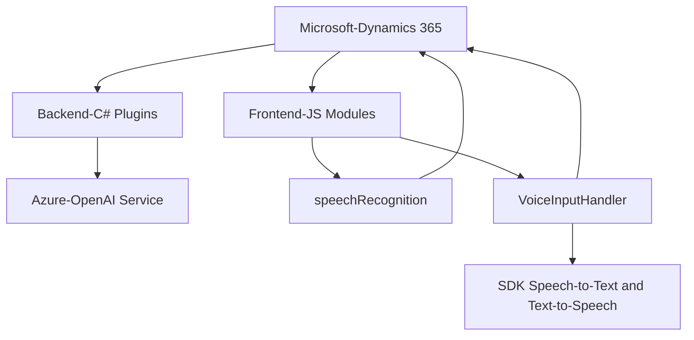

### Breve Resumen Técnico:
El conjunto de archivos analizados pertenece a una solución basada en Microsoft Dynamics 365 que integra funcionalidades de reconocimiento de voz, síntesis de texto a voz, y transformación de texto mediante servicios de Azure OpenAI. Está orientada a la mejora de la experiencia de usuario en formularios y al uso de inteligencia artificial para el procesamiento de datos.

---

### Descripción de Arquitectura:
La solución sigue una arquitectura **n capas** con integración entre dos grandes bloques: **frontend** y **backend**. Las funcionalidades del frontend están implementadas en JavaScript, donde se utilizan APIs del navegador y SDKs externos para el procesamiento de voz (Azure Speech SDK). El backend se implementa como **plugins personalizados en Dynamics CRM**, utilizando la interfaz `IPlugin` para procesar datos y conectar con el servicio de Azure OpenAI. Además, se identifica el uso del patrón **Repository** para manipular entidades del sistema CRM.

---

### Tecnologías Usadas:
1. **Frontend:**
   - Lenguaje: JavaScript (ES6+).
   - SDK: Azure Speech SDK.
   - Microsoft Dynamics 365 JavaScript API (`Xrm.WebApi`).
   - Modularidad basada en funciones.
   - Event-driven programming (basado en callbacks y promesas).
2. **Backend:**
   - Lenguaje: C# (.NET Framework).
   - Framework: Microsoft Dynamics CRM (plugins, API).
   - Azure OpenAI Service (GPT-4 integrado).
   - Librerías para JSON (Newtonsoft.Json, System.Text.Json).
   - RESTful HTTP (System.Net.Http).

---

### Dependencias y Componentes Externos:
1. **Azure Speech SDK**:
   - Procesamiento de voz para reconocimiento de audio y síntesis de texto a voz.
2. **Microsoft Dynamics 365 SDK**:
   - API y extensibilidad mediante plugins (.NET) e interacción con objetos estándar del CRM.
3. **Azure OpenAI Service**:
   - Realiza la transformación semántica y de estructura de texto.
4. **Frontend JavaScript APIs**:
   - Uso de APIs del navegador para cargar dependencias dinámicamente, interactuar con el DOM y manejar eventos asincrónicos.

---

### Diagrama **Mermaid** (Compatible con GitHub Markdown)

---

### Conclusión Final:
La solución presentada está diseñada para simplificar la interacción de usuarios con formularios en Dynamics CRM mediante tecnologías de reconocimiento de voz y transformación AI. La arquitectura de n capas implementa una integración fluida entre el frontend (JavaScript) y el backend (plugins en C#). El uso de servicios en la nube de Azure para voz y AI asegura alta escalabilidad y precisión en las operaciones. A nivel técnico, el código exhibe un diseño modular, patrones de carga bajo demanda, y una buena estructuración para interacción con APIs externas, aunque debe abordar ciertos problemas de seguridad como el manejo de claves sensibles.