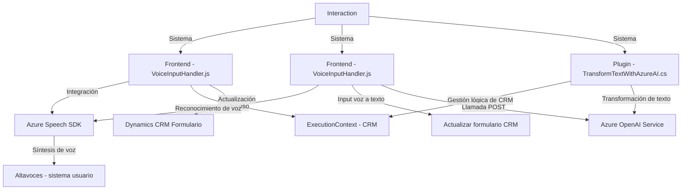

### Breve resumen técnico
El repositorio describe una solución para integrar la funcionalidad de síntesis y reconocimiento de voz, utilizando **Azure Speech SDK** y **Azure OpenAI Service**, dentro de un entorno **CRM basado en Dynamics**. El sistema incluye módulos frontend en **JavaScript** y Plugins en **C#** para extender las capacidades de los formularios CRM con interacción por voz.

---

### Descripción de la arquitectura
La solución parece estar implementada en una arquitectura **n capas** que divide la lógica entre presentación (frontend), negocio (plugins en C#) y servicios externos (integración con Azure). Aunque los componentes no están completamente desacoplados como en una arquitectura hexagonal, el uso del Azure Speech SDK y Azure OpenAI Service introduce un enfoque de microservicio dependiente de APIs externas para funcionalidades avanzadas.

1. **Presentación (frontend)**:
   - Implementada en **JavaScript**, configura la interacción con el usuario mediante voz y mapeo de formularios dinámicos en **Dynamics CRM**.
   - Modulares funciones encapsulan operaciones específicas; estas interactúan con el SDK o servicios CRM para realizar síntesis de voz y reconocer datos usando la entrada de voz.

2. **Negocio (C# Plugin)**:
   - Implementa lógica para transformar datos mediante el modelo OpenAI de Azure y opera como plugin en el entorno Microsoft Dynamics CRM.
   - Fuerte dependencia de la **interfaz IPlugin** del SDK de Dynamics.

3. **Servicios externos (API)**:
   - Usa el **Azure Speech SDK** para síntesis/reconocimiento de voz y **Azure OpenAI** para el procesamiento avanzado de texto con IA.

---

### Tecnologías usadas
1. **Frontend (JavaScript):**
   - **Azure Speech SDK** para habilitar síntesis y reconocimiento de voz.
   - **Microsoft Dynamics CRM ExecutionContext** para integrar elementos del sistema CRM (adición/modificación de valores de formularios).
   - **Xrm.WebApi**: para realizar operaciones de datos del CRM a través de API.

2. **Backend (C#):**
   - **Microsoft.Xrm.Sdk API**: Extiende el CRM con lógica de negocio personalizada.
   - **Azure OpenAI GPT-based**: Utiliza el servicio de completado de chat (gpt-4o) para procesar texto y devolver datos estructurados.
   - Dependencias comunes de C#: `Newtonsoft.Json`, `System.Net.Http`.

---

### Diagrama Mermaid válido para GitHub Markdown

---

### Conclusión final
La solución en el repositorio describe un sistema basado en la integración de **Azure Cloud Services (Speech SDK, OpenAI)** y **Microsoft Dynamics CRM** para funcionalidades de reconocimiento de voz. 

Tiene una arquitectura **n capa modular**, separando las responsabilidades en módulos frontend, plugins backend y servicios externos. Utiliza patrones de diseño como **facade** y **separación de intereses**, con una fuerte dependencia de APIs externas.

Si bien la arquitectura es bastante organizada y encaja con los principios de Dynamics CRM, podría mejorar hacia una **arquitectura hexagonal** mediante una mayor desacopla de los módulos y las dependencias con los servicios externos, facilitando pruebas e independencia tecnológica.