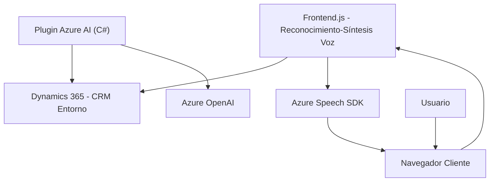

### Breve resumen técnico

Este repositorio parece centralizar una solución distribuida para integrar reconocimiento y síntesis de voz (Azure Speech SDK) con formularios y flujos adaptados en Microsoft Dynamics 365. Adicionalmente, incluye un **plugin** para realizar transformaciones de texto mediante **Azure OpenAI**.

---

### Descripción de arquitectura

La solución se divide en tres componentes principales:
1. **Frontend**:
   - JavaScript basado en módulos para interactuar con el cliente del navegador y el SDK de Azure Speech.
   - Incluye las funcionalidades de:
     - Síntesis de voz (leer contenido de formularios y convertirlo en voz).
     - Reconocimiento de voz (transcribir comandos hablados y procesarlos directamente en un formulario).
   - Modularización y uso de dependencias dinámicas (SDK de Azure cargado en tiempo de ejecución).
   
2. **Backend/Plugins**:
   - Plugins de Dynamics 365, como `TransformTextWithAzureAI.cs`, definen extensiones personalizadas:
     - Reciben texto desde Dynamics, interactúan con Azure OpenAI y devuelven resultados procesados.
   - Arquitectura basada en servicios externos y uso de SDK y API internas de Dynamics CRM.

3. **Servicios Externos**:
   - Azure Speech SDK para funciones de síntesis y reconocimiento de voz.
   - Azure OpenAI para transformación de texto en el backend.

---

### Tecnologías usadas

1. **Frontend:**
   - **JavaScript ES6**: Base del código.
   - **DOM manipulation**: Usado para cargar dinámicamente dependencias y gestionar interacción con formularios.
   - **Azure Speech SDK**: Servicio de síntesis y reconocimiento de voz.
   - Dinámicas vinculadas a **Dynamics 365 Web API** para acceso a entidades.

2. **Backend/Plugins:**
   - **C# .NET Framework o .NET Core**: Lenguaje de implementación de los plugins.
   - **Microsoft Dynamics 365 SDK**: Interacción directa con entidades de CRM.
   - **Azure OpenAI (via HTTP)**: Middleware externo para procesamiento de texto.

---

### Patrones de arquitectura

1. **Monolito distribuido con servicios externos**:
   - El frontend y los plugins están diseñados para integrarse con Dynamics CRM, lo que genera dependencia sobre un entorno monolítico, aunque ambos interactúan con servicios externos como Azure Speech SDK y OpenAI.

2. **Modularización**:
   - Las funciones en los archivos `.js` están divididas por responsabilidad: procesamiento de datos, interacción con formularios, integración con API de terceros.

3. **Carga dinámica**:
   - En el frontend, la carga dinámica del SDK de Azure Speech asegura que las dependencias externas no están rígidamente acopladas.

4. **Plugin pattern** (en el backend):
   - Extensiones de Dynamics 365 que implementan lógica personalizada para responder a eventos CRM.

---

### Dependencias o componentes externos presentes

1. **Azure Speech SDK**:
   - Utilizado para síntesis y reconocimiento de voz, integrado en los archivos de frontend.

2. **Azure OpenAI (API externa)**:
   - Utilizado por el plugin para realizar transformaciones avanzadas de texto.

3. **Dynamics 365 Web API**:
   - Acceso y manipulación de entidades de CRM desde los scripts del frontend y C# plugins.

4. **Newtonsoft.Json y HttpClient**:
   - Manejo de datos estructurados (JSON) y solicitudes HTTP en los plugins.

5. **DOM elementos básicos**:
   - En el frontend, para crear dinámicamente `<script>` y gestionar integraciones con SDK.

---

### Diagrama Mermaid válido para GitHub Markdown

---

### Conclusión final

Esta solución está orientada a implementar reconocimiento y síntesis de voz, integrándose estrechamente con Microsoft Dynamics 365. El backend complementa esta funcionalidad mediante plugins que aprovechan Azure OpenAI para transformar texto. 

Las tecnologías usadas (Azure Speech SDK, Dynamics SDK y API externas) colocan esta solución en una arquitectura híbrida de monolito distribuido, con integración de servicios en la nube. Es modular y concebida para extender capacidades específicas de los formularios Dynamics con funciones avanzadas de IA y voz.