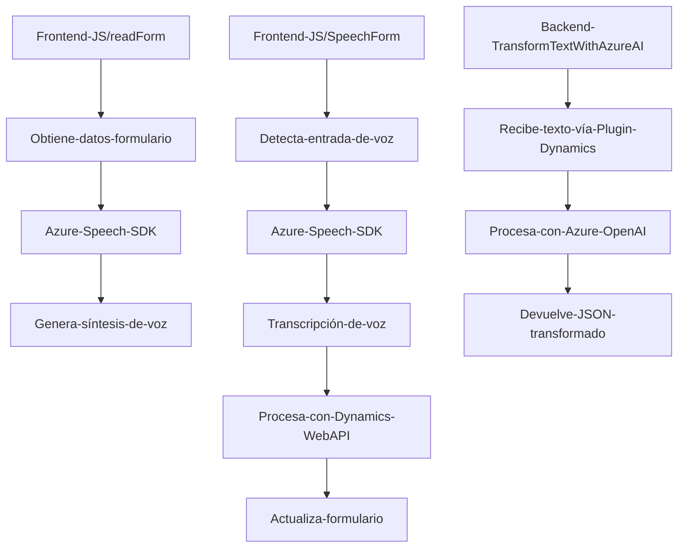

### Breve resumen técnico

El repositorio contiene componentes que conforman una **aplicación empresarial** centrada en la integración de voz, texto y procesamiento avanzado mediante servicios externos de Azure (Speech SDK y OpenAI). Está diseñada para extender funcionalidades en entornos como Dynamics 365, manejando formularios y procesamiento de datos mediante voz y texto.

---

### Descripción de arquitectura

La solución sigue una arquitectura **modular de n-capas** para estructurar la lógica de negocio, que incluye:
1. **Frontend (JavaScript):**
   - Implementa interactividad en el navegador para la manipulación de formularios y el procesamiento de **voz** y datos visibles.
   - Consume el **Azure Speech SDK** y otras APIs como Dynamics Web API.
2. **Backend (C# Plugin):**
   - Implementa un **plugin** dentro de Dynamics CRM para procesar texto con **Azure OpenAI API**.
   - Actúa como una capa de integración entre Dynamics y servicios Cloud externos.
3. **Patrones de diseño:**
   - **Event-Driven Programming**: Uso de callbacks en el frontend para manejar eventos asincrónicos, como la carga del SDK o el reconocimiento de voz.
   - **Plugin Pattern**: Backend diseñado para actuar en el flujo de Dynamics CRM.
   - **External API Consumption**: Interacción modular con servicios de Azure para procesamiento de voz y texto.

---

### Tecnologías usadas

1. **Frontend:**
   - _JavaScript_: Base del procesamiento y manipulación del DOM.
   - **Azure Speech SDK**:
     - Para reconocimiento de voz (grabación, transcripción) y síntesis de texto en voz.
   - **HTML DOM API**: Inserción dinámica de componentes necesarios como scripts.
   - **Dynamics Web API**: Llamadas internas hacia formularios y entidades del sistema.
2. **Backend:**
   - _C#_: Lenguaje usado para implementar un plugin específico de Dynamics CRM.
   - **Azure OpenAI API**:
     - Para generative AI y transformación de texto según reglas.
   - **Microsoft Dynamics CRM SDK**:
     - Base para conectar lógica del negocio con entornos CRM.
   - **NuGet Packages**:
     - `Newtonsoft.Json`: Manejo avanzado de JSON en formato .NET.
3. **Infraestructura:**
   - Azure Cloud: Servicios como Speech SDK y OpenAI API para procesamiento inteligente.

---

### Diagrama Mermaid

El flujo integrado entre frontend, backend y servicios externos (Azure, Dynamics) se ilustra aquí:

---

### Conclusión final

La solución es un conjunto de componentes integrados dentro del ecosistema empresarial de Dynamics 365, extendidos con funcionalidades avanzadas basadas en **Azure Speech** y **OpenAI API**. Sigue prácticas modernas como la **modularidad funcional** y la interacción Cloud. Su estructura refleja una arquitectura **n-capas**, destacando integración entre frontend, backend y servicios Azure para mejorar la experiencia de usuario y el procesamiento inteligente en negocios basados en formularios y voz.