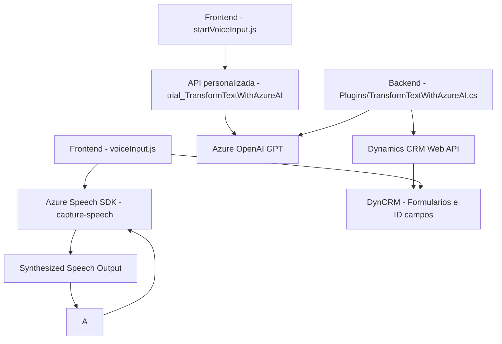

### Breve Resumen Técnico:
Este repositorio contiene tres componentes que trabajan juntos para habilitar funcionalidades avanzadas en una solución basada en Microsoft Dynamics CRM. El código combina capacidad de entrada/salida de voz en formularios con inteligencia artificial utilizando servicios de Azure (Speech SDK y OpenAI). La solución aborda la integración directa con SDKs, APIs personalizadas y plugins. Está diseñada para capturar, procesar y transformar texto con base en inteligencia artificial, actualizando formularios de Dynamics CRM con datos procesados.

---

### Descripción de la Arquitectura:
La arquitectura combina un frontend modular en JavaScript con servicios cloud (Azure Speech SDK y Azure OpenAI Service) que funcionan como servicios externos. El núcleo del negocio reside en un plugin de Dynamics CRM escrito en C#. La arquitectura tiene componentes que interactúan mediante protocolos estándar (HTTP para el backend y API hooks para el frontend). Se observa una estructura de **arquitectura en n capas**, donde el frontend es responsable de capturar datos, el backend (plugin y APIs) los procesa, y el servicio de datos (Dynamics CRM) gestiona la persistencia. Aunque existen elementos de integración con terceros, sigue funcionando como un sistema monolítico extendido con capacidades de SaaS.

---

### Tecnologías, Frameworks y Patrones Usados:
1. **Frontend:**
   - **Javascript ES6+:** Base del desarrollo del frontend.
   - **Azure Speech SDK:** Para reconocimiento y síntesis de voz a texto.
   - **Dynamic Field Mapping:** Implementado usando funciones para procesar y mapear campos visibles en formularios de Dynamics CRM.
   - **Asynchronous Programming:** Se hace uso extensivo de las promesas (`async`, `Promise`) para comunicación con APIs externas.

2. **Backend:**
   - **C# en .NET Framework:** Para desarrollar el plugin que interactúa con Dynamics CRM.
   - **Plugin Design:** Implementa el patrón de plugins mediante la interfaz `IPlugin` de Dynamics CRM.
   - **Azure OpenAI GPT API:** Se utiliza esta API para procesamiento avanzado de texto con IA.
   - **JSON Manipulación:** Utiliza librerías estándar de .NET (`System.Text.Json`) y externas (`Newtonsoft.Json.Linq`) para manejar JSON.

3. **Patrones de diseño:**
   - **Modularidad:** Los módulos en el frontend (como las funciones en JavaScript) están separados por propósito, siguiendo el principio de responsabilidad única.
   - **API Integration:** Patrón de integración con APIs externas para operaciones específicas.
   - **Event-driven design:** Las operaciones desencadenadas por capturas de voz y llamadas a plugins manifiestan un diseño orientado por eventos.

---

### Diagrama Mermaid (Mermaid compatible con GitHub Markdown):

---

### Conclusión Final:
La solución presenta una arquitectura consolidada para manejo de formularios con entrada y síntesis de voz en el frontend, procesamientos con APIs externas y conexiones a Microsoft Dynamics CRM mediante un plugin especializado. Aunque la estructura mantiene los principios de modularización y reutilización, a nivel macro es una solución de arquitectura **n capas**, donde los componentes se separan por su pertenencia y propósito: presentación (frontend), lógica de negocio (plugin y API personalizada), y persistencia (Dynamics CRM). Aunque de baja complejidad para pequeños escenarios, podría necesitar una revisión para escalar en ambientes más grandes o distribuidos donde quizá sea necesario adoptar microservicios de manera extensiva.