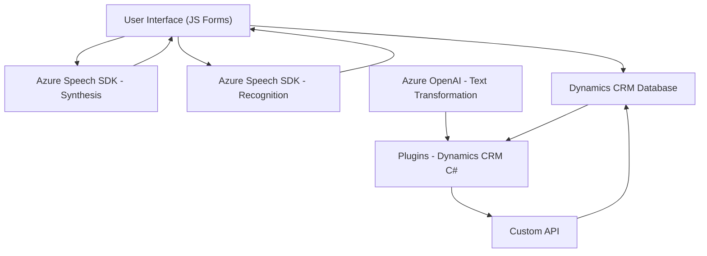

### Breve Resumen Técnico:
El repositorio contiene una solución que integra funcionalidades de procesamiento de formularios mediante interacción con servicios externos como **Azure Speech SDK** y **Azure OpenAI GPT-4**, y está diseñada para trabajar en el entorno de Microsoft Dynamics CRM. La lógica está dividida entre funcionalidades frontend en JavaScript (para la interacción con formularios) y funcionalidades backend como plugins (.NET) para procesar datos complejos y transformar texto.

---

### Descripción de Arquitectura:
La arquitectura de la solución es híbrida y se puede clasificar como una variante de **arquitectura n-capas** (una bifurcación de frontend y backend), con principios de integración de servicios externos que lo acercan a un **Service-Oriented Architecture (SOA)**. Las capas identificadas son:
1. **Capa UI (Frontend)**:
   - Gestiona la interacción del usuario en el navegador mediante JavaScript.
   - Procesa los contenidos visibles de formularios de un CRM (Dynamics 365).
   - Utiliza el **Azure Speech SDK** para síntesis y reconocimiento de voz.
   
2. **Capa lógica de negocio (Backend)**:
   - Implementa un plugin de Dynamics CRM en .NET que transforma texto mediante **Azure OpenAI GPT-4**.
   - Opera en contexto de gestión de datos en el CRM y se comunica con otros servicios mediante HTTP APIs.
   
3. **Capa externa**:
   - Procesamiento de voz (Azure Speech SDK).
   - Procesamiento de texto e inteligencia artificial (Azure OpenAI API).

Esta arquitectura permite módulos separados de ejecución que interactúan a través de servicios externos (Azure APIs y Dynamics Web APIs).

---

### Tecnologías y Frameworks Usados:
1. **Frontend**:
   - **JavaScript**: Funciones de procesamiento como manipulación de formularios y datos dinámicos.
   - **Azure Speech SDK**: Carga dinámica y uso de APIs basadas en síntesis/reconocimiento de voz.
   - **Dynamics 365 Web API**: Para comunicación con un entorno CRM.

2. **Backend**:
   - **C#/.NET**: Implementación de plugins para Dynamics CRM.
   - **Newtonsoft.Json/JObject**: Para manejo de datos JSON.
   - **Azure OpenAI GPT-4 API**: Interpretación y transformación de texto según reglas.
   - **System.Net.Http**: Enviar solicitudes HTTP para APIs externas.

3. **Tools**:
   - **GitHub**: Versionamiento y gestión de código.
   - **Microsoft Dynamics CRM SDK**: Plugins y APIs para manipulación de datos de CRM.

---

### Diagrama Mermaid:

---

### Conclusión Final:
La solución implementada en este repositorio es una integración avanzada con Microsoft Dynamics CRM, que utiliza múltiples Azure APIs y SDKs para permitir tanto la síntesis y reconocimiento de voz como el procesamiento inteligente de texto mediante IA. La arquitectura es modular y emplea una combinación de **SOA** y **n-capas**, separando las responsabilidades de UI, lógica de negocio y procesamiento externo. Las tecnologías utilizadas son modernas y permiten a la solución escalar adecuadamente en entornos empresariales, asegurando tanto la extensibilidad mediante APIs como la interoperabilidad en el ecosistema de Dynamics CRM.