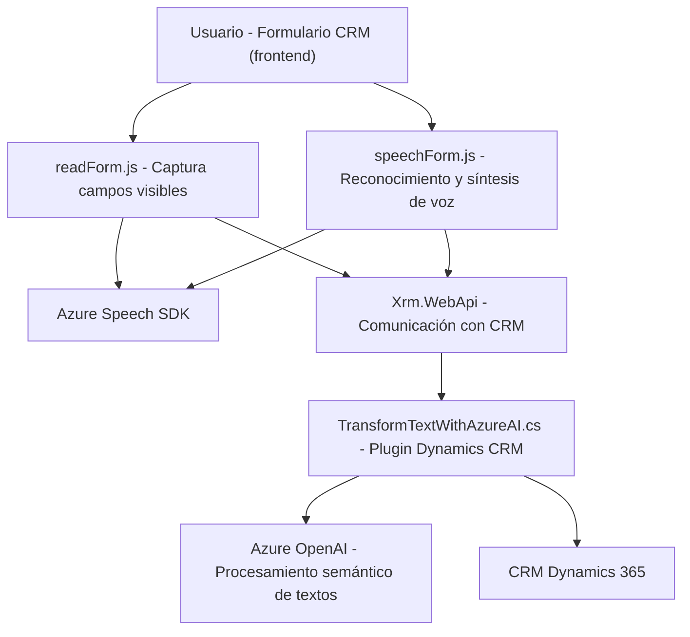

### Breve Resumen Técnico

El repositorio contiene tres archivos principales que implementan funcionalidades separadas dentro de un sistema que parece estar destinado a integración con **Microsoft Dynamics 365 CRM**. Se enfocan en la interacción entre formularios, gestión de voz (reconocimiento y síntesis) mediante **Azure Speech SDK**, y procesamiento de texto utilizando **Azure OpenAI**. Esto indica que el sistema está diseñado para **interacción dinámica con un CRM** mediante voz, inteligencia artificial (IA), y procesamiento de datos estructurados.

---

### Descripción de la Arquitectura

La arquitectura general del sistema utiliza un enfoque **modular**, donde cada archivo tiene una responsabilidad específica:
1. **Frontend JavaScript (readForm.js y speechForm.js):** 
   - Funciona como una capa cliente para capturar datos de formularios, procesarlos y sintetizarlos en voz, o capturar comandos por medio de reconocimiento de voz.
   - Se utiliza el **SDK de Azure Speech** para estas operaciones, junto con **Xrm.WebApi** como puente entre los datos de voz y Dynamics 365 CRM.

2. **Plugin Backend (TransformTextWithAzureAI.cs):**
   - Implementa la lógica de procesamiento de texto mediante **Azure OpenAI**, integrándolo como un servicio de acción dentro del Dynamics CRM. Esto aporta mayor inteligencia semántica al sistema, generando datos estructurados que pueden ser reenviados al CRM o aplicaciones adicionales.

Por lo tanto, la arquitectura combina un diseño **orientado a servicios (SOA)** con elementos de una **arquitectura por capas**, donde el procesamiento en JavaScript sirve como capa inicial y los plugins C# actúan como capa backend para conectar servicios externos.

---

### Tecnologías Usadas

1. **Frontend:**
   - **JavaScript**: Usado para formularios, reconocimiento de voz y conexión con APIs.
   - **Azure Speech SDK**: Reconocimiento de voz y síntesis de sonido.
   - **Xrm.WebApi**: Para comunicación con el backend de Dynamics 365 CRM mediante REST API.

2. **Backend:**
   - **C# (.NET Framework)**: Implementación de plugins.
   - **Azure OpenAI**: Para procesamiento de textos y generación de datos estructurados en JSON.
   - **Newtonsoft.Json** y **System.Text.Json**: Manejo avanzado de JSON.

---

### Patrones Usados

#### En Frontend:
- **Modularidad:** Cada función tiene un propósito bien definido, lo que permite una integración clara de voz y texto en los formularios.
- **API Gateway**: Invoca servicios externos para reconocimiento y análisis de voz mientras centraliza la interacción.

#### En Backend:
- **Service-Oriented Architecture (SOA):** Uso de Azure OpenAI y Dynamics CRM como servicios organizados para tareas específicas.
- **Plugin Pattern:** Alineado con Dynamics CRM, se usa para procesar datos en contexto y respuesta directa.
- **Adapter Pattern:** La función `GetOpenAIResponse` estructura la interacción con APIs como OpenAI.

---

### Dependencias o Componentes Externos 

#### Dependencias Externas:
- **Azure Speech SDK**: Para síntesis y reconocimiento de voz en JavaScript.
- **Azure OpenAI**: Procesamiento avanzado de textos basado en IA.
- **Xrm.WebApi**: API de Dynamics 365 para comunicación con el CRM.
- **Newtonsoft.Json**, **System.Text.Json**: Procesadores JSON.

#### Dependencias Internas:
- Mapeadores de campos de formularios y normalizadores (`getFieldMap`, `findMatchingFieldKey`, etc.), estructuras para transformar y asignar datos recibidos desde APIs.

---

### Diagrama Mermaid para GitHub Markdown

---

### Conclusión Final

Este sistema combina frontend (JavaScript) y backend (C#) para habilitar interacción avanzada en Dynamics 365 CRM. Utiliza voz, IA y APIs para facilitar la experiencia del usuario, acoplando servicios como Azure Speech SDK y OpenAI. La arquitectura modular y orientada a servicios asegura escalabilidad y buenas prácticas, permitiendo integraciones futuras con otros sistemas y servicios basados en CRM.