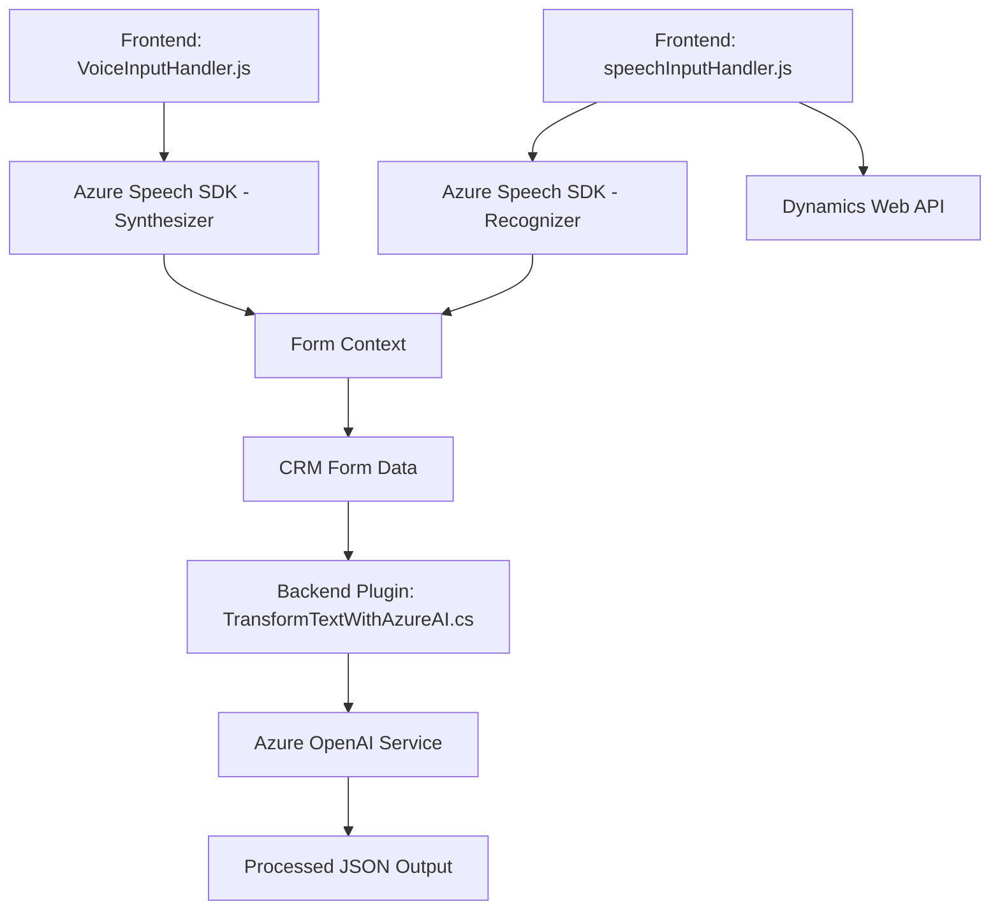

### Breve resumen técnico

La solución descrita parece ser una plataforma diseñada para implementar interacción por voz, reconocimiento de lenguaje natural y síntesis de texto para formularios integrados en Microsoft Dynamics CRM, con Azure como proveedor de servicios clave. Utiliza integración directa con APIs de Azure (Speech SDK, OpenAI) y una arquitectura basada en eventos y plugins para extender capacidades del CRM.

---

### Descripción de arquitectura

La arquitectura del repositorio consta de varios niveles colaborativos:
1. **Frontend**:
   - Funcionalidad de reconocimiento por voz y síntesis de voz a través del Azure Speech SDK.
   - Interacciones dinámicas con formularios en Dynamics CRM para lectura (VoiceInputHandler.js) y escritura basada en comandos naturales (speechInputHandler.js).
   
2. **Backend (Plugin)**:
   - Transformaciones textuales vía Azure OpenAI Service para estructurar datos en formato JSON, usando lógica de plugin en Dynamics CRM.

3. **Capacidades extendidas**:
   - Uso de Azure Speech SDK para integrar voz y lectura automatizada de formularios.
   - Integración REST para interacción con el Azure OpenAI Service.

La arquitectura general puede clasificarse como **n-capas distribuida**, donde los módulos de frontend interactúan con un CRM basado en Dynamics, mientras que los plugins implementan lógica de backend para transformación avanzada, comunicándose con APIs externas en Azure.

---

### Tecnologías usadas

1. **JavaScript**:
   - Herramientas del frontend para interacción dinámica y eventos del CRM.
   
2. **Azure Speech SDK**:
   - Síntesis y reconocimiento de voz.
   
3. **Dynamics CRM SDK (`Microsoft.Xrm.Sdk`)**:
   - Framework para plugins del backend en Dynamics 365.
   
4. **Azure OpenAI Service**:
   - Implementación de modelos avanzados de procesamiento de lenguaje natural.

5. **Librerías JSON (Newtonsoft.Json.Linq y System.Text.Json)**:
   - Serialización/deserialización en el plugin `TransformTextWithAzureAI.cs`.

---

### Diagrama Mermaid válido para GitHub

---

### Conclusión final

El repositorio proporciona una solución extensible y moderna que ejecuta tareas especializadas de interacción de voz y procesamiento inteligente de texto en un entorno Dynamics CRM. El diseño modular está orientado a la reutilización y escalabilidad, aprovechando patrones como integración SDK y comunicación directa con servicios externos (Azure Speech y OpenAI). La arquitectura, aunque distribuida, tiene una marcada separación de capas, facilitando la gestión independiente de frontend, lógica CRM y procesamiento en Azure. Esta solución está preparada para entornos empresariales con necesidades avanzadas de voz y texto.