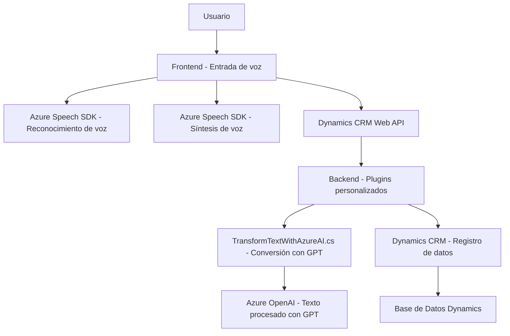

### **Breve resumen técnico**
La estructura de los archivos del repositorio indica que estamos ante una solución técnica que combina un frontend interactivo con funcionalidad de accesibilidad (lectura y reconocimiento de formularios), integración de inteligencia artificial mediante Azure OpenAI y un backend que extiende las capacidades de Dynamics CRM a través de plugins personalizados.

### **Descripción de arquitectura**
La arquitectura parece combinar los principios de **n-capas** y **FAAS (Functions as a Service)**:
1. **Frontend modular**, con funciones que gestionan accesibilidad y entrada de voz desde el cliente.
2. **Backend orientado a eventos**, basado en el SDK de Dynamics CRM donde se implementan plugins.
3. **Integración de servicios externos**, como Azure Speech SDK y Azure OpenAI para reconocimiento de voz y procesamiento de texto mediante IA.

---

### **Tecnologías usadas**
1. **Frontend**:
   - **Azure Speech SDK**: Para síntesis y reconocimiento de voz.
   - **Vanilla JS**: El código parece estar escrito en JavaScript estándar.
   - **Dynamics CRM Web API**: Permite realizar operaciones CRUD y enviar información desde formularios a las entidades de CRM.

2. **Backend (Plugins)**:
   - **Azure OpenAI Service**: Procesa texto con modelos GPT integrados en Dynamics CRM.
   - **Microsoft Dynamics SDK**: Permite extender las capacidades nativas del CRM.
   - **Newtonsoft.Json**: Para manejar JSON estructurado.
   - **System.Net.Http**: Para comunicaciones REST con Azure y otros posibles APIs.

3. **Patrones de diseño**:
   - Modularidad en el frontend y backend.
   - Gestión de dependencias externas dinámica.
   - Plugin-driven architecture para extender el CRM.
   - Consumo de APIs de terceros.

---

### **Diagrama Mermaid válido para GitHub**

---

### **Conclusión final**
Este repositorio constituye un ejemplo de una solución **multifuncional y orientada a servicios**, donde se integran accesibilidad, inteligencia artificial y capacidades de CRM en un sistema eficiente. La arquitectura se basa en una estrecha integración entre un frontend interactivo y un backend extensible con plugins. Es un enfoque apropiado para equipos que necesitan agregar **inteligencia contextual** y funcionalidades avanzadas de accesibilidad a sus entornos CRM.