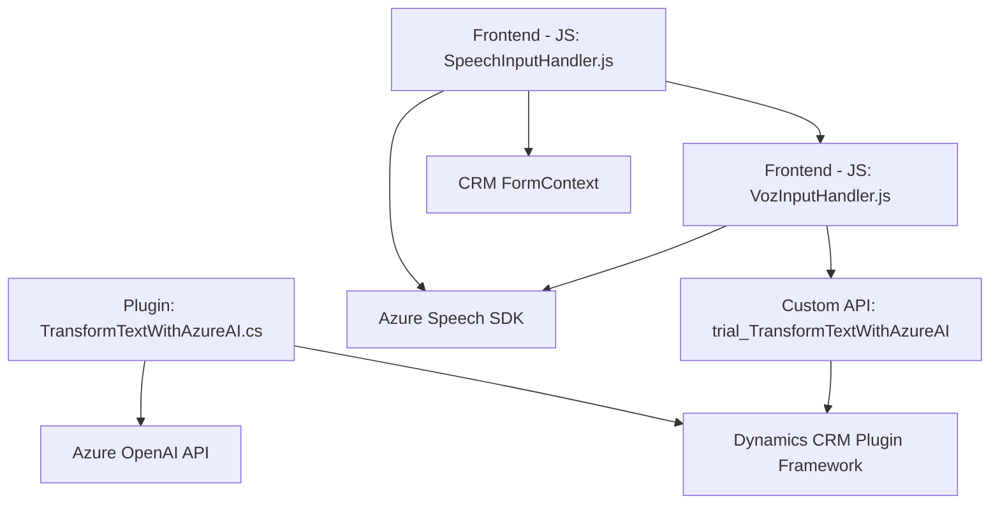

### Breve resumen técnico

Esta solución integra capacidades avanzadas de reconocimiento y síntesis de voz con un servicio CRM, utilizando **Azure Speech SDK** y **Azure OpenAI API**. Está organizada en tres capas:
1. **Frontend en JavaScript**: Procesos de voz en reconocimiento y síntesis orientados al usuario y al formulario.
2. **Plugins en C#**: Extensibilidad para Dynamics CRM, que transforma entradas con inteligencia artificial.
3. **Dependencias externas**: Usa servicios de Azure para voz y procesamiento de lenguaje natural.

---

### Descripción de arquitectura

La arquitectura tiene características de **microservicios** en la integración de servicios externos (Azure APIs). Sin embargo, se combina con un diseño basado en **plugins** propio de Dynamics CRM:
1. **Monolito extendido mediante APIs**: La solución utiliza el patrón de plugins en Dynamics CRM como punto central y dependencias orientadas a servicios específicos de Azure.
2. **Modularidad**: La lógica está separada entre procesamiento de frontend, interfaces API, y funciones backend en los plugins.
3. **Patrón Hexagonal para plugins**: Los plugins actúan como adaptadores entre Dynamics CRM y los servicios de Azure.

---

### Tecnologías usadas
1. **Frontend (JavaScript)**:
   - **Azure Speech SDK** mediante carga dinámica.
   - **Navegadores compatibles** para ejecutar el script como cliente en el CRM.
   - Dependencias internas del framework del CRM para manipular formularios (`formContext`).

2. **Backend (C#, Dynamics CRM)**:
   - **Dynamics CRM Plugin Framework** con la interfaz `IPlugin`.
   - **Azure OpenAI API** para procesamiento de lenguaje natural (GPT-based engine).
   - **Newtonsoft.Json.Linq** y `System.Net.Http` para manipulación de JSON y solicitudes HTTP.
   - Validación en `C#` para limpieza de propiedades orientadas a reglas estrictas de negocio para texto.

3. **Servicios externos**:
   - **Azure**:
     - **Azure Speech SDK** para voz.
     - **Azure OpenAI API** para procesamiento avanzado.
     - Gestión de claves y configuraciones regionales.

---

### Diagrama Mermaid **válido para GitHub Markdown**

---

### Conclusión final

La solución está diseñada para extender las capacidades de un sistema CRM (Dynamics CRM) mediante el uso de inteligencia artificial y reconocimiento de voz en los formularios de usuarios. Integra servicios externos de Azure para ofrecer una experiencia enriquecida, automatizando la interacción entre el usuario y el sistema, principalmente con datos transmitidos por voz o texto procesado.

La arquitectura del sistema es un híbrido:
- **Microservicios** en las integraciones con Azure APIs.
- **Monolito de plugins CRM** que actúa como punto central.
- Modularidad y un enfoque orientado a servicios en **backend** y **frontend** con Javascript.