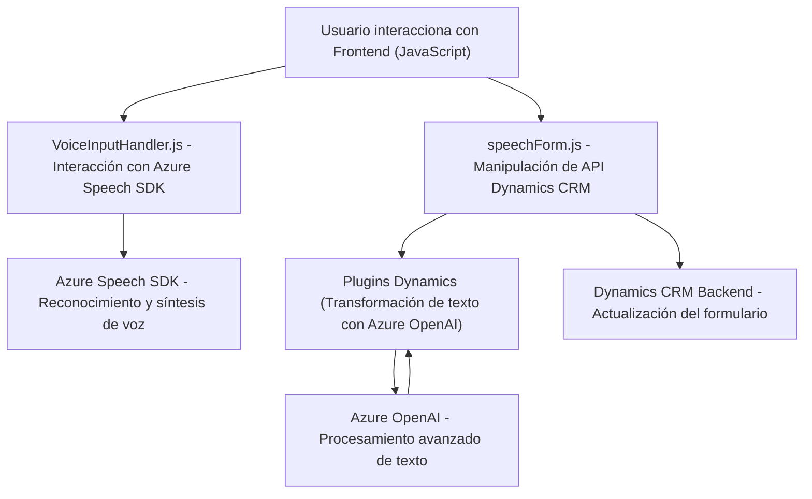

### Breve resumen técnico
El repositorio está estructurado para resolver varias funcionalidades relacionadas con la interacción de formularios en un sistema de Microsoft Dynamics CRM. Estas funcionalidades se integran con tecnologías externas como Azure Speech SDK y Azure OpenAI para manejar transcripción de voz y transformar texto en JSON. La naturaleza modular y las dependencias sugieren una arquitectura multifacética que cubre frontend (JS) y backend (plugins).

---

### Descripción de arquitectura
La solución representa una arquitectura híbrida centrada en:
1. **Frontend interactivo basado en voz**: configurado con Azure Speech SDK y manipulación dinámica de formularios mediante las API de Dynamics CRM usando JavaScript.
2. **Plugins de Dynamics CRM**: desarrollados en .NET para procesamiento lógico más avanzado e integración con Azure OpenAI.
3. **Capas distintivas**:
   - **Capa de presentación**: Implementada con JavaScript, interactúa con el usuario mediante voz y formularios.
   - **Capa de lógica empresarial**: En los plugins (.NET) manejando transformaciones textuales siguiendo reglas definidas.
   - **Capa de integración**: Integraciones hacia servicios externos como Azure Speech SDK y Azure OpenAI.

Se puede considerar una arquitectura **n-capas** debido a la clara segmentación entre frontend, lógica empresarial (plugins) e interactuación con servicios externos.

---

### Tecnologías usadas
1. **Frontend**:
   - **JavaScript**
   - **Azure Speech SDK**
   - **Dynamics CRM Web API**
2. **Backend/Plugins**:
   - **C#/.NET Framework**
   - **Microsoft Dynamics CRM SDK**
   - **Azure OpenAI**
   - Dependencias complementarias como `Newtonsoft.Json`, `System.Text.Json`.
3. **Patrones arquitectónicos usados**:
   - **Lazy Loading** (carga dinámica del SDK).
   - **Facade** (abstracta accesos complejos a funcionalidades externas).
   - **Programación orientada a eventos** (callbacks y promesas en JavaScript).
   - **Plugin pattern de Dynamics CRM** (evento `IPlugin` como ejecutor de lógica).

---

### Diagrama Mermaid válido para GitHub

---

### Conclusión final
La solución combina un frontend interactivo y un backend especializado; utiliza tecnologías modernas como Azure Speech SDK para accesibilidad y naturalidad en la entrada de datos, además de procesamiento avanzado de texto mediante Azure OpenAI. Su arquitectura basada en **n-capas** asegura una separación clara de responsabilidades y escalabilidad. Es ideal para sistemas actuales que demandan accesibilidad mejorada e interacción inteligente con usuarios. Sin embargo, el uso intensivo de servicios externos (Azure) implica dependencia y costos asociados que deben ser gestionados.