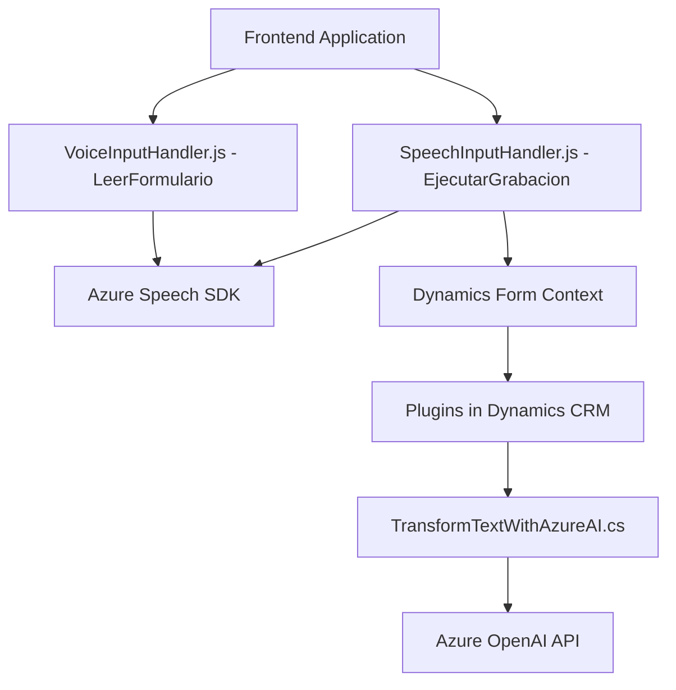

### Breve Resumen Técnico
El repositorio contiene componentes de un sistema que usa reconocimiento de voz y procesamiento semántico basado en tecnologías Azure (Speech SDK y OpenAI). Está diseñado para integrarse con Microsoft Dynamics 365, proporcionando funcionalidades como operación en formularios y transformación de texto semántico.

### Descripción de Arquitectura
Este sistema sigue una arquitectura híbrida entre un enfoque modular de programación, APIs externas y un patrón **event-driven** que responde a interacciones específicas. La solución está diseñada para ser extensible, integrando SDKs externos, APIs personalizadas y plugins de Dynamics CRM implementados en `.NET`.

### Tecnologías Usadas
1. **Frontend:**
   - **JavaScript:** Usado para integrar la funcionalidad del Azure Speech SDK y la lógica en formularios.
   - **Azure Speech SDK:** Para reconocimiento y síntesis de voz (incluyendo traducciones semánticas de texto).
   - Dependencias menores: Promesas `async/await`, Mapas de datos y manipulación de atributos.
   
2. **Backend:**
   - **Microsoft Dynamics CRM Plugins:** Implementados en C# con la interfaz `IPlugin`.
   - **Azure OpenAI API:** Para transformar texto según reglas predefinidas y generar JSON estructurado.
   - Dependencias: `System.Text.Json`, `Newtonsoft.Json`, `System.Net.Http`.

### Diagrama Mermaid Válido para GitHub

### Conclusión Final
Este sistema representa una arquitectura híbrida que combina una aplicación **Frontend modulada en JavaScript** con un **backend basado en plugins y APIs externas**. El frontend automatiza tareas utilizando servicios avanzados de Azure, mientras que los plugins potencian la capacidad dinámica de transformación de texto y su integración en Microsoft Dynamics CRM. La elección de patrones funcionales está alineada con los principios de modularidad y extensibilidad, permitiendo mantener un balance entre escalabilidad, adaptabilidad y eficiencia en procesamiento.