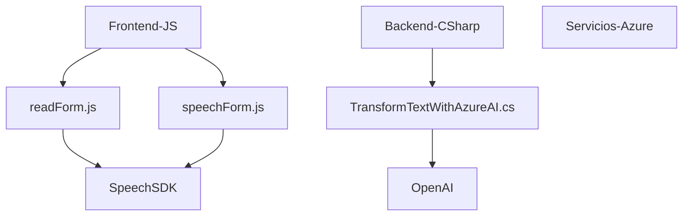

### Breve Resumen Técnico:
El repositorio contiene archivos que integran Azure Speech SDK y Azure OpenAI con Dynamics CRM para agregar funcionalidades avanzadas de voz y procesamiento de texto. En particular:
1. **Frontend:** Se detectan scripts de JavaScript para capturar la voz del usuario y sintetizarla desde o hacia un formulario interactivo.
2. **Plugins en Dynamics CRM:** Se utiliza C# para implementar lógica personalizada que transforma texto mediante APIs de IA, además de manipular datos directamente en la plataforma CRM.

### Descripción de Arquitectura:
La solución sigue una arquitectura híbrida formada por tres componentes:
1. **Frontend interactivo:** Está gestionado mediante JavaScript con integración dinámica de servicios de voz (Azure Speech SDK), ideal para un entorno interactivo de usuario.
2. **Backend y Plugins:** Complementa la funcionalidad mediante plugins en Dynamics CRM escritos en C#. Estos están orientados hacia manipulación de datos en la base de datos de CRM y el consumo de servicios externos como Azure OpenAI.
3. **Servicios externos:** Azure provee componentes clave como OpenAI y Speech SDK, utilizados para tareas específicas de procesamiento de texto, interpretación de voz y análisis semántico.

La arquitectura se puede clasificar como **n-capas**:
- **Capas Frontend:** Scripts que manejan entrada y salida del usuario.
- **Capas Backend:** Plugins en Dynamics CRM.
- **Capas de Servicios Externos:** APIs de Azure Speech y OpenAI para la inteligencia artificial.

Se adopta un **patrón de integración SDK/servicios** en toda la arquitectura.

### Tecnologías Usadas:
- **Frontend:** 
  - JavaScript.
  - Dynamics CRM SDK.
  - Azure Speech SDK.
- **Backend:** 
  - C# (Dynamics CRM Plugins con `Microsoft.Xrm.Sdk`).
  - Azure OpenAI (HTTP POST, JSON payload).
  - `Newtonsoft.Json` para manipulación de datos JSON.
- **Dependencias externas:** 
  - Azure Speech SDK (JS Browser Package).
  - Azure OpenAI.

### Diagrama Mermaid:

### Conclusión Final:
Esta solución integra procesamiento de voz (speech-to-text y text-to-speech) y manipulación de datos con Dynamics CRM usando una combinación de frontend en JavaScript y backend en C#. La arquitectura **n-capas** y los patrones de **servicios externos SDK/IA** garantizan funcionalidad descentralizada y adaptable. Es adecuada para entornos empresariales que requieren interacción automatizada y basada en inteligencia artificial con los usuarios.