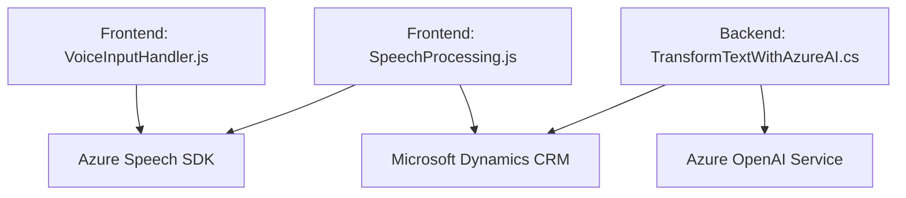

### Breve resumen técnico:
El repositorio define una solución híbrida de frontend y backend, integrada con servicios externos de Azure como Speech SDK y OpenAI Service. Permite la interacción entre formularios de Microsoft Dynamics CRM y funcionalidades avanzadas de voz y procesamiento de texto.

---

### Descripción de arquitectura:
1. **Arquitectura general:**  
   La solución usa una arquitectura de **n capas**:
   - **Frontend:** Implementación basada en JavaScript para el manejo de formularios y integración de Azure Speech SDK.
   - **Backend:** Un plugin (escrito en C#) destinado a ejecutarse dentro del contexto de Dynamics CRM, que realiza llamadas a Azure OpenAI para procesamiento avanzado de texto.

2. **Flujo:**  
   - El frontend se comunica con Azure Speech SDK para síntesis y reconocimiento de voz.  
   - Se procesan datos del formulario y se realizan llamadas a APIs externas y a Dynamics CRM.  
   - El backend ejecuta transformaciones basadas en reglas mediante OpenAI Service.

---

### Tecnologías usadas:
- **Frontend:**
  - **JavaScript:** Desarrollo modular y funcional para gestionar interacciones del formulario.
  - **Azure Speech SDK:** Servicios de síntesis y reconocimiento de voz.
- **Backend:**
  - **C#:** Implementación del plugin para Microsoft Dynamics CRM.
  - **Azure OpenAI Service:** Transformaciones y procesamiento avanzado de texto.
  - **Microsoft Dynamics CRM SDK:** Interacción con el modelo de datos del CRM.
  - Librerías estándar de .NET (`HttpClient`, `System.Text.Json`) y potencial uso de terceros (Newtonsoft.Json).
- **Patrones:**
  - **Integración-API externa:** Comunicación directa con Azure Speech SDK y OpenAI Service mediante REST.
  - **Responsabilidad única:** Código modular con funciones segmentadas por propósito específico.
  - **Adaptador:** Traducción de datos reconocidos en voz o texto al formato CRM.

---

### Dependencias o componentes externos:
- **Azure Speech SDK:** Para síntesis y transcripción de voz.
- **Azure OpenAI Service:** Procesamiento de texto utilizando GPT-4.
- **Microsoft Dynamics CRM SDK:** APIs para manipulación de datos del CRM.
- **Librerías estándar:** Utilizadas principalmente en el plugin (`HttpClient`, `JsonDocument`).
- **Hosting:** No detallado, pero se asume infraestructura cloud para ejecutar el código en Dynamics CRM o servicios web externos.

---

### Diagrama Mermaid válido para GitHub:

---

### Conclusión final:
La solución implementa una arquitectura de **n capas**, proporcionando interacción dinámica con formularios de Dynamics CRM mediante transcripción de voz y procesamiento avanzado con Azure OpenAI. Esto demuestra un diseño moderno que combina modularidad en el frontend y extensibilidad en el backend con integración directa a servicios cloud de Azure y Dynamics CRM. Es escalable, adaptable y enfocado en maximizar la experiencia del usuario con capacidades avanzadas de IA y voz.