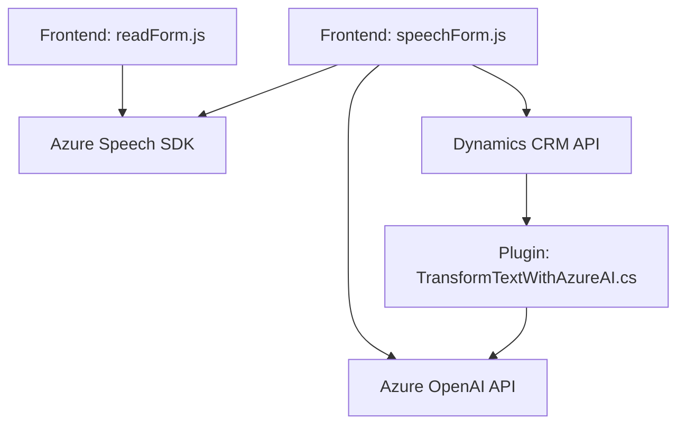

--- 
### Breve resumen técnico:
El repositorio incluye código para una solución orientada al manejo de voz y texto mediante el uso de servicios de Azure Cloud y la integración con Dynamics CRM. La solución tiene partes orientadas al frontend (JavaScript), manejo de lógica de voz/texto y APIs externas para inteligencia artificial mediante el uso de Azure OpenAI. También incluye un componente backend (plugin) en C# que opera como extensión para Dynamics CRM.

---

### Descripción de la arquitectura:
La aplicación tiene una arquitectura híbrida basada en capas. Se observa la siguiente estructura:
1. **Frontend**
   - JavaScript para captura de voz, síntesis de voz y manejo de formularios.
   - Tiene funciones individuales con separación clara de responsabilidades (ej.: carga de SDK, extracción/mapeo de datos de formularios y API calls).

2. **Backend**
   - Extensión de Dynamics CRM mediante el plugin.
   - Funciones encapsuladas para procesamiento de texto y comunicación con Azure OpenAI.
   - El plugin sigue un patrón típico de ejecución asíncrona en Dynamics, llamado solo durante eventos específicos.

### Tecnologías usadas:
1. **Frontend**: 
   - **Azure Speech SDK**: Reconocimiento de habla y síntesis de voz.
   - **JavaScript**: Desarrollo orientado a funciones individuales y dinámico (ej.: carga de scripts mediante DOM).
   - **Dynamics CRM (API)**: Obtención y manipulación de datos en formularios CRM.
   
2. **Backend**:
   - **C#**: Programación orientada a objetos usada para plugins extensibles en Dynamics.
   - **Azure OpenAI API**: Interacción con modelos como GPT para procesar texto.
   - **System.Net.Http** y **System.Text.Json**: Realizan solicitudes HTTP y procesan respuestas JSON para integraciones API.

### Dependencias o componentes externos:
- **Azure Speech SDK**: Para funcionalidades de síntesis y captura de voz.
- **Azure OpenAI API**: Para la estructuración y transformación de texto.
- **Microsoft Dynamics CRM SDK**: Framework central para la interacción con operaciones de entidad en Dynamics CRM.
- **NewtonSoft.Json**: Biblioteca especializada en serialización/deserialización JSON en .NET.

---

### Diagrama Mermaid:

---

### Conclusión Final:
La solución parece ser diseñada para una empresa que utiliza Dynamics CRM con funcionalidades extendidas mediante Azure AI y Speech SDK. La arquitectura es híbrida con algunos principios de capas entre frontend, APIs externas y backend, aprovechando los servicios de Azure para reconocimiento de voz y procesamiento avanzado de texto. 

**Fortalezas:**
- Modularización clara en frontend y backend.
- Uso de servicios avanzados como Azure Speech y Azure OpenAI.

**Oportunidades de mejora:**
- Seguridad en el manejo de claves API y credenciales (migrar a variables de entorno o servicio seguro).
- Mejor documentación para el mapeo entre formularios dinámicos y los procesos de voz.
    
En general, la solución está bien orientada a su propósito y utiliza patrones de integración que facilitan la comunicación entre servicios heterogéneos.