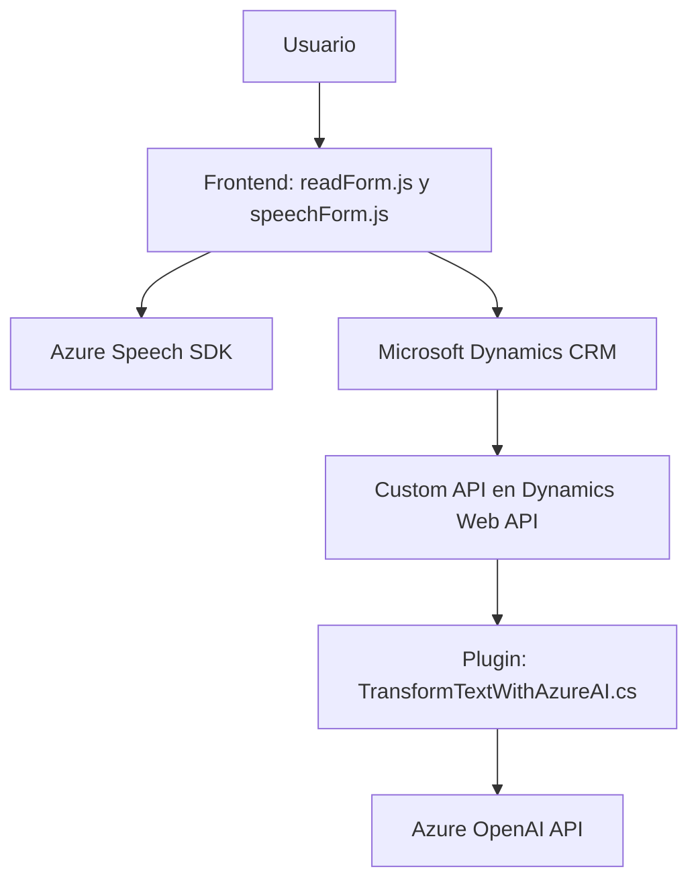

### Breve Resumen Técnico

Este repositorio describe una solución basada en una integración entre Microsoft Dynamics CRM y los servicios de Azure. Contiene dos archivos clave para el frontend, enfocados en la entrada y salida de voz en formularios utilizando el **Azure Speech SDK**. También incluye un plugin en .NET que extiende aún más la funcionalidad al conectarse al servicio de **Azure OpenAI API** para transformar texto en JSON estructurado. 

---

### Descripción de Arquitectura

Este sistema se puede dividir en **dos capas principales**: una capa de frontend que se ejecuta en el navegador y proporciona entrada/salida por voz utilizando el **Azure Speech SDK**, y una capa de backend que opera como un plugin directamente en el entorno de Dynamics CRM, gestionando la lógica avanzada de transformación de texto. 

La arquitectura general podría considerarse **Service-Oriented Architecture (SOA)** debido a la integración de servicios externos (Azure Speech SDK, OpenAI), y la interacción con Dynamics Web API sugiere un enfoque basado en **API-First**. 

La solución usa componentes modulares, donde las funciones están claramente separadas para tareas específicas, como procesamiento de audio, transformación de texto y actualización de datos en el CRM. También utiliza patrones como **Event-Driven Architecture**, **Factory** y **Middleware**.

---

### Tecnologías Usadas

1. **Frontend:**
   - Javascript.
   - **Azure Speech SDK**: Para entrada e interpretación de voz, así como síntesis de texto a audio.
   - **Microsoft Dynamics CRM SDK**: Para manipulación de formularios y atributos.
   - Async/Await y Promesas para procesamiento asíncrono.
   - Dynamics Web API para integración entre el frontend y cualquier API personalizada.

2. **Backend (Plugins):**
   - **C#/.NET Framework**: Para crear un plugin que se ejecuta dentro del contexto de Microsoft Dynamics CRM.
   - **Microsoft Dynamics SDK:** Clases como `IPlugin`, `IPluginExecutionContext`, `IOrganizationServiceFactory`.
   - **Azure OpenAI Service API** (GPT-4): Para transformación y procesamiento de texto.
   - **HTTP Requests** (System.Net.Http): Para conectarse a APIs web.
   - **JSON Manipulación** (System.Text.Json, Newtonsoft.Json): Para parseo y construcción de estructuras para la comunicación con APIs.

---

### Diagrama Mermaid **(Formato recomendado)**

---

### Conclusión Final

La solución en el repositorio implementa un sistema integral para procesar voz y texto en formularios de Microsoft Dynamics CRM. Utiliza tecnologías de front y back para manejar tareas específicas relacionadas con entrada y salida de voz y dinámicas basadas en contenido. 

La arquitectura es una combinación de **SOA** (por la integración con servicios externos como Azure), junto con el uso de patrones modernos como **Event-Driven Architecture.** La modularización en los scripts frontend y los métodos backend ofrecen facilidad de extensión y mantenimiento para futuros desarrollos. Basicamente, esta solución podría funcionar como un sistema accesible para proporcionar interacción por voz con formularios empresariales en tiempo real.