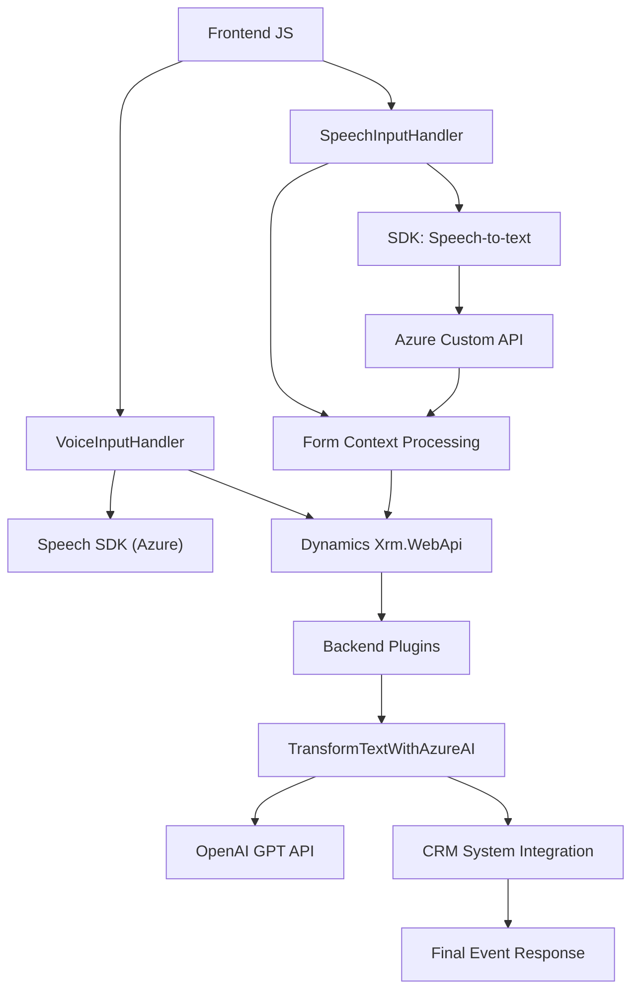

### Breve Resumen Técnico
El repositorio se centra en una solución integrada entre sistemas de Dynamics 365 y servicios de Azure, específicamente Azure Speech SDK y Azure OpenAI GPT. La funcionalidad abarca desde captura de voz y su procesamiento hasta la manipulación y transformación de texto para automatización en formularios.

### Descripción de Arquitectura
La arquitectura es una mezcla de **n capas** con funcionalidades distribuidas en:
1. **Frontend/JS:** Procesamiento de voz y manipulación client-side, usado para interacción directa con el usuario y integrando APIs externas como Azure Speech SDK y Dynamics Web API.
2. **Backend/Plugins:** Un plugin de Dynamics CRM se encarga de transformación avanzada del texto (utilizando Azure OpenAI GPT), ejecutándose en el servidor y siguiendo el ciclo de vida de los eventos de la plataforma Dynamics.

No hay evidencia de microservicios, ya que el sistema opera dentro del ecosistema monolítico de Dynamics CRM, pero hay una separación clara de responsabilidades entre cliente y servidor.

### Tecnologías Usadas
1. **Frontend:**
   - **Azure Speech SDK:** Para entrada, salida y procesamiento de voz.
   - **JavaScript:** Framework nativo del navegador para manipular formularios y gestiones dinámicas.
   - **Dynamics Xrm.WebApi:** Interfaz para manipular formularios en Dynamics 365.

2. **Backend:**
   - **Azure OpenAI GPT:** Modelo de IA para transformar texto.
   - **Microsoft Dynamics SDK:** Framework oficial para extensiones y plugins en Dynamics.
   - **HTTP REST APIs:** Comunicación desde el plugin al servicio Azure OpenAI.

3. **Patrones:**
   - **Modularidad:** Funciones separadas y específicas para tareas claras.
   - **Carga dinámica de dependencias:** SDK de Azure Speech cargado solo cuando es necesario.
   - **Solicitud-Respuesta:** Integración de múltiples servicios externos (Azure).

### Dependencias o Componentes Externos
1. **Azure Speech SDK:** Para reconocimiento y síntesis de voz.
2. **Azure OpenAI GPT:** Para transformar texto según reglas específicas.
3. **Microsoft Dynamics Xrm.WebApi:** Herramienta interna/externa para manipular formularios.

### Diagrama Mermaid para GitHub Markdown
A continuación, se representa el flujo funcional y lógico:

### Conclusión Final
La solución presentada tiene una arquitectura **n capas**, donde el frontend maneja entrada/salida de voz y datos, mientras que el backend transforma texto mediante servicios de IA en Azure. Se emplea una fuerte integración con APIs externas como Azure Speech SDK y OpenAI GPT, así como internas con Dynamics Web API para manipulación directa de formularios.

El código sigue estándares modularizados, carga dinámica de dependencias y buena separación de tareas específicas. Aunque opera dentro de un sistema monolítico (Dynamics), la integración con tecnologías modernas como Azure lo hace escalable y funcionalmente poderosa.