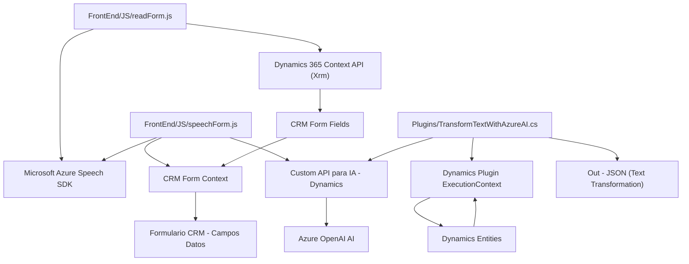

## Breve resumen técnico:
El repositorio presenta una solución integrada con Microsoft Dynamics CRM y servicios externos (Azure Speech SDK y Azure OpenAI) para la captura, procesamiento y salida de datos mediante reconocimiento de voz y manipulación de texto utilizando inteligencia artificial. Los archivos están estructurados para diferentes funcionalidades, desde el frontend (captura y síntesis de voz) hasta la lógica en backend (plugin para reglas de transformación de texto).

---

## Descripción de arquitectura:
La arquitectura combina:
- **Multicapa/N-capas** para hacer separación entre presentación y lógica empresarial.
- **Event-driven programming** en el frontend para gestionar eventos asincrónicos (p. ej., entrada de voz, sintaxis AI).
- **Plugin architecture** en el backend para integrar funcionalidades específicas en Microsoft Dynamics CRM.
- **Service-oriented architecture** al consumir servicios externos (Azure Speech SDK y Azure OpenAI) que encapsulan capacidades avanzadas como reconocimiento de voz, síntesis y transformación de texto.

Aunque hay algunos elementos modulares, la solución no llega a ser completamente **microservicios** ni usa patrones como hexagonal. Cumple mejor con una arquitectura híbrida basada en componentes integrados y servicios externos.

---

## Tecnologías usadas:
### Frontend:
1. **Azure Speech SDK**:
   - Para reconocimiento de voz y síntesis de texto a voz.
2. **JavaScript**:
   - Realiza manipulación de formularios y callbacks asincrónicos.
3. **Dynamics 365 Context API (Xrm)**:
   - Permite interacción con entidades del CRM como campos, atributos y formularios visibles.
4. **Custom Dynamics API**:
   - La API personalizada facilita comunicación entre el frontend y el backend interpretando datos mediante IA.

### Backend:
1. **Azure OpenAI API**:
   - Procesamiento avanzado de texto y estandarización en formato JSON.
2. **Microsoft Dynamics Plugin (IPlugin)**:
   - Extensión de lógica empresarial dentro del ecosistema CRM.
3. **JSON Libraries**:
   - Como Newtonsoft.Json para manejar estructuras avanzadas de JSON.

---

## Distribución de dependencias o componentes externos:
- **Azure Speech SDK**: Funcionalidades de reconocimiento y síntesis de voz en el frontend.
- **Azure services for OpenAI**: Maneja procesamiento y transformación de texto mediante inteligencia artificial.
- **Dynamics 365 Platform**: Base para integraciones con datos del sistema CRM (contexto, entidades, API personalizada).
- **Custom Dynamics API**: Puede incluir servicios adicionales que conectan IA con el sistema CRM.

---

## Diagrama Mermaid válido para GitHub Markdown:

---

## Conclusión final:
Este repositorio representa una solución para integrar Microsoft Dynamics CRM, reconocimiento de voz, síntesis de voz e inteligencia artificial. Aunque la arquitectura es predominantemente n-capas con componentes especializados (frontend, backend y APIs externas), la eficacia se apoya en patrones como SOA, Plugin architecture y en diseños basados en eventos para el frontend. Es un ejemplo robusto, aunque existe espacio para refactorizar las partes de integración en una estructura más modular que facilite escalabilidad y mantenimiento.