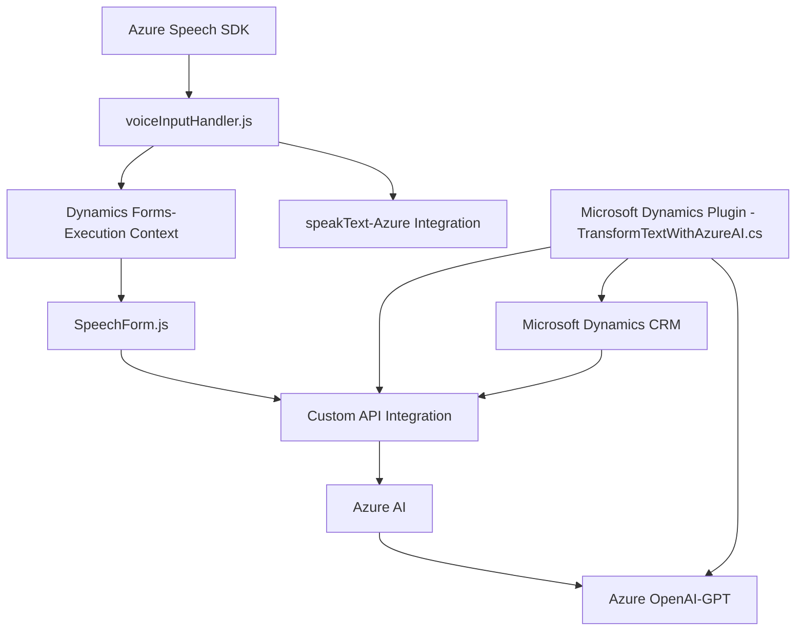

### Breve resumen técnico
Este repositorio contiene una solución que integra funcionalidades de interacción por voz y procesamiento avanzado de datos en un entorno de trabajo basado en formularios (Dynamics CRM). Está conformada principalmente por módulos de frontend en JavaScript que interactúan con SDKs y APIs externas (Azure Speech SDK y Azure OpenAI), y plugins de backend (implementados en C#) que extienden la funcionalidad de Dynamics CRM.

---

### Descripción de arquitectura
La arquitectura de la solución es híbrida y puede clasificarse como una **arquitectura en capas**, que combina:
- **Frontend dinámico**: Scripts en JavaScript ubicados en el contexto del navegador del cliente (Integración con Dynamics Formularios), organizados por módulos específicos.
- **Backend-based plugins** dentro de Dynamics CRM, que siguen el patrón **Plugin** tradicional (implementando `IPlugin`) y actúan como controladores sobre eventos empresariales. Estos plugins también funcionan como **clientes ligeros** que consumen APIs externas como Azure OpenAI.

Además, se observa el patrón de diseño **cliente-servicio**, dado que las aplicaciones utilizan servicios remotos (Azure Speech SDK y Azure OpenAI) para realizar tareas específicas como síntesis de voz y procesamiento de texto.

---

### Tecnologías utilizadas
1. **Frontend**:
   - **JavaScript**: Para manejar la lógica específica asociada al usuario, integrando con APIs y SDKs.
   - **Azure Speech SDK**: Realiza síntesis y transcripción de voz utilizando el servicio en la nube de Azure.
   - **Dynamics CRM Web API**: Interactúa con formularios del sistema CRM.
   - **Modularización**: Funciones separadas para realizar tareas específicas, promoviendo la reutilización.

2. **Backend**:
   - **C#**: Para implementar la lógica del plugin dentro del framework de Dynamics CRM.
   - **Microsoft Dynamics SDK**: Extensiones para integrar el plugin con el contexto de Dynamics CRM y bases de datos relacionadas.
   - **Azure OpenAI API**: Procesa y transforma texto mediante modelos GPT alojados en Azure.
   - **System.Net.Http**: Realiza solicitudes HTTP.
   - **JSON Handling Libraries**: `Newtonsoft.Json.Linq` y `System.Text.Json` para trabajar con datos JSON.

3. **Servicios utilizados**:
   - **Azure Speech SDK**
   - **Azure OpenAI**
   - **Dynamics CRM Web API**
   - **Microsoft SQL Server** (mencionado indirectamente).

---

### Diagrama Mermaid válido para GitHub Markdown

---

### Conclusión final
Este repositorio representa una solución mixta centrada en la interacción por voz y la manipulación de datos mediante inteligencia artificial. La arquitectura combina un frontend modular con capacidades extendidas para enfrentar dinámicas de usuario en formularios de Dynamics CRM y plugins personalizados en el backend para transformar datos. El uso de servicios externos como Azure Speech y Azure OpenAI proporciona flexibilidad y escalabilidad en las tareas de reconocimiento de voz y procesamiento de datos avanzados. La solución es un ejemplo de integración eficiente entre frontend, backend, y servicios externos.