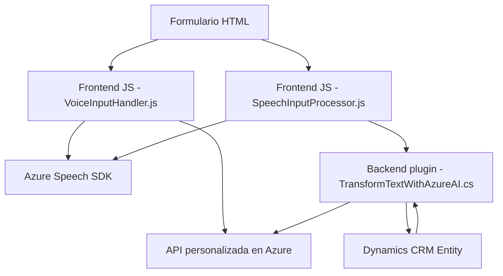

### Breve resumen técnico:

La estructura del repositorio refleja una solución *híbrida* que integra funcionalidades de frontend (interacción con usuarios y procesamiento en tiempo real) y backend (manipulación de datos y transformación usando servicios externos). Predomina la interacción con servicios basados en la nube, como Azure Speech SDK para entrada/salida de voz y Azure OpenAI para la transformación avanzada de texto. Las tecnologías están centralizadas en torno a Microsoft Dynamics CRM.

---

### Descripción de arquitectura:

La solución utiliza una arquitectura *modular de capas*:
1. **Frontend**: Incluye archivos JavaScript dedicados a la interacción con formularios y capacidades de voz.
   - Manejo de eventos y extracción de datos de vistas dinámicas.
   - Comunicación con servicios externos como Azure Speech SDK.
2. **Backend**: Implementado como plugins .NET que corren dentro de Dynamics CRM.
   - Ejecuta lógica de negocio y servicios avanzados mediante Azure OpenAI.
   - Plugins como una capa aislada que interactúan con el modelo de datos y servicios del sistema.

Patrones identificados:
- **MVC** en el frontend: Procesamiento de input (controlador), representación de datos en formularios (vista) y manipulación de atributos (modelo).
- **Carga dinámica**: Funciones cargan SDKs externos como scripts a través de callbacks.
- **Arquitectura orientada a eventos**: Los patrones del SDK de Dynamics CRM y funciones JavaScript reaccionan a triggers basados en eventos de usuario o API calls.

---

### Tecnologías usadas:

1. **Frontend**:
   - **JavaScript**: Para procesamiento de datos en tiempo real, manipulación del DOM y comunicación con APIs.
   - **Azure Speech SDK**: Implementación de capacidades de síntesis de voz y reconocimiento de lenguaje.

2. **Backend**:
   - **Microsoft Dynamics CRM**: Plataforma de negocio que utiliza plugins y servicios personalizados.
   - **Azure OpenAI API**: Integra inteligencia artificial para procesamiento text-to-JSON y transformación avanzada.
   - **C#/.NET Framework**: Desarrollo de plugins integrados con Dynamics CRM.
   - **System.Net.Http**: Realiza solicitudes HTTP para acceso a endpoints externos.

---

### Diagrama **Mermaid** válido para GitHub:

---

### Conclusión final:

El repositorio define una solución orientada a la interacción avanzada con formularios dinámicos, enriquecida mediante servicios en la nube de Microsoft Azure. Integra procesamiento en tiempo real de lenguaje junto con inteligencia artificial, optando por una arquitectura orientada a eventos y capas. Está optimizado para escenarios en los que la manipulación de formularios y la interacción por voz son requerimientos centrales, como en aplicaciones CRM. Sin embargo, aspectos como la gestión de credenciales y la dependencia directa de Azure podrían requerir ajustes respecto a seguridad y desacoplamiento para mayor flexibilidad.