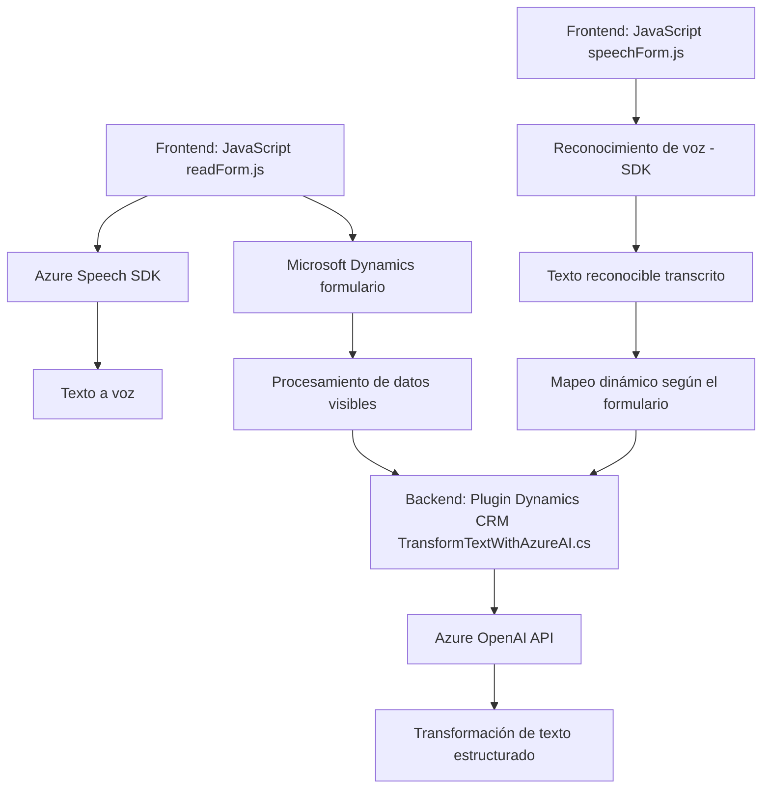

### Breve resumen técnico:
Este repositorio contiene tres archivos enfocados en la integración con Microsoft Azure, Dynamics CRM y Microsoft Intelligent APIs. Las funcionalidades clave permiten la interacción entre la interfaz de usuario (frontend escrito en JavaScript), un plugin en Dynamics CRM (C#), y servicios externos como Azure Speech SDK y Azure OpenAI. Las principales tareas se centran en el procesamiento y transformación de datos, tanto de texto hacia voz como de voz hacia texto, con adaptaciones específicas para formularios.

---

### Descripción de arquitectura:
La arquitectura se divide en tres capas principales:
1. **Frontend (JavaScript)**: Para captura de voz, lectura de formularios y activación de APIs para procesamiento avanzado.
   - Utiliza Azure Speech SDK para la síntesis y reconocimiento de voz.
   - Manejo asincrónico con promesas y módulos dinámicos.
   
2. **Backend (Plugin en C#)**: Lógica empresarial y procesamiento avanzado vía Dynamics CRM.
   - Usa el patrón de **Plugins** propio de Dynamics para integrar servicios de Azure OpenAI API.
   - Responsable de generar transformaciones de texto con fines analíticos en normativas específicas.

3. **Servicios externos (Azure Speech SDK & OpenAI API)**: Procesamiento avanzado.
   - Azure Speech SDK: Síntesis de voz y reconocimiento de habla.
   - Azure OpenAI API: Ofrece transformación basada en IA utilizando estándares como GPT.

La arquitectura general está construida sobre un patrón de **n capas**, donde las responsabilidades están separadas entre la presentación (Frontend), lógica de negocio (Plugin en el Backend) y servicios externos (Azure).

---

### Tecnologías y patrones usados:
1. **Tecnologías principales**:
   - Lenguajes: JavaScript y C#.
   - SDK: [Azure Speech SDK](https://aka.ms/csspeech/jsbrowserpackageraw) y Azure OpenAI API.
   - Frameworks: Dynamics CRM.
   - Módulos de HTTP (`System.Net.Http` para C#).

2. **Patrones arquitectónicos y diseño**:
   - **Modularidad funcional**: División del código con responsabilidades únicas.
   - **Desacoplamiento de implementación**: Separación entre la lógica de negocio (C# Plugin) y procesamiento en el frontend.
   - **Integración con SDK externo**: Uso dinámico del Azure Speech SDK y OpenAI API.
   - **Asynchronous Processing**: Implementación de promesas en JavaScript y llamadas HTTP asincrónicas en C#.

---

### Dependencias y componentes externos:
1. **Frontend**:
   - Azure Speech SDK (cargado dinámicamente).
   - Microsoft Dynamics contexto de formulario (`formContext`).

2. **Backend**:
   - Azure OpenAI API (procesamiento avanzado de texto).
   - Bibliotecas para manipulación HTTP (`System.Net.Http`) y JSON (`System.Text.Json`).

3. **Servicios externos**:
   - Azure Speech SDK: Para síntesis y reconocimiento de voz.
   - Azure OpenAI API: Para transformar estructuras de texto basadas en IA.

---

### Diagrama Mermaid:

---

### Conclusión final:
Este repositorio implementa una solución integral orientada a sistemas empresariales que utilizan Microsoft Dynamics CRM. La arquitectura se basa en **n capas**, separando frontend, backend y servicios externos para garantizar responsabilidades claras y desacoplamiento. Las tecnologías clave del repositorio, como Azure Speech SDK y Azure OpenAI API, demuestran un enfoque en habilitar interfaces avanzadas al usuario utilizando reconocimiento y síntesis de voz, así como transformación de datos con AI. Es una solución bien organizada y modular, capaz de escalar en entornos empresariales distribuidos.