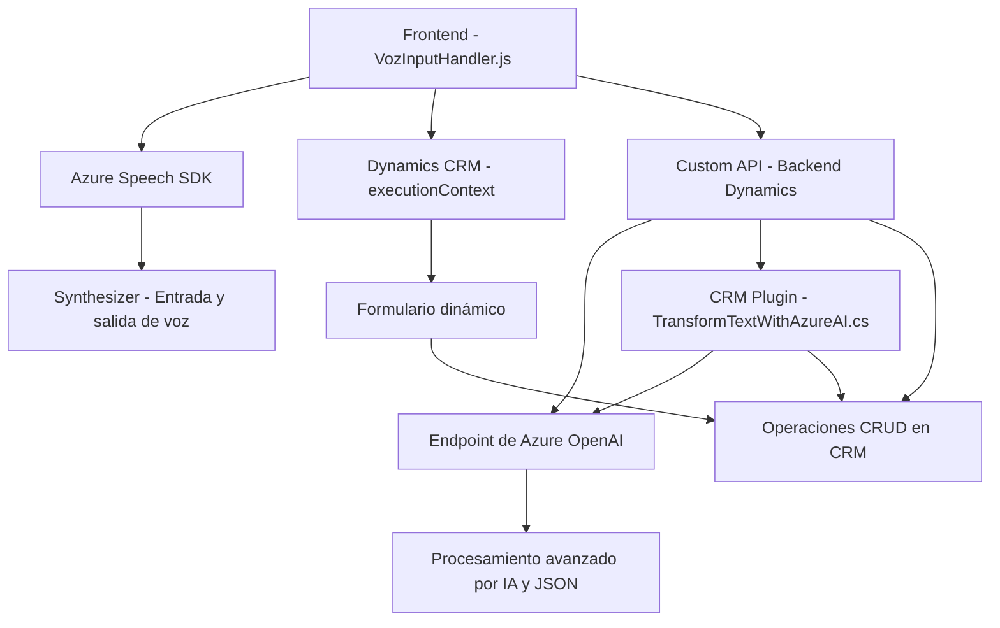

### Breve resumen técnico

El repositorio contiene componentes orientados a enriquecer un sistema CRM, posiblemente Dynamics 365, mediante integración con el **Azure Speech SDK** y **Azure OpenAI GPT**. Los archivos facilitados implementan funcionalidad de entrada y síntesis de voz, así como transformación de texto utilizando IA. Se aborda tanto lógica de frontend como backend mediante plugins y scripts.

---

### Descripción de arquitectura

El conjunto de archivos indica una **arquitectura híbrida basada en n capas**, donde:
1. **Frontend**: Contiene lógica de interacción en tiempo real con formularios (JavaScript). Aprovecha el Azure Speech SDK para mejorar la experiencia de usuario mediante entrada de voz y síntesis.
2. **Backend**: Implementa un **plugin basado en Dynamics CRM** que extiende la funcionalidad del sistema utilizando procesamiento de IA con **Azure OpenAI GPT**.

La interacción directa con servicios externos (Azure Speech y Azure OpenAI) sugiere un patrón de **arquitectura en capas con componentes acoplados a servicios externos**.

---

### Tecnologías usadas

1. **Frontend**:
   - **Azure Speech SDK**: Reconocimiento y síntesis de voz.
   - **Dynamics CRM**:
     - Manipulación del contexto `executionContext` en formularios.
     - Uso de `Xrm.WebApi` para llamadas a APIs personalizadas.
   - **JavaScript ES6+**: Modularización y manejo de callbacks/asíncronos.

2. **Backend**:
   - **C#** (en plugins).
   - **Azure OpenAI GPT**: Procesamiento de texto basado en IA.
   - **Dynamics CRM SDK**:
     - `Microsoft.Xrm.Sdk` para operaciones de plugin.
     - `Microsoft.Xrm.Sdk.Query` para consultas dinámicas.
   - **HTTP Client**: Comunicación con APIs externas.

3. **Patrones de diseño**:
   - **Facade**: Encapsulación del SDK de Azure Speech.
   - **Plugin-based Architecture**: Backend extendido en Dynamics CRM.
   - **Event-driven**: Manejo de callbacks en el SDK de voz en frontend.
   - **Helper Methods**: Separación lógica en funciones aisladas.

---

### Diagrama Mermaid válido para GitHub

---

### Conclusión final

El sistema presente en el repositorio combina soluciones de frontend y backend para extender la funcionalidad de un CRM, soportando interacción por voz y servicios de IA avanzados. La integración modular se basa en tecnologías específicas de Microsoft, como **Azure Speech SDK** y **Dynamics CRM SDK**, así como servicios de inteligencia artificial externos, como **Azure OpenAI GPT**.

Por tanto, la arquitectura se clasifica como **híbrida basada en arquitecturas en capas**, con una división explícita entre interfaz (frontend) y lógica de dominio (backend). Está pensada para entornos empresariales que requieren soluciones de automatización inteligente y funcionalidad extendida en sistemas CRM existentes.