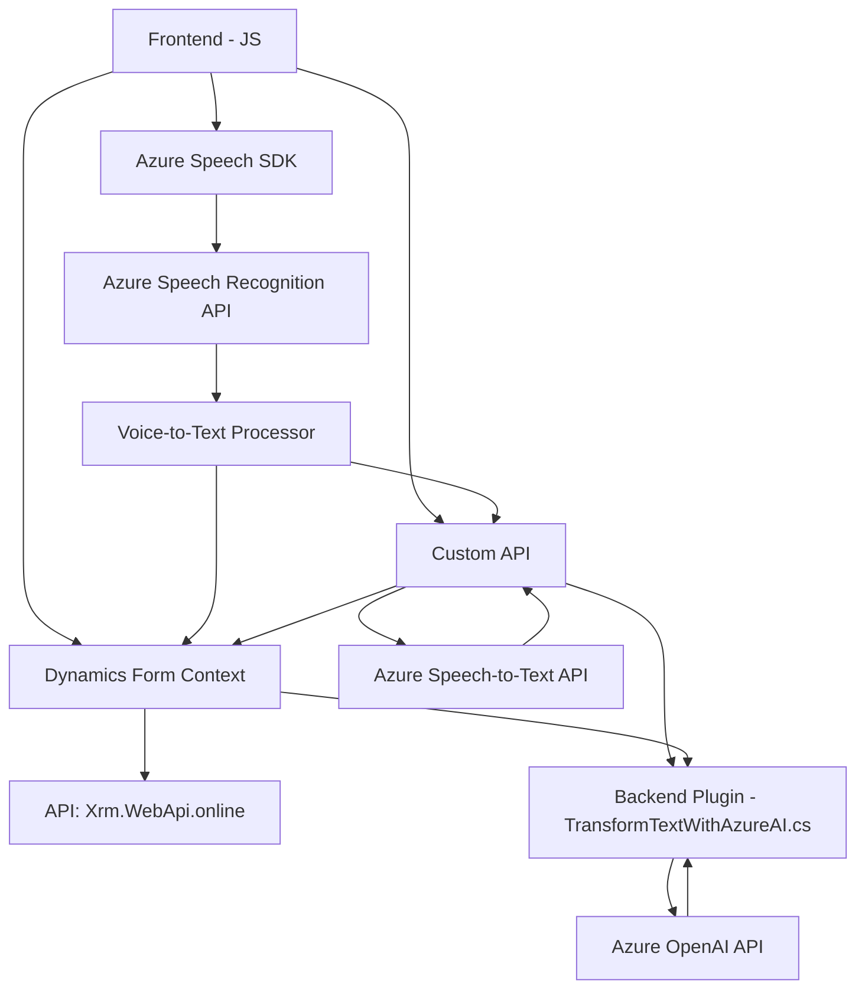

### Breve Resumen Técnico
El repositorio contiene una solución que integra funcionalidades frontend y backend con servicios de Azure para manejar interacción, procesamiento de voz, conversión de texto en voz y transformación de texto mediante IA. Los archivos analizados muestran un sistema que combina UI dinamismo y lógica externa en una arquitectura orientada a servicios.

---

### Descripción de Arquitectura
La arquitectura general parece ser un **n capas** orientada a servicios:
1. **Capa de presentación (frontend)**: Responsabilidades relacionadas con la interacción visual y funcionalidad directa del usuario (formularios, datos procesados por voz).
2. **Capa de lógica de negocio (backend)**: Incluye un plugin de Microsoft Dynamics CRM que delega el procesamiento avanzado de texto a Azure OpenAI.
3. **Capa de integración/externalización**: Utiliza SDKs y APIs como Azure Speech y OpenAI para implementar operaciones avanzadas fuera del sistema local.
4. **Dependencias externas**: Interacción con Dynamics CRM, Azure Cognitive Services y APIs personalizadas.

Además, muestra patrones de **event-driven architecture**, interacción con SDKs y API-centric design orientados a microservicios externos.

---

### Tecnologías Usadas
1. **Frontend (JavaScript)**:
   - Manejo de interacciones en formularios (procesamiento de datos visibles y entrada por voz).
   - Azure Speech SDK para conversión de texto a voz y reconocimiento de voz.
   - Microsoft Dynamics API (`Xrm.WebApi.online`) para interacción con CRM.

2. **Backend (.NET)**:
   - C#, Microsoft Dynamics CRM (plugin estándar basado en `IPlugin`) para integración con el CRM y manejo de workflows.
   - Azure OpenAI API para transformación de texto mediante IA.
   - `Newtonsoft.Json` y `System.Text.Json` para serialización y deserialización de datos JSON.
   - `System.Net.Http` para llamadas HTTP al servicio OpenAI.

3. **Patrones arquitectónicos**:
   - Patrón MVC-like en el frontend (modularización de controllers y acciones).
   - Plugin Design Pattern para integración estructurada en Dynamics CRM.
   - `SDK Integration`: Frontend [Azure Speech SDK] y Backend [Azure OpenAI].
   - **Microservicio externo**: Se aprovechan servicios externos (Azure OpenAI) vía peticiones HTTP.
   - Condicional loading en JS para la mejora de cargas de SDK.

---

### Diagrama Mermaid

---

### Conclusión Final
La solución muestra un marco bien estructurado para la integración entre frontend dinámicos, backends conectados a servicios de terceros y recursos externos en la nube. Presenta una combinación funcional de diversas tecnologías (Azure Speech SDK, Microsoft Dynamics CRM, y OpenAI), lo cual lo hace ideal para aplicaciones empresariales enriquecidas con capacidades inteligentes. La solución combina una arquitectura **n-capas** que maximiza la flexibilidad y reusabilidad de los componentes haciendo uso estratégico de servicios externos sin sobrecargar los propios recursos del sistema.