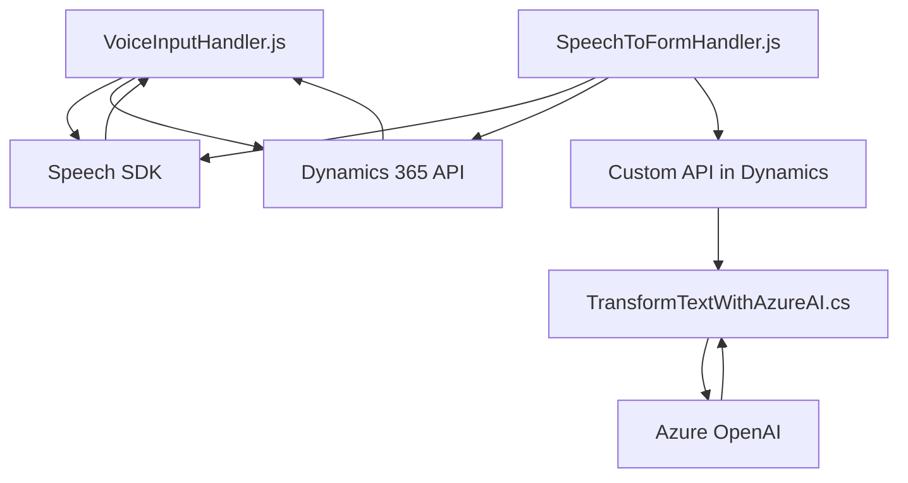

### Breve Resumen Técnico:
El repositorio contiene archivos que implementan funcionalidades para integrar reconocimiento de voz y síntesis de texto, ejecutando acciones sobre formularios en Dynamics 365 CRM. Utiliza Azure Speech Services y Azure OpenAI para manejar flujos de entrada y salida de voz, transformar texto y aplicar valores a formularios dinámicamente. El código del repositorio muestra un alto grado de modularización y una orientación hacia la integración con APIs externas.

---

### Descripción de la Arquitectura:
La solución representa una arquitectura **n capas** con un estilo distribuido, donde:
1. **Frontend/JS** contiene scripts interactivos que ejecutan reconocimiento de voz y síntesis de texto. Las interacciones se llevan a cabo utilizando el SDK de Speech de Azure y APIs de Dynamics CRM.
2. **Plugins** contienen lógica del lado servidor, como la transformación de texto mediante Azure OpenAI, implementada según el patrón **plugin design** de Dynamics CRM.
3. **Patrón de integración API**: La comunicación entre las capas ocurre mediante llamadas a servicios externos (Azure Speech Services y Azure OpenAI) y APIs personalizadas en Dynamics CRM.

El sistema opera como una capa de integración con servicios externos, procesando la entrada de voz/forma textual y aplicándola a formularios dinámicos. Resalta la alta **modularización**, con funciones bien aisladas para manejar diferentes aspectos del flujo.

---

### Tecnologías Usadas:
1. **Frontend (JS)**:
   - **Azure SDKs**:
     - Azure Speech SDK para reconocimiento de voz y síntesis de texto.
   - **Dynamics CRM API** (`Xrm.WebApi`) para manejo de formularios y registros.
   - Manipulación DOM y lógica de sincronización en los formularios.

2. **Backend (C#)**:
   - **Microsoft Dynamics SDK**:
     - Framework de plugins y contexto de datos del CRM.
   - **Azure OpenAI Service** para transformación de texto.
   - **System.Net.Http** para llamadas HTTP externas.
   - Procesamiento de datos con `System.Text.Json`.

3. **Patrones Arquitectónicos**:
   - Modularización en funciones claras (JS) y métodos (C#).
   - Integración con APIs externas (Speech SDK, OpenAI).
   - Plugin-based Design para integrar funcionalidades con Dynamics CRM.
   - Carga dinámica de recursos (ej. Speech SDK).
   - API Gateway para centralizar procesamiento en Dynamics.

---

### Diagrama Mermaid:
El siguiente diagrama muestra la interacción básica entre componentes en el repositorio:

### Explicación del Diagrama:
- El componente **VoiceInputHandler.js** gestiona principalmente la síntesis de texto en voz y recopila datos del formulario utilizando **Speech SDK** y los APIs de **Dynamics 365**.
- El componente **SpeechToFormHandler.js** capta entrada de voz, procesa transcripciones, normaliza datos y aplica valores a formularios del CRM interactuando con **Speech SDK**, APIs de CRM, y una API personalizada (**Custom API**) alojada posiblemente en Dynamics CRM.
- La API personalizada delega el procesamiento final a un **plugin de Dynamics CRM** implementado en C# (**TransformTextWithAzureAI.cs**) que interactúa con **Azure OpenAI** para la transformación del texto.

---

### Conclusión Final:
El repositorio representa una solución **integral para entrada y salida de voz aplicada a formularios en Dynamics 365 CRM**. Es una arquitectura **n capas** con elementos de integración API, modularización y componente backend dinámico basado en plugins de Dynamics CRM. Utiliza poderosas herramientas de Azure (Speech Services y OpenAI) para sintetizar y transformar texto. Es una arquitectura robusta y extensible para escenarios centrados en automatización y procesamiento de datos basados en voz. Algunas dependencias como la gestión de claves API pueden mejorarse implementando mejores prácticas de seguridad.