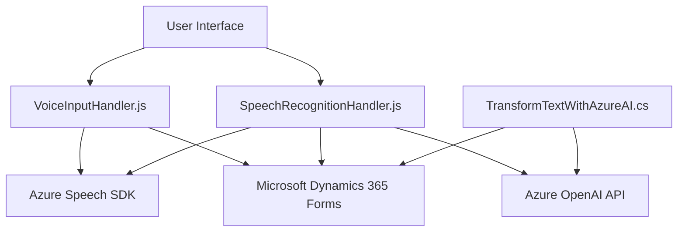

### Breve Resumen Técnico

Este repositorio combina funcionalidades que implementan integraciones entre Dynamics 365, Azure Speech SDK y Azure OpenAI, utilizando una mezcla de JavaScript para el frontend y C# para backend plugin en Dynamics CRM.  
La solución permite entrada y salida de voz y texto, actualización dinámica de formularios y procesamiento de datos basado en Inteligencia Artificial.

---

### Descripción de Arquitectura

1. **Tipo de Solución**:  
   Este repositorio apunta hacia una solución híbrida que integra funcionalidades de un **frontend** basado en JavaScript con un backend construido para **Microsoft Dynamics CRM** mediante un plugin en C#. La solución también aprovecha servicios de nube como el **Azure Speech SDK** y **Azure OpenAI API** para entrada/salida de voz y procesamiento avanzado de texto.

2. **Arquitectura**:  
   - **N Capas**: La solución tiene diferentes responsabilidades claramente separadas (frontend para interacción con usuarios, lógica en plugins y datos en formularios de Dynamics CRM).  
   - Uso de **Integración orientada a servicios**: Implementa comunicación con APIs externas (Azure AI y Speech SDK) para lógica avanzada de voz y texto.  
   - **Plugin-Based Architecture**: Implementación de `IPlugin` en el backend sigue el diseño estándar de plugins de Dynamics 365.  

3. **Patrones**:  
   - **Modular Design**: Cada archivo está organizado en funciones autónomas que definen una alta cohesión y bajo acoplamiento.  
   - **Facade pattern** para encapsular puntos de entrada claros en el frontend y el backend.  
   - **Proxy Pattern**: Implementado en la intermediación entre los servicios de Dynamics y los servicios externos como Azure AI.  
   - **Asincronía**: Uso extensivo de funciones `async/await` y callbacks reflejan un diseño moderno que prioriza operaciones no bloqueantes.  

4. **Dependencias**:
   - **Azure Speech SDK** para entrada y síntesis de voz en los archivos frontend.  
   - **Newtonsoft.Json** y **System.Net.Http** en el plugin backend para manejo de solicitudes REST y procesamiento de datos JSON.  
   - Integración con APIs de Dynamics 365 (`Xrm.WebApi.online.execute` y `Microsoft.Xrm.Sdk`).

---

### Tecnologías Usadas

1. **Frontend (JavaScript)**:  
   - Lenguaje principal: **JavaScript ES6**.  
   - Integración con **Microsoft Dynamics 365** para manipulación de formularios.  
   - Servicios de voz: **Azure Speech SDK**.  
   - Uso de `async/await` para operaciones asincrónicas.    

2. **Backend (C#)**:  
   - Lenguaje principal: **C# 10** (basado en el framework .NET Core).  
   - **Microsoft Dynamics SDK** para desarrollar plugins en la plataforma.  
   - REST y comunicación HTTP por **System.Net.Http**.  
   - JSON Parsing por **Newtonsoft.Json** o `System.Text.Json`.  
   - Uso de **Azure OpenAI** para transformación textual inteligente.

---

### Diagrama Mermaid **100 % compatible con GitHub Markdown**

---

### Conclusión Final

La solución implementada en el repositorio es una integración híbrida centrada en la conexión entre **Microsoft Dynamics 365** y las capacidades avanzadas de **Azure AI** (OpenAI & Speech SDK). La arquitectura usa un enfoque modular y de encapsulación, con una base de N capas que divide claramente responsabilidades entre frontend, servicios de terceros y lógica backend.

La elección de tecnologías y patrones asegura escalabilidad, facilidad de mantenimiento y adaptabilidad para futuras integraciones. Ideal para proyectos de automatización empresarial con el uso de voz y procesamiento de lenguaje natural.