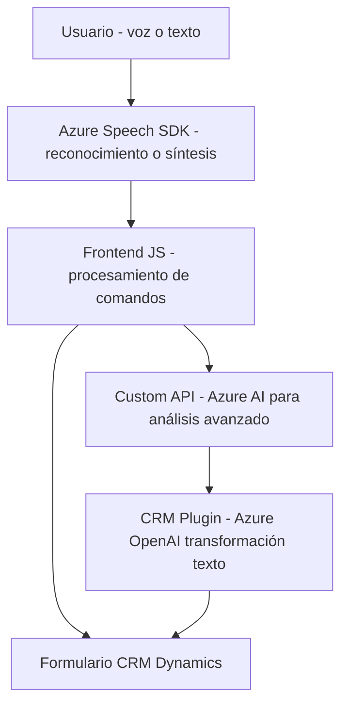

### Análisis Técnico

#### Breve Resumen Técnico:
Este repositorio claramente se orienta al desarrollo de una solución que integra servicios de voz (asistida por inteligencia artificial) con aplicaciones empresariales, específicamente **Microsoft Dynamics CRM**. Está compuesto por tres elementos principales:
1. **Frontend en JavaScript**: Encargado de manejar la voz del usuario (sintetización y reconocimiento) mediante el SDK de Azure Speech y actualizar formularios CRM.
2. **Backend en C#**: Contiene un plugin para Dynamics CRM que utiliza Azure OpenAI para transformar el texto enviado a un formato estructurado.
3. **Dependencias Externas**: Incluyen servicios como Azure Speech SDK y Azure OpenAI, además de librerías internas de Dynamics CRM.

---

#### Descripción de Arquitectura:
- **Tipo de Solución**: 
  - Es una **aplicación híbrida** orientada a la integración de servicios de inteligencia artificial (reconocimiento y síntesis de voz) con un sistema CRM (Dynamics 365). Combina lógica del frontend para el manejo de datos en tiempo real y lógica del backend ejecutada como plugins dentro del ecosistema CRM.

- **Arquitectura**:
  - **N Capas**: (Frontend, integración lógica, y CRM).
  - **Monolítica extendida**: Si bien la solución está fragmentada entre frontend y backend, sigue un modelo basado en plugins con fuerte acoplamiento con Dynamics, que la encasilla como monolítica en esencia. 
  - **Integración con servicios externos**: Uso de APIs y SDKs como componentes esenciales para el funcionamiento.

---

#### Tecnologías Usadas:
1. **Frontend**:
   - **Librerías Externas**:
     - Azure Speech SDK.
     - `Xrm.WebAPI.online` para conectarse al CRM.
     - DOM y JavaScript nativo.
   - **Patrones**:
     - Modularización por funciones.
     - Adaptador (para mapeo del texto a campos).
     - Asynchronous Workflow (a través de `promises` y `callbacks`).
     - SDK Loading (carga dinámica).

2. **Backend**:
   - Lenguaje: C#.
   - Framework: Dynamics CRM Plugin Framework (`IPlugin` interface).
   - Dependencias:
     - Azure OpenAI Service para procesamiento avanzado de texto.
     - `Newtonsoft.Json.Linq` para manipulación JSON.
     - `System.Net.Http` para peticiones HTTP.
   - **Patrones**:
     - Plugin CRM.
     - DTO para manejo de solicitudes y respuestas API.
     - Desacoplamiento lógico mediante APIs externas.

---

#### Dependencias o Componentes Externos:
- **Azure Speech SDK**:
  - Manejo de reconocimiento y síntesis de voz.
  - Carga dinámica en frontend con manejo de errores.
- **Azure OpenAI Service**:
  - Transformación avanzada de texto en el backend.
- **Dynamics 365 SDK `Xrm.WebAPI.online`**:
  - Interacción directa entre el frontend y el modelo de datos CRM.
- **Librerías comunes de manipulación**:
  - JSON serialization/deserialization (Newtonsoft y System.Text.Json).
  - Manejo de HTTP con `System.Net.Http`.

---

#### Diagrama Mermaid:

---

#### Conclusión Final:
El repositorio define una solución sólida y extensible que integra servicios de inteligencia artificial con sistemas empresariales como Dynamics CRM. Los principales beneficios de esta arquitectura incluyen modularidad, integración dinámica con SDKs externos, y capacidad de escalar procesos IA avanzados. Sin embargo, ciertas partes presentan lógica redundante que podría optimizarse para mejorar la eficiencia en tiempo de ejecución y mantener la consistencia del código. La dependencia directa de servicios como Azure OpenAI puede ser un punto crítico de seguridad y estabilidad, por lo que se recomienda manejar las claves y configuraciones con especial cuidado.