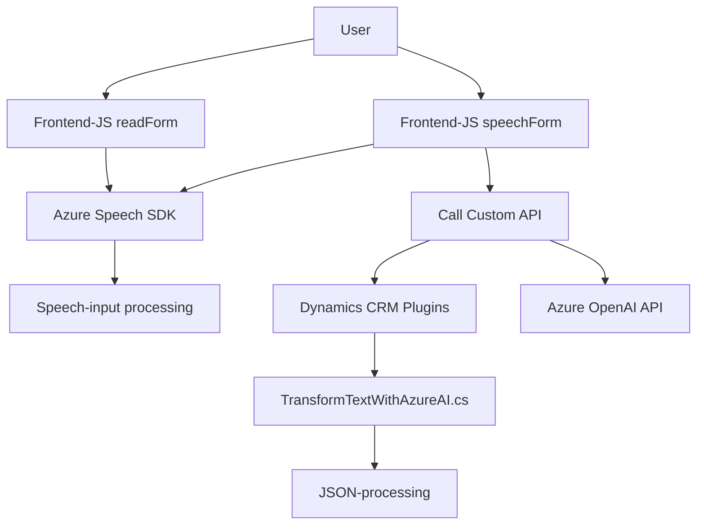

### Resumen técnico
El repositorio apunta a una solución híbrida que integra **frontend**, **backend (plugin para Dynamics CRM)** y servicios externos como Azure Speech SDK y Azure OpenAI API. Está orientado al ecosistema Dynamics CRM y a mejorar la accesibilidad y automatización mediante procesamiento de voz/transcripción, transformación de texto en JSON estructurados, e integración con IA.

---

### Descripción de arquitectura
#### 1. **Frontend**:
   - **Componentes principales**:
     - `readForm.js`: Extrae datos visibles de formularios del cliente mediante JavaScript y hace uso de síntesis de voz mediante Azure Speech SDK.
     - `speechForm.js`: Captura audio, procesa transcripciones vía Azure Speech SDK e interactúa con APIs externas y formularios dinámicos en el cliente para autocompletado o procesos manuales.

#### 2. **Backend (plugin)**:
   - Implementación en Dynamics CRM **Microsoft.Xrm.Sdk**.
   - Plugin `TransformTextWithAzureAI.cs` integrado de forma directa con la API de Dynamics CRM mediante `IPlugin`. Utiliza servicios de Azure OpenAI API para transformación avanzada de texto en estructura JSON modelada.

#### Tipo de arquitectura:
   - **Frontend**:
     - Arquitectura modular basada en funciones individuales (principio de responsabilidad única).
     - Lógica cliente para integrarse con **Azure Speech SDK** y recolectar/transcribir voz.
   - **Backend**:
     - Arquitectura **plugin-driven**, específicamente diseñada para ser ejecutada en eventos del sistema Dynamics CRM (asociado al patrón de programación orientado a eventos).
   - **General**:
     - La solución sigue una **arquitectura servida por capas**, donde el frontend, backend y servicios externos tienen roles bien definidos.
     - Existe una **microarquitectura orientada a microservicios**, con el uso de APIs separadas (Azure Speech/AI).

---

### Tecnologías usadas
1. **Frontend**:
   - **JavaScript**: Base para la lógica del cliente.
   - **Azure Speech SDK**: Manejo de síntesis de voz y transcripción.
   - **Dynamics CRM Web API**: Integración para manejar formularios y entidades.
   - **DOM API**: Crear elementos dinámicos del frontend.

2. **Backend**:
   - **C# y .NET Framework**: Implementación del plugin Dynamics CRM.
   - **Azure OpenAI API**: Transformación de texto en JSON con reglas específicas.
   - **Microsoft Dynamics CRM SDK**: Para interacciones con elementos del sistema CRM (`OrganizationService`, `PluginExecutionContext`).

3. **Dependencias Externas**:
   - **Azure Speech SDK** (frontend).
   - **Azure OpenAI API** (backend).

4. **Patrones de diseño**:
   - Modularidad (frontend + backend).
   - Integración de proveedor externo (Azure Speech SDK y OpenAI API).
   - Asincronía mediante Promesas (JS) y controladores asincrónicos en .NET.

---

### Diagrama Mermaid

---

### Conclusión final
El repositorio presenta una solución híbrida orientada a accesibilidad y procesamiento de datos mediante voz (frontend) y transformación avanzada (backend). La integración con Azure Speech SDK y Azure OpenAI API permite delegar tareas complejas de síntesis y transformación a servicios externos, mejorando la escalabilidad y separación de responsabilidades.

#### Ventajas:
- **Modularidad**: Cada componente está diseñado con roles bien definidos.
- **Escalabilidad**: Al integrar servicios externos, puede manejar cargas mayores manteniendo complejidad reducida en el sistema nativo.
- **Accesibilidad**: Facilita interacción a través de voz y transcripciones dinámicas.

#### Potenciales áreas de mejora:
- **Seguridad**: Claves API deben gestionarse mejor mediante tecnologías como Azure Key Vault.
- **Manejo de errores asincrónicos**: Implementar estrategias de fallback robustas para llamadas a APIs externas que puedan fallar.