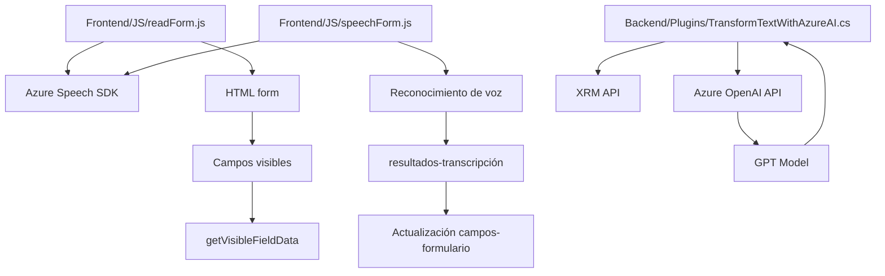

# Análisis técnico del sistema basado en los archivos proporcionados

## Resumen técnico
El primer archivo (`readForm.js`) implementa funcionalidades para leer datos de formularios y convertirlos en texto hablado utilizando Azure Speech SDK, mientras que el segundo (`speechForm.js`) integra reconocimiento de voz para capturar datos hablados y aplicarlos a campos de formularios con interacción avanzada. El tercer archivo (`TransformTextWithAzureAI.cs`) es un plugin para Dynamics CRM que utiliza Azure OpenAI para transformar y estructurar texto utilizando GPT.

Estos archivos forman parte de una solución que combina procesamiento de formularios, síntesis de voz, reconocimiento de voz e inteligencia artificial mediante la integración con servicios de Microsoft Azure.

---

### Descripción de la arquitectura
La solución sigue una arquitectura de **n capas**:
1. **Capa de presentación**: 
   - Repositorio estructurado con componentes de frontend (`readForm.js`, `speechForm.js`) que actúan en el navegador.
   - Funciones de interacción con formularios (lectura y escritura).

2. **Capa lógica de negocio**:
   - Procesamiento lógico para transformar información de formulario (normalización de datos, modelos de reconocimiento de voz y texto).
   - Mapeo de entrada a campo mediante funciones dedicadas (`applyValueToField` y similares).

3. **Capa de integración con servicios externos**:
   - SDKs y API de Microsoft Azure integrados en el frontend y en el backend.
   - Comunicación directa con servicios Azure Speech y Azure OpenAI.

4. **Capa de datos**:
   - La capa de almacenamiento no se describe en detalle, pero se deduce que los datos procesados interactúan principalmente con las entidades de Dynamics CRM.

### Tecnologías empleadas
1. **Frontend**:
   - JavaScript: Base del frontend para procesamiento de formularios y entrada de voz.  
   - Azure Speech SDK: Implementación dinámica para síntesis y reconocimiento de voz.

2. **Backend**:
   - C#: Desarrollo del plugin para Dynamics CRM.
   - Microsoft Dynamics SDK: Para manejar interacción CRM.
   - Azure OpenAI: Servicios de inteligencia artificial y procesamiento de lenguaje natural.

3. **Integración**:
   - APIs REST a través de HTTP: Usadas para interactuar con Azure OpenAI.
   - Servicios personalizados en Dynamics CRM.

### Patrones de diseño
1. **Event-driven programming**: Los SDK de Azure dependen de eventos de entrada (voz, carga del SDK).
2. **Dependency Injection**: Carga dinámica de dependencias como Azure Speech SDK y APIs personalizadas.
3. **Modular Design**: Código organizado en funciones independientes y reutilizables.
4. **Plugin Design Pattern**: Extensiones en Dynamics CRM implementadas como plugins, habitual en soluciones empresariales de Microsoft.

---

### Dependencias o componentes externos
1. **Azure Speech SDK**: Para síntesis y transcripción de voz, cargado dinámicamente en los archivos JavaScript desde un CDN.
2. **Azure OpenAI API (GPT Model)**: Integrado en el plugin para procesamiento avanzado de texto.
3. **Dynamics CRM Web API (Xrm.WebApi)**: Operaciones CRUD sobre entidades del sistema.
4. **Custom APIs en CRM**:
   - Procesamiento adicional basado en Azure AI.

---

### Diagrama **Mermaid**

---

### Conclusión final
La solución presentada combina tecnologías avanzadas (Azure Speech y OpenAI) con integración en Microsoft Dynamics CRM para crear un sistema robusto de interacción entre usuarios y formularios utilizando reconocimiento y generación de voz, así como transformación de textos mediante inteligencia artificial. El diseño sigue principios claros de modularidad y extensibilidad mediante el uso de plugins y APIs. Es adecuada para entornos corporativos que requieran automatización con soporte multilingüe y AI.