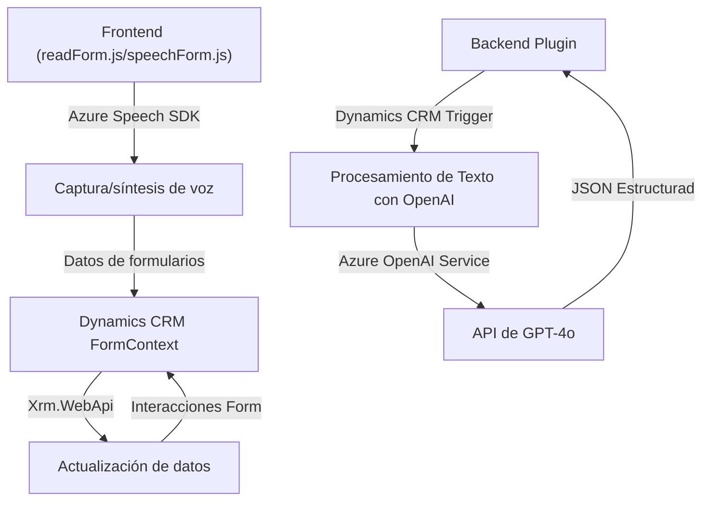

### Breve resumen técnico
El repositorio presentado incluye tres componentes principales integrados con tecnologías como Azure Speech SDK, Dynamics 365, y Azure OpenAI. Los archivos `readForm.js` y `speechForm.js` se utilizan en la interfaz (frontend) de Dynamics 365 para interacción con formularios y la captura de voz, mientras que el plugin `TransformTextWithAzureAI.cs` se ejecuta en el backend, integrando lógica personalizada con la API de Azure OpenAI para procesamiento avanzado.

---

### Descripción de arquitectura
1. **Tipo de solución**: El proyecto incluye una **aplicación de frontend orientada a Dynamics 365** con interacción a través de voz y backend integrado vía **plugins de Dynamics CRM**.
2. **Arquitectura global**: 
   - **Multicapa (n capas)**:
     - **Capa frontend**: JavaScript interactúa con formularios de Dynamics y servicios externos como el Azure Speech SDK.
     - **Capa backend**: C# Plugins están integrados con Dynamics 365 y Azure OpenAI.
   - Uso de servicios externos como SDKs y APIs añade características de estilo **event-driven architecture** y dependencia a servicios de nube.
3. **Interacciones clave**:
   - El frontend captura datos del usuario (voz y texto) y los procesa.
   - En el backend, se utiliza un plugin para transformar texto mediante la API de Azure OpenAI antes de asignar datos al modelo correspondiente de Dynamics CRM.

---

### Tecnologías usadas
1. **Frontend**:
   - **Azure Speech SDK (JavaScript)**: Reconocimiento y síntesis de voz.
   - **Dynamics CRM JavaScript SDK (Xrm.WebApi)**: Manipulación de formularios y datos en Dynamics 365.
   - Promesas y programación asincrónica.
   - Adopción de patrones como Modularidad y Adapter para normalización de datos.
2. **Backend**:
   - **Microsoft Dynamics 365 SDK**: Implementación de plugins para la plataforma CRM.
   - **Azure OpenAI Service**: Procesamiento avanzado de texto vía GPT-4o.
   - **Newtonsoft.Json / System.Text.Json**: Interpretación y manipulación de data en JSON.
   - **HTTP Client**: Llamadas API externas hacia Azure OpenAI.
3. **Patrones observados**:
   - **Facade**: Simplificación de SDKs mediante funciones encapsuladas.
   - **Modularidad**: Separación de responsabilidades.
   - **Event-driven architecture**: Respuesta basada en eventos de formulario y flujo asincrónico de datos.

---

### Diagrama Mermaid

---

### Conclusión Final
El repositorio implementa una solución técnicamente sólida y bien estructurada orientada hacia una integración con Microsoft Dynamics 365. Su arquitectura de **n capas** utiliza inteligencia artificial (Azure Speech SDK y Azure OpenAI) para habilitar captura de voz y procesamiento avanzado de datos, representando potentes capacidades de automatización de procesos. La separación de las responsabilidades frontend y backend facilita el mantenimiento y escalabilidad.