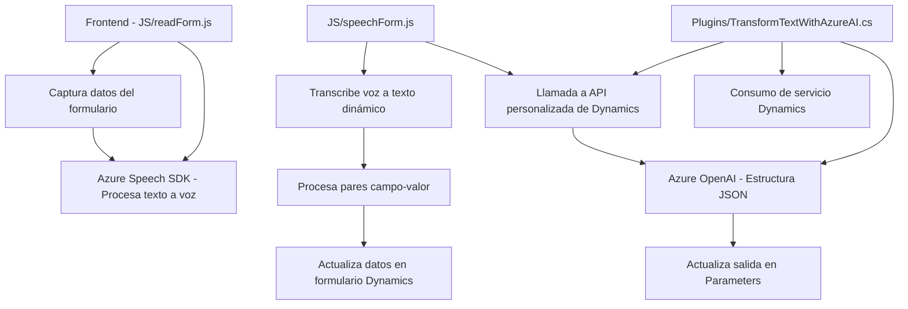

### Breve Resumen Técnico

El repositorio contiene archivos relacionados con la gestión de formularios mediante entrada y síntesis de voz, haciendo uso de tecnologías como el **Azure Speech SDK** y **Azure OpenAI**. Los archivos implementan lógica para interactuar directamente con Dynamics 365, permitiendo la manipulación dinámica de datos mediante voz, procesamiento de texto y servicios de inteligencia artificial.

---

### Descripción de Arquitectura

La solución parece ser una arquitectura modular de una **aplicación de Dynamics CRM personalizada**, donde se extienden las capacidades del sistema mediante:
- **Frontend (JavaScript)** para interactuar con el usuario en formularios, manejando entrada y salida de voz.
- **Backend (Plugins en C#)** para manipular datos internos del sistema, realizar llamadas a servicios externos (Azure OpenAI) y garantizar una respuesta estructurada según normas establecidas.

Esta solución tiene características de **n capas** y **integración API**, ya que hay una separación clara entre la interacción de cliente (JavaScript) y los servicios externos o datos del sistema (mediante plugins).

---

### Tecnologías y Frameworks Usados

1. **Frontend**:
   - **JavaScript**: Lenguaje para manejar interacciones en el navegador.
   - **Azure Speech SDK**: Framework para implementación de síntesis y reconocimiento de voz.
   - **Dynamics 365 SDK (WebApi)**: Contexto del formulario para manipular atributos y datos en tiempo real.

2. **Backend**:
   - **C#** con **Microsoft.Xrm.Sdk**: Framework dedicado al desarrollo de extensiones para Dynamics CRM.
   - **Azure OpenAI**: Servicio externo para la transformación de texto mediante IA.
   - **Newtonsoft.Json** y **System.Text.Json**: Herramientas para serialización JSON.
   - **HttpClient**: Gestión de peticiones HTTP al servicio Azure OpenAI.

3. **Patrones**:
   - **SDK Wrapper**: Simplifica la interacción con SDK externos.
   - **Plugin Pattern**: Extensión modular en Dynamics CRM.
   - **Event-driven architecture**: Uso de promesas y callbacks para la gestión asincrónica.
   - **Data extraction and transformation**: Procesamiento orientado a manejar datos de estructuras dinámicas.

---

### Dependencias o Componentes Externos

1. **Azure Speech SDK**:
   - Reconocimiento de voz (entrada) y síntesis de voz (salida) desde formularios.
   - URL dinámica cargada desde el cliente (`https://aka.ms/csspeech/jsbrowserpackageraw`).
   
2. **Azure OpenAI Service**:
   - Generación de respuestas estructuradas para transformar texto según normas específicas.
   - Credenciales de API y configuración están integrados en los plugins.

3. **Dynamics CRM**:
   - Los formularios y datos dentro del sistema son manipulados utilizando el contexto `executionContext`.

4. **LOV (Lookups)**:
   - Entradas relacionadas mediante atributos lookup que vinculan datos en diferentes entidades dentro de Dynamics CRM.

---

### Diagrama **Mermaid** 

---

### Conclusión Final

La solución está basada en una arquitectura de **n capas** que integra tecnologías para entrada/salida de voz, manipulación dinámica de formularios y procesamiento avanzado con inteligencia artificial. Combina un frontend robusto basado en **Azure Speech SDK** con plugins en C# que interactúan directamente con Dynamics 365 y servicios como **Azure OpenAI**. Su principal fortaleza es la modularidad y extensibilidad para aplicaciones corporativas con flujos dinámicos e interacción mediante voz.

Aunque bien estructurada, hay ciertos aspectos a considerar:
1. **Seguridad y configuración**: Se deben evitar credenciales incrustadas en el código, utilizando almacenamiento seguro como Azure Key Vault.
2. **Escalabilidad y latencia**: La dependencia del servicio Azure podría causar retrasos en escenarios de gran volumen de datos.

