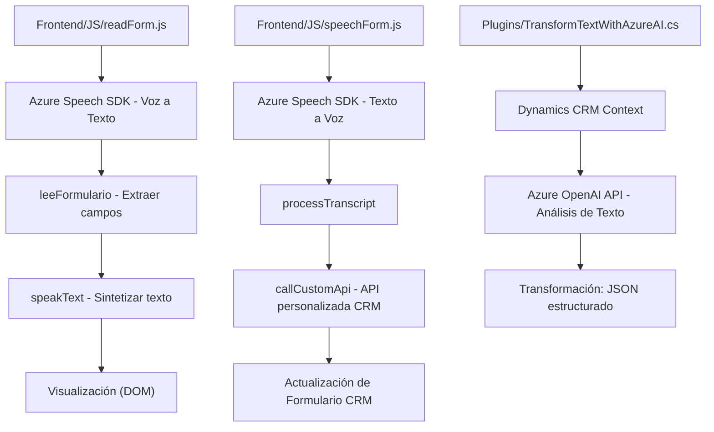

### Breve resumen técnico

El repositorio representa una solución que combina módulos de front-end en JavaScript y un plugin en C# orientado a entornos Dynamics CRM. La funcionalidad se centra en integrar reconocimiento de voz, generación de texto a voz y llamadas a servicios de inteligencia artificial externos (Azure OpenAI y Azure Speech SDK) para transformar datos y enriquecer formularios CRM.

---

### Descripción de arquitectura

**Arquitectura de la solución:**
La solución opera como un **sistema modular basado en eventos** dentro de un modelo de arquitectura **n capas**:
1. **Capa de presentación (Frontend/JS)**:
   - Implementa módulos que permiten capturar comandos de voz y sintetizar texto a voz.
   - Procesa datos mediante integración directa con Azure Speech SDK.
   - Trabaja en forma desacoplada, interactuando con formularios CRM usando `executionContext` y APIs.

2. **Capa de negocio (Plugins)**:
   - El plugin en C# transforma datos textuales usando Azure OpenAI y aplica reglas específicas.
   - Interactúa con Dynamics CRM a través de parámetros de entrada y salida del plugin.

---

### Tecnologías usadas

#### En módulos JavaScript:
- **Azure Speech SDK**: Reconocimiento de voz y síntesis de texto.
- **DOM API**: Manipulación del DOM para cargar scripts dinámicos y extraer datos de formularios.
- **Promise API**: Usada para ejecutar operaciones asíncronas como la carga del SDK de Speech y llamadas a APIs.

#### En el plugin C#:
- **Azure OpenAI API**: Procesamiento de texto mediante inteligencia artificial.
- **Microsoft Dynamics CRM (Xrm)**: Extensión de CRM para integración y manipulación de datos.
- **Newtonsoft.Json** y **System.Text.Json**: Serialización/deserialización de respuestas JSON.

#### Patrones observados:
1. **Event Handler**: Procesamiento basado en eventos (ejemplo: capturar voz y procesarla).
2. **Modularidad**: Código dividido en funciones específicas para mejorar la mantenibilidad y reducir acoplamiento.
3. **Programación orientada a API**: Dependencia de servicios externos como Azure Speech y OpenAI API.
4. **Callback Patterns**: Uso de funciones de callback para cargar dinámicamente SDKs y procesar resultados.

---

### Diagrama Mermaid

---

### Conclusión final

Esta solución integra varios elementos tecnológicos y arquitectónicos para enriquecer la experiencia en un entorno Dynamics CRM, implementando capacidades avanzadas de reconocimiento de voz, síntesis de texto a voz y procesamiento mediante inteligencia artificial de Azure OpenAI. La arquitectura, aunque basada en un sistema de capas tradicional, hace uso efectivo de servicios externos para descentralizar la lógica y promover la modularidad.

Sin embargo, la seguridad de las claves API y la integración de Azure OpenAI podrían mejorarse empleando mecanismos como Azure Key Vault o entornos de configuración dinámicos. En general, se trata de una solución robusta y bien estructurada para aplicaciones empresariales.