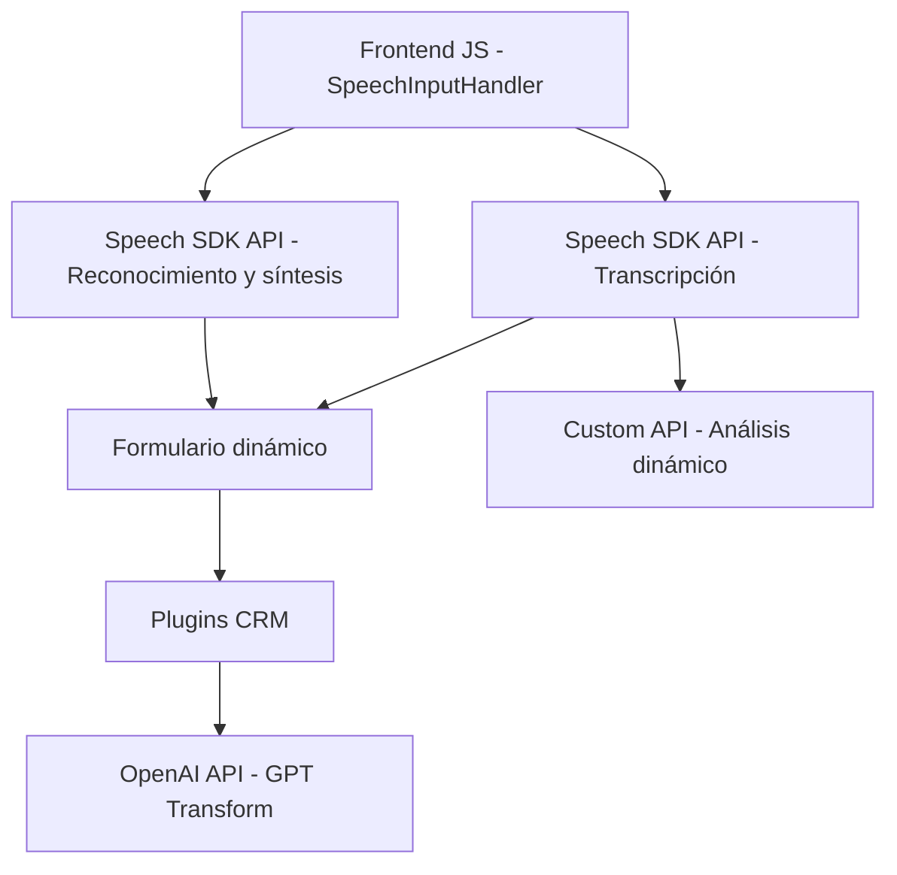

### Breve resumen técnico:
El repositorio indica una solución integrada entre frontend, servicios externos, y plugins para Microsoft Dynamics CRM. La funcionalidad principal se centra en el procesamiento de texto y voz utilizando Azure Speech SDK y Azure OpenAI. Además, se extiende el CRM para transformar datos basados en IA, lo que permite funcionalidades avanzadas orientadas al usuario.

---

### Descripción de arquitectura:
1. **Tipo de solución:**  
   - La solución es una integración multimódulo que conecta un **frontend** (JavaScript) con servicios externos de Microsoft Azure (Speech SDK y OpenAI), y extensiones en forma de **plugins** para Microsoft Dynamics CRM.

2. **Tipo de arquitectura:**  
   - **Arquitectura en n capas:** La solución tiene división lógica entre capa de presentación (frontend), capa de servicios externos (Speech SDK y OpenAI), y capa de lógica de negocio (plugins en CRM).  
   - Los componentes interactúan mediante APIs externos (REST) y métodos de SDK definidos por Microsoft Dynamics CRM y Azure.

3. **Patrones observados:**  
   - **Procedural:** Uso de funciones independientes para estructurar operaciones en los archivos JavaScript.  
   - **Cliente-Servidor:** Interacción entre código cliente (JavaScript) y servicios externos (Speech SDK y OpenAI).  
   - **Plugin extensible:** En el backend, los plugins siguen el patrón recomendado por Microsoft para Dynamics CRM, encapsulando funcionalidad en objetos que interactúan con el contexto del servidor.

---

### Tecnologías usadas:
1. **Frontend:**
   - **JavaScript:** 
     - Manejo de lógica del cliente.  
     - Integración con Microsoft Azure Speech SDK para reconocimiento y síntesis de voz.  
     - Uso del API de Microsoft Dynamics CRM (`Xrm.WebApi`) para manipular datos dinámicos de formularios.  
     - Customización de reglas para procesar datos dinámicos.  

2. **Backend:**
   - **C# plugins:**
     - Plugins extensibles mediante `IPlugin` del CRM.  
     - HttpClient para llamadas REST hacia Azure OpenAI API.  
     - Manejo de JSON con `Newtonsoft.Json` y `System.Text.Json`.

3. **Servicios externos:**  
   - **Azure Speech SDK:** Para captura de voz y conversión de texto.  
   - **Azure OpenAI API:** Para transformar y estructurar texto según normas dinámicas.

---

### Dependencias o componentes externos presentes:
- **Microsoft Azure servicios:**
  - Azure Speech SDK para trabajo con voz.
  - Azure OpenAI para procesamiento inteligente de texto.
- **Microsoft Dynamics CRM:** Extensiones del sistema mediante plugins en C#.  
- **Librerías:**
  - **Newtonsoft.Json** y **System.Text.Json:** Trabajan JSON para interacción con APIs.  
  - **HttpClient:** Para llamadas REST en los plugins C#.  
  - **System.Text.RegularExpressions:** Manejo avanzado de texto.

---

### Diagrama **Mermaid**:

---

### Conclusión final:
La solución representa una arquitectura en n capas con una clara separación entre:
- Capa de presentación en frontend con funcionalidades enriquecidas por Azure Speech SDK.
- Capa de servicios externos que interactúa con APIs (Speech y OpenAI).
- Capa de plugins que integra y extiende las funcionalidades de Microsoft Dynamics CRM.

Los patrones observados son adecuados para garantizar modularidad, mantenibilidad y escalabilidad. Sin embargo, para ambientes con alta frecuencia de uso, sería importante evaluar la latencia de las interacciones entre cliente y servicios externos, especialmente al depender de Speech SDK y OpenAI.