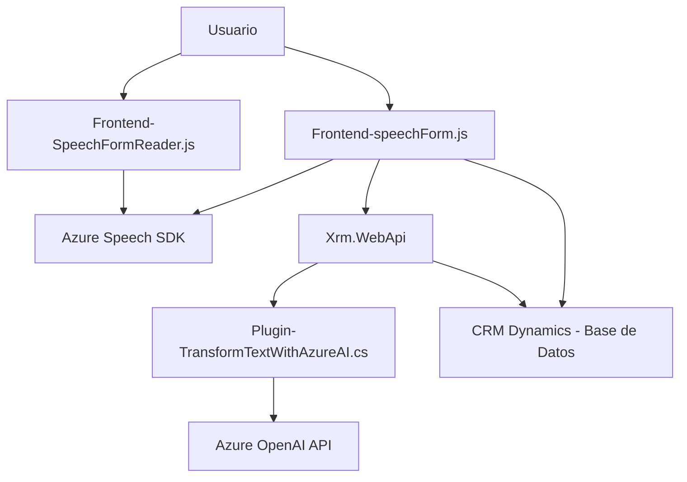

### Breve Resumen Técnico
El repositorio contiene tres componentes principales orientados a una solución de interacción mediante voz y procesamiento de datos basada en inteligencia artificial. Emplea la integración con servicios de Azure Speech y Azure OpenAI para completar tareas específicas en un escenario de CRM Dynamics:

1. La **funcionalidad de frontend JavaScript** captura y procesa datos visuales y de audio en formularios.
2. La **interfaz entre frontend y backend** usa un plugin de Dynamics CRM para realizar transformaciones automatizadas basadas en Azure OpenAI.  

---

### Descripción de Arquitectura
La solución tiene los siguientes componentes:
1. **Frontend (JavaScript)**:
   - Forma parte de la capa de presentación de una aplicación orientada a lectura y escritura en formularios utilizando entrada de datos provenientes de transcripción de voz.
   - Utiliza una arquitectura **funcional modular** en lugar de componentes centralizados.
   - El backend interactúa a través del uso de APIs internas del entorno Dynamics CRM.

2. **Backend Dynamics Plugin (.NET)**:
   - Es un componente orientado a eventos (plugin), ejecutándose en Dynamics cuando ocurren actividades específicas en formularios CRM.
   - Implementa el patrón **Plugin** y una interacción directa con **Azure OpenAI** para tareas de análisis de datos escritos.

La solución comparte características típicas de una arquitectura de **microservicios**, compuesta por un **frontend modular independiente**, una **API interna de CRM** y la integración con servicios externos como **Azure Speech SDK** y **Azure OpenAI API** para completar funcionalidades específicas.

---

### Tecnologías Usadas
1. **Frontend**:
   - **JavaScript**, junto con una estructura modular basada en funciones.
   - **Azure Speech SDK** para transcripción y síntesis de voz.
   - Manejo de DOM y carga dinámica de paquetes.

2. **Backend**:
   - **Microsoft Dynamics CRM Sdk** para implementar el plugin.
   - **Azure OpenAI API** para transformaciones automáticas.
   - Lenguaje **C# (.NET)** con uso de `IPlugin`.
   - Librerías auxiliares: `Newtonsoft.Json.Linq`, `System.Net.Http`, `System.Text.Json`.

3. **Servicios Externos**:
   - **Azure Speech**: SDK utilizado en la capa de frontend.
   - **Azure OpenAI (GPT-4)**: Servicio implementado en el backend para generación de JSON estructurado.

---

### Diagrama Mermaid **100 % compatible con GitHub Markdown**

---

### Conclusión Final
Este repositorio representa una solución híbrida con interacciones entre frontend dinámico, un backend especializado en plugins, y el aprovechamiento de servicios inteligentes como **Azure Speech SDK** y **Azure OpenAI API**. Aunque la arquitectura está basada en principios de aplicaciones distribuidas con microservicios, el alto acoplamiento con Dynamics CRM sugiere una integración estrecha con una plataforma específica.

Las decisiones arquitectónicas favorecen la modularidad del código, diseño reutilizable de funciones en frontend y separación de responsabilidades entre el procesamiento de datos (frontend) y la transformación de texto en estructuras personalizadas (backend). Es una solución escalable y adaptable, ideal para escenarios complejos dentro de sistemas CRM empresariales.