### Breve resumen técnico:
El repositorio muestra partes de un sistema que combina funcionalidades de voz, inteligencia artificial y gestión de formularios en entornos como Microsoft Dynamics CRM, en conjunto con SDKs de Azure Speech y OpenAI. Los módulos están orientados hacia la captura y procesamiento de datos desde múltiples fuentes, priorizando la integración con servicios externos. Las clases y archivos están claramente organizados con responsabilidades bien definidas.

---

### Descripción de arquitectura:
La arquitectura del sistema podría clasificarse como **n-capas** dentro de una implementación **orientada a servicios (SOA)**. Los módulos interactúan entre sí y con dependencias externas como APIs de Azure (Speech, OpenAI). El sistema se divide en capas:
- **Capa de Interfaz de Usuario (Frontend):** Manejo de formularios y captura/representación de voz.
- **Capa de lógica de aplicación:** Procesamiento y mapeo de datos entre voz/texto y atributos de formulario.
- **Capa de servicios externos:** Integración con APIs de Azure (Speech y OpenAI) para capacidades avanzadas como síntesis de voz y conversión inteligente de datos.

Los archivos muestran uso de **event-driven design**, separación modular de funciones y patrones como Adapter para mapeo de datos de formularios a objetos internos. Esto asegura que el sistema pueda escalar eficientemente al interactuar con nuevas APIs o módulos externos.

---

### Tecnologías usadas:
1. **Microsoft Dynamics CRM:**
   - Plugins (TransformTextWithAzureAI).
   - API Xrm.WebApi para operaciones con formularios.

2. **Azure Speech SDK:**
   - Reconocimiento de voz y síntesis de texto en voz.
   - Carga dinámica del SDK.

3. **Azure OpenAI API:**
   - Procesamiento avanzado de texto con reglas definidas (GPT-4o).

4. **JavaScript:**
   - Modularidad y dinámico en archivos de frontend.
   - Patrón "Handler" para flujos de voz/formularios.

5. **C# (.NET):**
   - Plugin para integrarse con Dynamics CRM.
   - Manejo HTTP y JSON mediante `System.Text.Json`, `Newtonsoft.Json.Linq`.

---

### Diagrama Mermaid válido para GitHub:

```mermaid
graph TD
A["Frontend JS - readForm.js"] --> B["leerFormulario: Extrae datos visibles"]
A --> C["getVisibleFieldData: Obtiene etiquetas y valores"]
A --> D["speakText: Sintetiza texto con Azure Speech SDK"]
A --> E["ensureSpeechSDKLoaded: Carga SDK dinámicamente"]

F["Frontend JS - speechForm.js"] --> G["startVoiceInput: Reconocimiento de voz"]
F --> H["ejecutarGrabacion: Reconoce y transcribe voz"]
F --> I["callCustomApi: Procesa voz con Azure AI"]
F --> J["processTranscript: Mapea transcripción - formulario"]
F --> K["applyValueToField: Asigna valores procesados"]

L["Plugin C# - TransformTextWithAzureAI"] --> M["Execute: Analiza texto de CRM y llama Azure OpenAI"]
L --> N["GetOpenAIResponse: Procesa texto con reglas y JSON"]
L --> O["Integración con Dynamics CRM"]
L --> P["API de Azure OpenAI para GPT-4o"]

AzureSpeechSDK["Azure Speech SDK"] --> D
AzureSpeechSDK --> G

OpenAIAPI["Azure OpenAI API"] --> M
OpenAIAPI --> I
```

---

### Conclusión final:
El sistema está diseñado para ofrecer capacidades avanzadas de reconocimiento y síntesis de voz, así como procesamiento inteligente de texto con AI. Aprovecha Azure Speech SDK y OpenAI para integrar dinámicamente funciones externas mientras mantiene una lógica robusta dentro del entorno de Dynamics CRM. La arquitectura basada en n-capas y orientada a servicios permite modularidad y escalabilidad, idónea para implementaciones con crecimiento previsible y expansión hacia nuevas APIs o módulos externos.