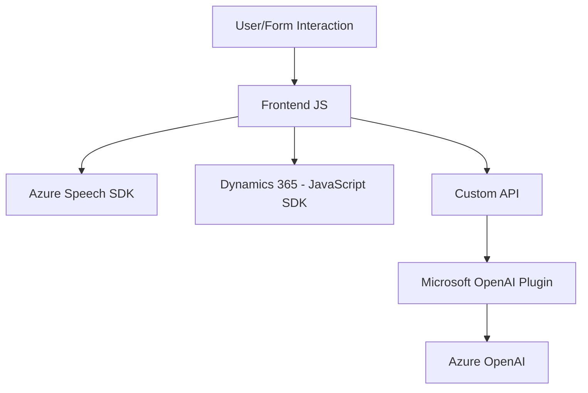

### Breve resumen técnico
El repositorio combina tecnología de frontend en JavaScript interactuando con Azure Speech SDK y Microsoft Dynamics 365, además de un componente backend (plugin) de procesamiento con Azure OpenAI. Su arquitectura está orientada a integrar servicios externos y gestionar operaciones necesarias para el análisis y transformación de datos de formularios dinámicos, incluyendo síntesis de voz y reconocimiento de texto.

---

### Descripción de arquitectura
La arquitectura sigue un patrón de **n-capas con integración externa**, organizada de la siguiente manera:
1. **Frontend:** Maneja la interacción del usuario incorporando:
   - Funcionalidad de reconocimiento de voz y síntesis usando Azure Speech SDK.
   - Lógica para mapeo, extracción, y aplicación de valores en formularios dinámicos de Microsoft Dynamics 365.
   - Llamadas a plugins o APIs externas para transformar texto.
2. **Backend (Plugin en C#):** Procesa transformaciones más avanzadas ligadas a normas específicas utilizando Azure OpenAI y devuelve resultados estructurados en formato JSON.
3. **Integración:** Azure Speech SDK y Azure OpenAI actúan como servicios secundarios para el reconocimiento, síntesis y transformación de texto.

---

### Tecnologías usadas
1. **Frontend (JavaScript):**
   - **Azure Speech SDK:** Reconocimiento de voz y síntesis de texto a voz.
   - **Microsoft Dynamics 365 JavaScript SDK:** Gestión de formularios y entidades.
   - **DOM Manipulation:** Para cargar dinámicamente dependencias externas.
2. **Backend (C#):**
   - **Microsoft.Xrm.Sdk:** Gestión de contexto y servicios de Dynamics CRM.
   - **System.Net.Http:** Realización de peticiones HTTP a servicios de terceros.
   - **Azure OpenAI:** Transformación avanzada de texto.
   - **JSON Libraries:** Serialización/deserialización de datos (`Newtonsoft.Json`, `System.Text.Json`).
3. **Dependencias externas:**
   - Custom API en Dynamics CRM.
   - Servicios de Azure para reconocimiento y procesamiento.

---

### Diagrama Mermaid válido para GitHub

---

### Conclusión final
El repositorio presenta una solución híbrida dirigida a la automatización y mejora de procesos dentro de Microsoft Dynamics 365. Usa una arquitectura basada en capas e integraciones externas para implementar dos funcionalidades principales:
1. Reconocimiento de voz y síntesis de texto mediante Azure Speech SDK en el frontend.
2. Procesamiento de texto escrito o reconocido a través de un plugin backend en C#, utilizando Azure OpenAI.

Esta solución aprovecha patrones como la **modularidad**, **integración de servicios** y **procesamiento dinámico de dependencias** para garantizar flexibilidad y eficiencia en la manipulación de formularios dinámicos, haciendo uso exhaustivo de las capacidades ofrecidas por Azure y Dynamics 365.