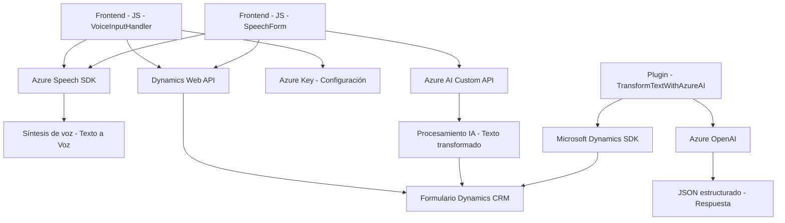

### Breve resumen técnico

El repositorio incluye múltiples archivos con una solución técnica orientada a habilitar funcionalidades avanzadas de entrada, salida y procesamiento de voz, integradas con formularios de Dynamics CRM. Esta implementación utiliza servicios externos de la nube (Azure Speech SDK, Azure OpenAI) para síntesis, transcripción y transformación de texto. Los archivos están segmentados por funcionalidades, siguiendo conceptos de modularidad y reutilización.

---

### Descripción de arquitectura

La solución se fundamenta en una **arquitectura modular** con componentes reutilizables y especializados en tareas específicas. La interacción con servicios externos como Azure Speech SDK y Azure OpenAI demuestra una implementación basada en **Microservicios**, donde cada módulo funciona como un pequeño bloque independiente que procesa flujos específicos de voz y texto. La integración con Dynamics CRM sigue un enfoque de **n-capas** dado que los plugins extienden la capa de lógica de negocio del sistema. En general, la arquitectura implementa conceptos de desacoplamiento y delegación.

---

### Tecnologías usadas

#### **Frontend (JavaScript):**
- **Azure Speech SDK:** Para procesamiento de voz incluyendo síntesis y transcripción.
- **Dynamics Web API:** Facilita mapeo y asignación de valores a los campos del formulario.
- **Modularidad funcional:** Se manejan patrones como Helper y Delegación.

#### **Backend Plugin (.NET - C#):**
- **Microsoft Dynamics SDK (`Microsoft.Xrm.Sdk`):** Usado para ampliar funcionalidad y operar directamente con el contexto del modelo de datos en Dynamics CRM.
- **Azure OpenAI:** Interactúa con APIs externas utilizando inteligencia artificial para transformar datos.
- **System.Net.Http:** Realiza solicitudes HTTP para la interacción con servicios externos.
- **Newtonsoft.Json / System.Text.Json:** Serialización y deserialización de datos JSON.

Estas tecnologías reflejan un stack centrado en soluciones empresariales integradas con servicios de nube.

---

### Diagrama **Mermaid** válido para GitHub

Este diagrama describe las interacciones entre los componentes del sistema y servicios externos:

---

### Conclusión final

La solución presentada en el repositorio utiliza una combinación efectiva de tecnologías empresariales (Microsoft Dynamics CRM) y servicios externos como Azure Speech y el Azure OpenAI, facilitando funcionalidades inteligentes en los formularios del CRM. El diseño modular permite la fácil escalabilidad y mantenimiento, mientras que la arquitectura basada en microservicios garantiza la separación de responsabilidades y una interacción eficiente con servicios en la nube.

- **Ventajas:** Modularidad, uso de tecnología puntera como Azure AI, desacoplamiento claro.
- **Áreas de mejora:** Mayor documentación, manejo más robusto de errores en las funciones de integración con APIs externas.