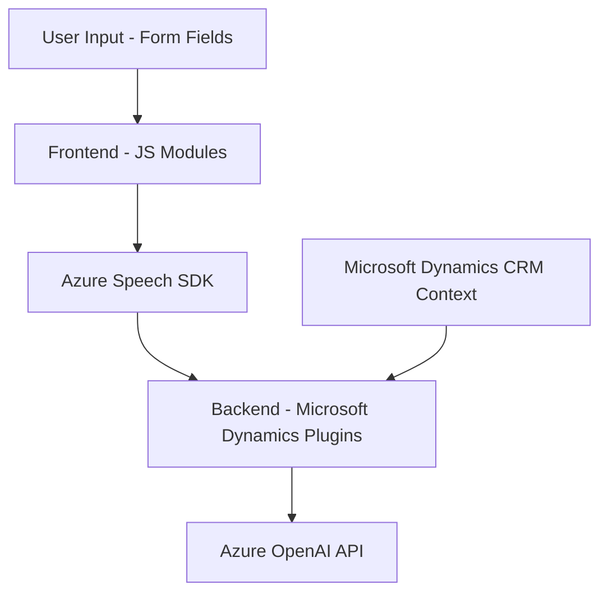

### Breve resumen técnico
El repositorio analiza la integración de tecnologías como reconocimiento de voz, procesamiento avanzado de texto e inteligencia artificial (IA) basada en Azure dentro de un entorno Microsoft Dynamics CRM. Los archivos presentan una solución que conecta funcionalidades frontend y backend con servicios como el Azure Speech SDK y Azure OpenAI API, organizados en una arquitectura basada en capas con modulos dinámicos y plugins en el backend.

---

### Descripción de arquitectura
El sistema combina varias capas:
1. **Frontend**: Contiene funcionalidad de reconocimiento y síntesis de voz embebida en formularios, utilizando Azure Speech SDK.
2. **Backend (Dynamics CRM)**: Implementa lógica empresarial dentro de plugins (`TransformTextWithAzureAI.cs`) que interactúan con servicios externos como Azure OpenAI.
3. **Servicios Externos**: Dependencias críticas en Azure Cognitive Services (Speech SDK y OpenAI), utilizadas tanto para reconocimiento de voz como para procesamiento de textos.

La arquitectura sigue el modelo de **n capas**:
- **Capa de Presentación (Frontend)**: Módulos en JavaScript gestionan la entrada de voz, evitando acoplamientos al backend usando segregación de responsabilidades.
- **Capa de Aplicación (Backend)**: Contiene plugins que implementan lógica hacia APIs externas.
- **Integración de servicios externos**: Consiste en una fuerte dependencia con Azure para tareas especializadas de IA y síntesis de voz.

---

### Tecnologías usadas
1. **Frontend**:
   - Lenguaje: JavaScript.
   - Framework: Ninguno específico (funciones nativas y modularidad).
   - Integración: Azure Speech SDK.
   - Servicios: JSON handling, async/await-con Promises.

2. **Backend**:
   - Lenguaje: C#.
   - Framework: .NET Framework (Microsoft Dynamics SDK).
   - Integración: Azure OpenAI API, Microsoft Dynamics CRM (Xrm.WebApi).
   - Librerías: `Newtonsoft.Json`, `System.Net.Http`, `System.Text.Json`.

---

### Diagrama **Mermaid**

---

### Conclusión final
La solución combina tecnologías modernas de IA y reconocimiento de voz mediante servicios en la nube (Azure Cognitive Services), integradas dentro de un sistema CRM empresarial. Con una arquitectura basada en n capas, utiliza modularidad en frontend y la extensibilidad de plugins en backend. Si bien es eficiente en su entorno específico (Microsoft Dynamics CRM), presenta ciertas limitaciones en términos de portabilidad por su fuerte dependencia de Azure y herramientas propietarias.