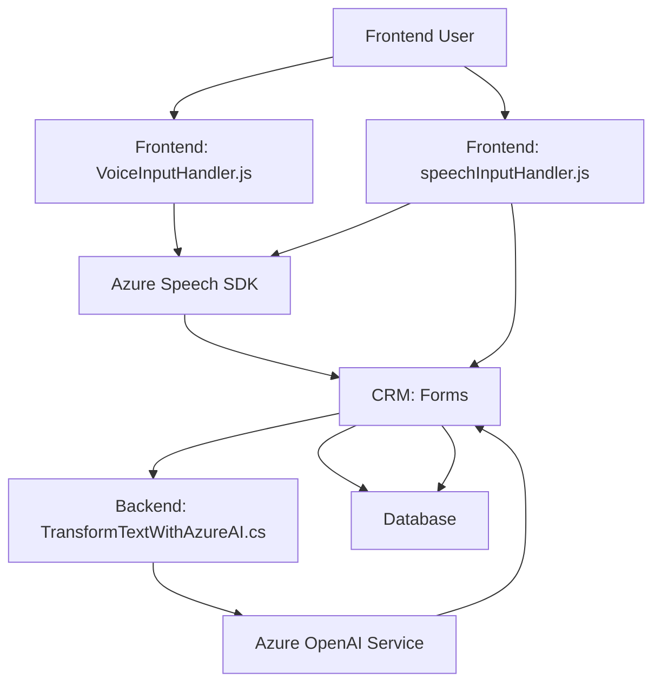

### Breve resumen técnico:

El repositorio mezcla soluciones frontend y backend, integradas con servicios de Azure y Microsoft Dynamics CRM. Utiliza dos herramientas principales: **Azure Speech SDK** para entrada/salida de voz y el **Azure OpenAI Service** para la transformación avanzada de texto en JSON estructurado. Destaca por implementar funciones específicas para lectura y actualización de formularios con soporte a inteligencia artificial.

---

### Descripción de arquitectura:

1. **Arquitectura principal:**
   - **Frontend:** Representa una arquitectura modular en el frontend, con funciones orientadas a procesamiento de eventos, interacción con capas del sistema CRM y uso de SDK externos.
   - **Backend:** Centralizado en la implementación de un **plugin** conectado a Dynamics CRM, empleando servicios cloud para transformar datos (Azure OpenAI).

2. **Patrones observados:**
   - **Modularización y separación de responsabilidades:** División clara entre facilitadores de interacción cliente-lado (JS) y lógica empresarial (plugin .NET).
   - **API Gateway:** Comunicación bidireccional entre Dynamics CRM, SDK externos (Azure Speech) y servicios REST (Azure OpenAI).
   - **Event-Driven Architecture:** Uso del patrón `Command` para ejecutar operaciones en Dynamics CRM mediante el contexto `IPluginExecutionContext`.

---

### Tecnologías usadas:

1. **Frontend:**
   - **JavaScript frameworks:** Probablemente usa librerías CRM como `Form Context API`.
   - **Azure Speech SDK:** Cliente basado en navegador para Text-to-Speech y reconocimiento de voz.

2. **Backend:**
   - **C#:** Desarrollo del plugin para Dynamics CRM.
   - **Microsoft Dynamics SDK:** Interfaces como `Microsoft.Xrm.Sdk` (para integración empresarial).
   - **REST APIs:** Uso de `System.Net.Http` para comunicación con Azure OpenAI.

3. **Servicios externos:**
   - **Azure Speech SDK:** Cargado dinámicamente para realizar síntesis de voz y reconocimiento.
   - **Azure OpenAI Service:** Aplicación del modelo GPT-4 para transformar textos según reglas definidas.

---

### Diagrama **Mermaid** válido para GitHub:

---

### Conclusión Final:

El repositorio describe una solución híbrida con elementos frontend y backend conectados a servicios de inteligencia artificial en la nube. La arquitectura general podría catalogarse como **orientada a servicios** con uso de SDKs y APIs REST para integrar servicios de Microsoft Azure y Dynamics CRM. La separación de lógica entre la interacción frontend y el procesamiento de datos backend aporta claridad, buena modularidad, y facilita mantenimiento. Sin embargo, la codificación de dependencias y configuraciones debe considerar mejoras (como el uso de vaults para manejar secretos).