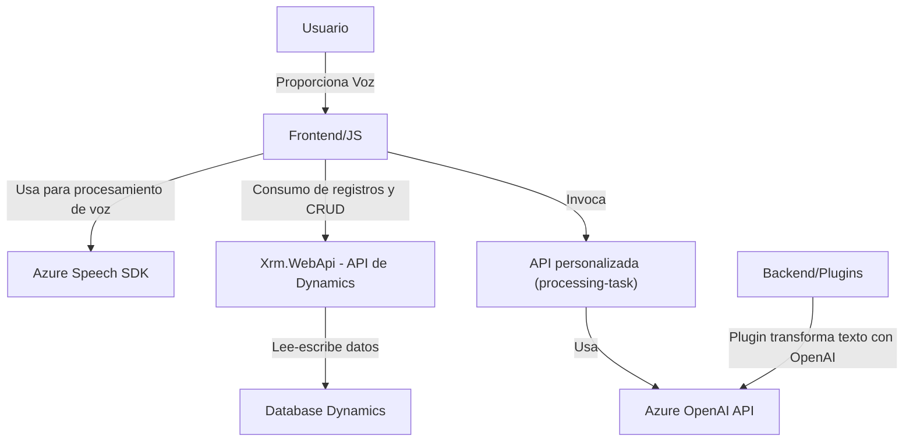

### Breve resumen técnico
El repositorio descrito contiene tres archivos clave que contribuyen a una solución orientada a la integración del procesamiento de voz y texto mediante servicios de Microsoft Dynamics CRM y Azure Cognitive Services. La solución aborda la interacción y actualización de formularios mediante mecanismos de síntesis y reconocimiento de voz, y utiliza los servicios de Azure OpenAI para transformar texto en objetos JSON estructurados en tiempo de ejecución.

---

### Descripción de arquitectura
La arquitectura del proyecto sigue los principios de **n capas** y **microservicios**. La interacción está claramente dividida entre front-end y back-end:

1. **Front-end**: Compuesto por lógica JavaScript para habilitar síntesis y reconocimiento de voz mediante el SDK de Azure, además de la integración con APIs externas del cliente (como la API web de Dynamics y API personalizada para transformar texto).
2. **Back-end**: Define un plugin de Dynamics CRM que delega tareas de procesamiento cognitivo al servicio externo de Azure OpenAI para realizar transformaciones avanzadas en textos según normas específicas. Esta integración utiliza un patrón de **plugin** para Dynamics CRMs y el patrón de **API externa** para realizar solicitudes a servicios basados en IA.

La separación de responsabilidades entre los componentes garantiza que las funcionalidades se mantengan escalables, reutilizables y fáciles de mantener. Cada componente tiene su propósito bien definido:

- El front-end (JavaScript) se encarga de la interacción visual con el formulario y de conectar con Servicios Cognitivos de Azure mediante el SDK de Speech.
- El back-end (Plugin C#) se especializa en la integración directa de Dynamics CRM con la API de Azure OpenAI, empleando estándares como `Newtonsoft.Json` y `System.Net.Http` para tratar datos y manejar comunicación HTTP.

---

### Tecnologías usadas
1. **Lenguajes de programación:**
   - **JavaScript:** Para lógica front-end y dinámica de formularios.
   - **C#:** Para plugin de Dynamics y comunicación con Azure OpenAI.
2. **Frameworks y bibliotecas principales:**
   - **Microsoft Azure SDK**: La parte front-end usa Azure Speech SDK para síntesis de voz y reconocimiento.
   - **Microsoft Dynamics CRM SDK:** En el backend, facilita el manejo del contexto y servicios organizacionales (integración).
   - **Newtonsoft.Json** y **System.Net.Http**: Manejan datos JSON y solicitudes HTTP en el plugin.
   - **API personalizada de Dynamics**: Lógica extendida para integración e inteligencia artificial.
3. **Servicios externos:**
   - **Azure Speech SDK**: Proceso de entrada de voz y síntesis.
   - **Azure OpenAI API**: Procesamiento cognitivo y generación de datos JSON estructurados.

---

### Diagrama Mermaid válido para GitHub 

---

### Conclusión final
El repositorio implementa un sistema que integra la inteligencia artificial y el reconocimiento de dominio empresarial para mejorar la interacción y automatización de tareas en formularios. Utiliza una arquitectura de **n capas** con división clara entre la interacción de los usuarios (front-end) y el procesamiento empresarial basado en servicios distribuidos (back-end y APIs externas). La solución es extensible y ejemplifica un buen uso combinado de diferentes paradigmas, como los **Microservicios** y los principios de **Single Responsibility**.