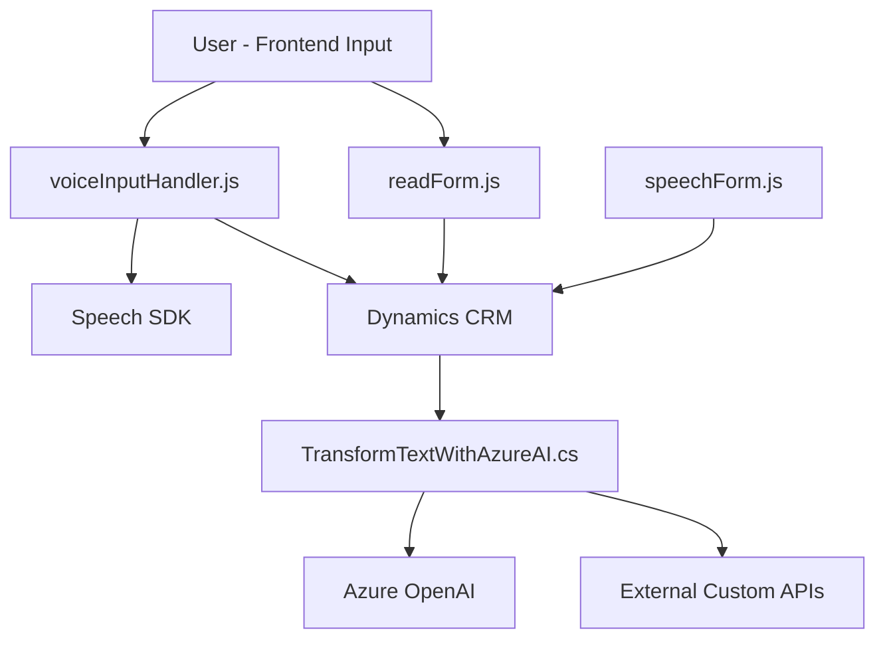

### Breve resumen técnico:
El repositorio contiene tres principales componentes:
1. Dos archivos relacionados con un **frontend** en JavaScript (`readForm.js` y `speechForm.js`), que implementan funcionalidades de transformación y síntesis de voz mediante el Azure Speech SDK integrados con formularios en Dynamics CRM.  
2. Un archivo backend (`TransformTextWithAzureAI.cs`) implementado como un **plugin para Microsoft Dynamics CRM**, que integra el servicio Azure OpenAI para realizar transformaciones avanzadas de texto.

---

### Descripción de arquitectura:
La arquitectura es **modular** con un patrón de integración de servicios externos. El sistema combina una solución **backend basada en plugins para Dynamics CRM** con capacidades de inteligencia artificial proporcionadas por Azure Speech SDK y Azure OpenAI. Los archivos JavaScript capacitan la interfaz de usuario del frontend para aceptar, transcribir y sintetizar entradas de voz, mientras que el backend gestiona la lógica empresarial mediante extensiones de Dynamics CRM. No es una arquitectura pura de microservicios ni monolítica, pero se aproxima a un **n-capas** dentro del ámbito de la interacción entre frontend y backend.

---

### Tecnologías usadas:
1. **Frontend**:
   - **JavaScript** con orientación modular.
   - **Azure Speech SDK** para procesamiento de voz (transcripción y síntesis de texto en audio).
   - **Microsoft Dynamics CRM API** para interacciones con el formulario y contexto dinámico.

2. **Backend**:
   - **C# Plugin** basado en `IPlugin`, integrado con Dynamics CRM.
   - **Azure OpenAI API** para procesamiento avanzado de texto (transformación según normas específicas).
   - Librerías .NET como `System.Net.Http` para realizar solicitudes HTTP al servicio externo.
   - **Newtonsoft.Json** y `System.Text.Json` para manipulación de objetos JSON.

---

### Dependencias o componentes externos:
1. **Azure Speech SDK**: Procesamiento de voz, síntesis de audio y transcripción.
2. **Azure OpenAI Service**: Transformaciones avanzadas de texto basado en reglas.
3. **Microsoft Dynamics CRM SDK**: Contexto y servicios para integraciones de plugins en un entorno CRM.
4. **Librerías auxiliares**: Manipulación de datos JSON, regex, y manejo de HTTP en el backend.

---

### Diagrama **Mermaid** válido para GitHub Markdown:

---

### Conclusión final:
El sistema implementa una solución híbrida que mezcla código frontend (JavaScript) y backend (C# plugins) integrados con Dynamics CRM, gestionando funcionalidades avanzadas de procesamiento de voz y texto. El diseño arquitectónico habilita servicios como Azure Speech SDK para transcripciones y síntesis de voz en el frontend, mientras que el backend se apoya en Azure OpenAI para transformar el texto de acuerdo con reglas predefinidas.

Esta estructura está orientada a la **modularidad**, emplea patrones como integración de servicios externos mediante APIs, y tiene una arquitectura de **n-capas**, donde el frontend, el backend y los servicios externos interactúan para lograr un flujo de trabajo robusto y escalable que integra datos no estructurados a un entorno Dynamics CRM.