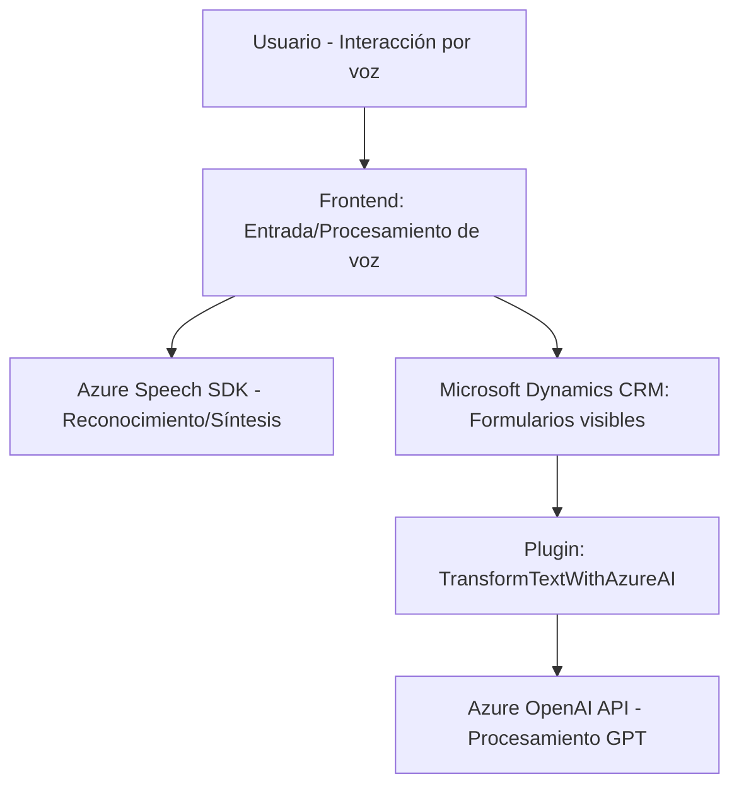

### Breve Resumen Técnico
El repositorio contiene un sistema que permite la interacción con formularios en Microsoft Dynamics 365 CRM mediante entradas de voz, utilizando el **Azure Speech SDK** y la integración con el servicio **Azure OpenAI API** a través de un plugin. El código está organizado en archivos de JavaScript para la lógica de frontend y un archivo de C# que implementa la lógica del plugin del backend.

---

### Descripción de Arquitectura
La arquitectura es de **n capas**, típica de integraciones de servicios en aplicaciones CRM. Se sigue un patrón de arquitectura **cliente-servidor**. El cliente (frontend en el navegador) gestiona la interacción del usuario y procesamiento preliminar, mientras el servidor implementa la lógica del negocio mediante un plugin que interactúa con APIs externas. En el frontend, cada archivo maneja flujos claramente definidos con separación de responsabilidades: lectura de formularios, aplicación de valores procesados y conversión de voz. Además, la arquitectura aprovecha dos patrones clave:
1. **Service-Oriented Architecture (SOA)**: Mediante la integración de servicios como Azure Speech SDK y Azure OpenAI API.
2. **Patrón de capas**: Divición clara entre presentación (frontend), negocio (plugin), e integración con API externas.

---

### Tecnologías Usadas
- **Frontend**:
  - **JavaScript**.
  - **Azure Speech SDK**: Para reconocimiento y síntesis de voz.
  - **Microsoft Dynamics 365 CRM APIs**: Para manipulación de datos de formulario y comunicación entre API y sistema CRM.
- **Backend**:
  - **C#**: Desarrollo del plugin.
  - **Azure OpenAI API**: Procesamiento de texto con GPT-4o.
  - **HttpClient**: Para manejo de solicitudes HTTP.
  - **Newtonsoft.Json**, **System.Text.Json**: Para manejo de JSON.
- **Contexto global**:
  - Microsoft Dynamics CRM como plataforma de integración para la gestión de datos empresariales.

---

### Diagrama Mermaid

---

### Conclusión Final
Este repositorio implementa una solución integral para interacción de voz con formularios en plataformas Microsoft Dynamics 365. Utiliza una arquitectura de **n capas**, con una separación clara entre presentación y negocio, además de la integración con servicios de terceros como Azure Cognitive Services y OpenAI API. El uso de patrones como orchestración de servicios y procesamiento asincrónico fortalece la modularidad y mejora la interactividad del sistema. Es robusto y bien diseñado, aunque puede requerir optimización en el manejo de la comunicación con el servicio de OpenAI para evitar posibles problemas de escalabilidad.