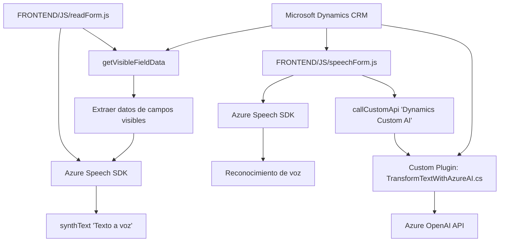

### Breve resumen técnico

El repositorio presenta archivos específicos para la integración entre Microsoft Dynamics CRM, Azure Speech SDK y Azure OpenAI, proporcionando funcionalidades avanzadas de reconocimiento de voz, síntesis de texto en voz, y transformación de texto contextual usando inteligencia artificial. La solución está diseñada para interactuar con formularios dentro de Dynamics CRM, facilitando la entrada y salida de datos en formatos accesibles y útiles.

---

### Descripción de arquitectura

1. **Tipo de solución:**  
   La solución combina elementos de un sistema **híbrido**:
   - "Frontend basado en APIs" y scripts de interacción (como `readForm.js` y `speechForm.js`) en JavaScript.
   - **Backend con plugins personalizados** (como `TransformTextWithAzureAI.cs`) para Dynamics CRM.
   - Integración hacia servicios externos como **Azure Speech SDK** y **Azure OpenAI** para procesamiento de voz e inteligencia artificial.

2. **Arquitectura general:**  
   La arquitectura parece seguir el enfoque de **n-capas**:
   - **Capa de presentación:** Scripts en JavaScript para interacción directa con formularios de Dynamics CRM.
   - **Capa de lógica de negocio:** Plugins `.cs` que integran procesamiento avanzado.
   - **Capa de servicios externos:** Comunicación con Azure Speech SDK y Azure OpenAI API para capacidades avanzadas fuera del entorno CRM.

3. **Características y patrones arquitectónicos:**  
   - **Event-driven:** Uso de callbacks y eventos para manejar interacciones asincrónicas con SDKs y servicios externos.
   - **Facade:** Abstracto de lógica compleja gracias a funciones reutilizables, como la extracción/síntesis de datos del formulario o el procesamiento de texto.
   - **Plugin/Modules:** Extensibilidad del CRM mediante el uso de plugins en C#.
   - **Separation of Concerns:** Separación clara entre frontend, lógica empresarial y procesamiento en servicios externos.

---

### Tecnologías usadas

1. **Frontend:**  
   - **JavaScript** con ES6 en `readForm.js` y `speechForm.js`.
   - **Azure Speech SDK**: Utilizado para reconocimiento y síntesis de voz.
   - Dependencias con `Xrm.WebApi`, presumiblemente para manipular formularios del CRM.

2. **Backend:**  
   - **Microsoft Dynamics SDK** y librerías como `Microsoft.Xrm.Sdk` para extender la lógica del CRM.
   - **C#** en el desarrollo de plugins personalizados (`TransformTextWithAzureAI.cs`).
   - **Azure OpenAI API** para transformación avanzada de texto.

3. **Servicios externos:**  
   - **Service-based communication:** Interacción con endpoints de **Azure** para Speech y OpenAI.
   - Dependencias como `System.Net.Http` y `System.Text.Json` para integración con servicios externos en el backend.

---

### Diagrama Mermaid válido para GitHub

---

### Conclusión final

La solución documentada indica una arquitectura bien diseñada con un enfoque modular y extensible. Los componentes frontend en JavaScript interactúan directamente con un sistema CRM, mientras que plugins en C# amplían las capacidades del tener una integración avanzada con servicios Azure para síntesis de voz y procesamiento de texto con inteligencia artificial.

Los patrones utilizados, como Observador, Fascade, y Modularidad reflejan buenas prácticas en desarrollo de software. Adicionalmente, el sistema demuestra adaptabilidad hacia escenarios de alta demanda, como asistencia por voz en tiempo real en aplicaciones CRM.

Si bien en términos generales esto parece ser un sistema **multicapa**, hay indicios de potencial adopción de **patrones de arquitectura avanzada**, como servicios de microprocesos con integración a servicios de terceros. Por lo tanto, este enfoque lo convierte en una plataforma moderna y eficiente.