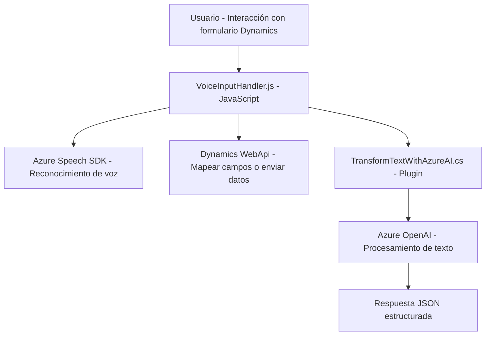

### Breve resumen técnico

Este repositorio implementa un sistema dirigido al procesamiento de formulaciones en **Microsoft Dynamics 365**, incluyendo reconocimiento de voz y generación/formateo de texto utilizando servicios externos como **Azure Speech SDK** y **Azure OpenAI GPT API**. Se trata de una solución híbrida que mezcla la integración directa con Dynamics 365 con funcionalidades de IA avanzada. Los componentes principales incluyen scripts de frontend, controladores de entrada de voz y plugins backend para el procesamiento de texto basado en IA.

---

### Descripción de arquitectura

La arquitectura se basa en un modelo **n capas**:
1. **Capa frontend**: Implementada en JavaScript, integra Azure Speech SDK y opera dentro de formularios de Dynamics 365. Su objetivo es manejar entrada por voz, procesar transcripciones y enviar datos relevantes a la API o al plugin backend.
2. **Capa backend**: Utiliza plugins de Dynamics CRM escritos en C# que interactúan con el contexto del CRM y Azure OpenAI para transformar y analizar texto.
3. **Servicios externos**: Azure Speech SDK y Azure OpenAI actúan como microservicios externos que proveen el reconocimiento y generación/síntesis de texto.

Esta arquitectura funciona bajo un esquema modular y asíncrono, donde los flujos dependen de servicios externos y la comunicación entre el frontend y backend de Dynamics CRM ocurre mediante contexto y parámetros.

---

### Tecnologías usadas

1. **Frontend**
   - JavaScript
   - Azure Speech SDK
   - Dynamics Web API (Xrm.WebApi)

2. **Backend**
   - Microsoft Dynamics SDK (C#, plugins)
   - Azure OpenAI GPT API
   - HttpClient para comunicación externa
   - Newtonsoft.Json/Text.Json para manejo de JSON

3. **Servicios externos**
   - Azure Speech API: Reconocimiento y síntesis de voz.
   - Azure OpenAI GPT: Procesamiento avanzado de texto basado en IA.

4. **Patrones**
   - Modularidad: Separación clara de funcionalidad.
   - Asincronía: Uso de promesas en el frontend y backend.
   - Dependencia de servicios externos mediante SDKs y APIs REST.

---

### Diagrama **Mermaid**

---

### Conclusión final

Este repositorio implementa una solución híbrida que combina procesamiento local en Dynamics 365 con servicios avanzados de voz e inteligencia artificial en Azure. La arquitectura es modular y se basa en patrones de integración con APIs externas que aportan funcionalidades de síntesis de voz y procesamiento complejo de texto. El diseño se adapta a un esquema **n capas**, con roles bien delimitados entre frontend y backend para optimizar la interoperabilidad entre sistemas internos y externos.