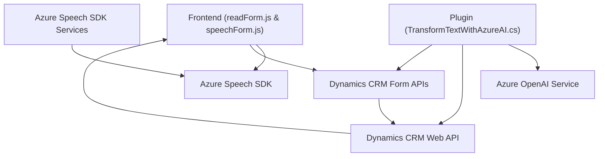

### Breve resumen técnico

El repositorio representa múltiples componentes diseñados para implementar un sistema de procesamiento de entrada y salida por voz, integrando reconocimiento de voz, síntesis de audio con Azure Speech SDK, y procesamiento de texto con Azure OpenAI Service en un entorno de Dynamics CRM. Los tres archivos destacan aspectos distintos:
1. **readForm.js y speechForm.js:** Implementan funciones del cliente (frontend) para interactuar con formularios visibles, procesar transcripciones de voz y sintetizar audio mediante Azure Speech SDK.
2. **TransformTextWithAzureAI.cs:** Define un plugin implementado para Dynamics CRM que interactúa con Azure OpenAI para la transformación avanzada de texto bajo normas específicas.

---

### Descripción de la arquitectura

La solución adopta una **arquitectura basada en capas con integración de funcionalidades específicas para la entrada/salida de voz y transformación de texto**:
- **Frontend (JavaScript):** Dos módulos que implementan lógica para el reconocimiento y síntesis de voz en los formularios, reutilizando el Azure Speech SDK y las APIs de Dynamics CRM. La arquitectura sigue un patrón modular con funciones desacopladas.
- **Backend (C# Plugin):** Plugin que implementa lógica del servidor mediante Dynamics CRM SDK y realiza llamadas externas a Azure OpenAI Service para el procesamiento de texto. Sigue un patrón **Plugin Architecture** y emplea integración API externa para procesamiento específico.

En conjunto, los archivos revelan una solución híbrida que combina servicios cloud (Azure Speech y OpenAI) y un entorno de Dynamics CRM.

---

### Tecnologías usadas
1. **Azure Speech SDK:**
   - Usado para reconocimiento de voz y síntesis de texto automatizada.
   - Cargado dinámicamente en el frontend.
   
2. **Azure OpenAI Service:**
   - Empleado en el plugin para transformar texto según reglas específicas a través de llamadas HTTP POST.

3. **Dynamics CRM SDK:**
   - Manejo del contexto de datos en el sistema CRM.
   - Actualización de atributos en formularios desde transcripciones de voz o datos transformados.

4. **JavaScript:** 
   - Scripts organizan comportamiento basado en eventos del SDK, con funciones auxiliares desacopladas.

5. **.NET Framework:**
   - Usado para implementar el plugin del servidor.
   - Bibliotecas incluidas: `HttpClient`, JSON Handling.

6. **REST APIs:**
   - Comunicación con servicios externos (Azure OpenAI y otros APIs personalizados para CRM).

---

### Diagrama Mermaid

Aquí está el diagrama que describe la relación entre los componentes de la solución:

---

### Conclusión final

La solución integra funcionalidades de reconocimiento de voz, síntesis de texto, y transformación de texto mediante servicios de Azure y plataformas de Dynamics CRM. El sistema presenta una arquitectura basada en capas, donde los módulos de frontend están desacoplados y dedicados a tareas específicas como procesamiento de voz y manipulación de formularios, mientras el backend se centraliza en un plugin que realiza lógica de negocio avanzada con comunicación dinámica a servicios externos. Se identifican áreas claras de optimización, como mejorar el manejo de errores, la seguridad de credenciales, y habilitar configuraciones más dinámicas para las dependencias de Azure.